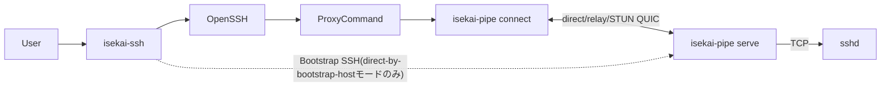

# isekai-ssh / isekai-pipe 設計書

**ステータス:** 実装済み(コア機能)。本書は2026-07-07時点の実装を反映する現行の設計書。
過去の検討過程は `archive/`(`chatgpt.md`・`ISEKAI_SSH_DESIGN.md`・`HELPER_PROTOCOL.md`・
`ISEKAI_PIPE_MIGRATION.md`)を参照。

## 1. 概要

多段NAT配下やprivate network内にあるSSHサーバーへ、多段SSHによるbootstrapを起点として
QUICのP2P経路(またはrelay経由)を構築し、その後のOpenSSH通信を再接続・再開可能な論理
バイトストリーム上で転送するシステム。`isekai-terminal`(Androidアプリ)が持つQUIC接続耐性
(ローミング・完全切断からのresume)を、Androidアプリに依存しない`ssh(1)`ラッパーとして
CLI環境でも使えるようにする。

主要コンポーネントは次の2つ。

| コンポーネント | 役割 |
| --- | --- |
| `isekai-ssh` | OpenSSHフロントエンド。`~/.ssh/config`解決、`#@isekai`設定解析、trust store管理、bootstrap、ConnectionIntent生成、OpenSSH起動を担当する |
| `isekai-pipe` | データプレーン。QUIC接続確立(direct/relay/STUN)・HELLO/proof/ACK・resume・stdio/TCP中継を担当する。`connect`(client)と`serve`(server)の両方を同一バイナリで提供する |

中核となる設計原則:

> **isekai-sshは接続の意図と信頼管理を担当し、isekai-pipeは実際の接続経路と通信状態を所有する。**

`isekai-ssh`はIPアドレスやUDP socketを所有しない。`isekai-pipe`はSSHプロトコルを解釈せず、
任意の双方向バイトストリームを扱う。

## 2. 用語

| 用語 | 意味 |
| --- | --- |
| logical host | ユーザーが指定する接続名。例: `production` |
| bootstrap candidate | remoteにSSHで到達し、`isekai-pipe serve`を配布・起動するための経路(host:port + 任意のvia jump chain) |
| service target | remote `serve`から見たTCP接続先。SSHなら通常`127.0.0.1:22` |
| candidate endpoint | STUN・relay等で実測・交換される短命な到達候補(`direct-by-bootstrap-host`/`server-reflexive`/`relayed`) |
| ConnectionIntent | `isekai-ssh`が生成し`isekai-pipe connect`に渡す短命な接続指示 |
| trust store / known_helpers.toml | `~/.config/isekai-ssh/known_helpers.toml`。信頼済みhelperのidentity・接続情報をキャッシュする |
| PersistentProfile | `known_helpers.toml`より新しいprofile schema(candidate list対応)。migration関数のみ実装済み、実際の読み書きは今後 |
| direct-by-bootstrap-host | bootstrap用SSH宛先を、そのままQUIC dial先のhost部分にも使う経路。Tailscale・LAN・既知direct hostでのみ成立する |

## 3. アーキテクチャ



## 4. isekai-ssh

### 4.1 呼び出し形式

**非サブコマンド呼び出し(wrapper mode、日常の接続)**:

```bash
isekai-ssh [ISEKAI_OPTIONS] [SSH_OPTIONS] destination [command [argument...]]
```

`wrapper.rs`が`ssh -G`で実効設定を解決し、`#@isekai`ディレクティブを読み、trust storeに
登録済みなら`ConnectionIntent`を作って実`ssh`を`ProxyCommand=isekai-pipe connect ...`付きで
起動する。wrapper自身はstdioを`Stdio::inherit()`で丸ごと`ssh`へ委譲するだけで一切加工しない。

固有オプション: `--isekai-bootstrap`/`--isekai-no-bootstrap`/`--isekai-direct`/
`--isekai-explain`/`--isekai-dry-run`/`--isekai-ssh-path`/`--isekai-pipe-path`/
`--isekai-helper-binary`(自動bootstrap用、後述)。

**サブコマンド呼び出し(対話的、trust store管理)**:

| コマンド | 対話性 | 役割 |
| --- | --- | --- |
| `isekai-ssh init <host>` | 対話的 | `isekai-bootstrap::OpenSshBackend`経由でremoteに`isekai-pipe`を配布・起動(`--relay`モード)し、確認後にtrust storeへ登録する |
| `isekai-ssh login` | 対話的(ブラウザ) | Device Authorization FlowでJWT取得 |
| `isekai-ssh logout` | 非対話 | ローカルtoken cache削除 |

過去にあった独立`connect`サブコマンド(自前QUIC relay実装)は削除済み。wrapper +
`isekai-pipe connect`が同じ役割を果たす。

### 4.2 `#@isekai` SSH config拡張

`~/.ssh/config`の`#@isekai <directive> <arguments...>`行(OpenSSHが`#`始まりの行として無視する)
に記述する。

```sshconfig
Host production
    HostName 10.20.0.15
    User deploy

    #@isekai bootstrap-candidate target=192.168.10.15:22 priority=120
    #@isekai bootstrap-candidate target=10.20.0.15:22 via=corp-bastion priority=100
    #@isekai link https://link.example.com
    #@isekai rendezvous https://rendezvous.example.com
    #@isekai stun stun1.example.com:3478
    #@isekai relay masque://relay.example.com
    #@isekai remote-path ~/.local/libexec/isekai/isekai-pipe
    #@isekai service ssh=127.0.0.1:22
    #@isekai resume-grace 120s
```

主なディレクティブ: `enabled`/`bootstrap-policy`(auto/always/never)/`bootstrap-candidate`/
`link`/`rendezvous`/`stun`/`relay`/`remote-path`/`service`/`profile`/`resume-grace`/
`candidate-race-delay`/`relay-delay`/`install-mode`。`bootstrap-candidate`/`link`/
`rendezvous`/`stun`/`relay`/`service`は複数指定で追記、それ以外は最初の値を採用(first-value-wins、
OpenSSHと同じ規則)。`Host`パターン(完全一致/`*`/`?`/否定/複数パターン)・`Include`(絶対/相対/`~`/
glob/循環検出)に対応。`Match`ブロック内の`#@isekai`は`ISEKAI_CONFIG_UNSUPPORTED_MATCH`で拒否する。

### 4.3 trust store(`known_helpers.toml`)

`~/.config/isekai-ssh/known_helpers.toml`(TOML)。キーは`host:port`に正規化(ポート省略時22、
ユーザー名は含めない)。

```toml
[helpers."myhost:22"]
identity_pubkey = "..."
trusted_helper_sha256 = "aaa..."
trusted_helper_version = "0.3.1"
update_policy = "exact-digest-only"
last_via = "bastion.example.com"
trusted_at = "2026-07-04T00:00:00Z"
last_seen_at = "2026-07-04T00:00:00Z"
cached_relay_addr = "203.0.113.10:45231"
cached_cert_sha256 = "3a7f..."
cached_session_secret = "MDEyMzQ1Njc4OTAxMjM0NTY3ODkwMTIzNDU2Nzg5MDE="
```

`update_policy`は閉じたenum(`ExactDigestOnly`のみ)で、serdeが未知のvariantをfail closedで
拒否する。署名検証(release signing key)は未実装。

**PersistentProfile migration path**(`isekai-pipe-core::profile`): `known_helpers.toml`から
chatgpt.md §13相当の新schema(`peer_id`/`link_endpoints`/`stun_servers`/`relay_endpoints`/
`candidates`ベース)への変換関数(`migrate_trust_store`)のみ実装済み。旧ファイルは据え置きで、
実際の読み書き経路(`wrapper.rs`/`isekai-pipe connect`)はまだ`known_helpers.toml`を直接使う。

### 4.4 自動bootstrap(direct-by-bootstrap-hostモードのみ)

wrapperは未登録ホストに対し、`--isekai-helper-binary <path>`が与えられていれば
**relay/STUNを使わない`direct-by-bootstrap-host`モードに限り**自動配布・登録できる
(`wrapper.rs::bootstrap_and_register`)。

1. 優先度最上位のbootstrap candidateへ、指定されたローカルバイナリを
   `isekai-bootstrap::OpenSshBackend::install_and_start`(`LaunchSpec::Direct`)経由でSSHアップロードする。
2. リモートで`isekai-pipe serve --target 127.0.0.1:22 --bind 0.0.0.0:0 --max-idle-lifetime <secs>`
   として起動し、handshake JSONを取得する。
3. `init`と同じ`[y/N]`確認(TOFU)を表示・確認後、trust storeへ登録する。
4. `build_connection_intent`を再試行して通常の接続フローへ進む。

**スコープ外(引き続き`isekai-ssh init`が必要)**:
- relay/STUN経由の自動bootstrap(JWT取得手段が未整備)。
- 複数hopの`--via`チェーン(単一hopのみ対応、複数hopは明示的にエラーにして`init`へ誘導)。

## 5. isekai-pipe

### 5.1 crate構成

```text
rust-core/
├── isekai-pipe-protocol/   # 純粋な値型(LogicalHost/ServiceName)
├── isekai-pipe-core/       # ConnectionIntent, ServiceSpec, trust store非依存のprofile migration
├── isekai-pipe/            # CLIバイナリ。connect/serve/probe/inspect
│   └── src/engine/         # serveエンジン本体(旧isekai-helper crate、下記5.4参照)
├── isekai-transport/       # QUIC接続確立(connect側)・relay/STUN到達性・resume
├── isekai-bootstrap/       # --via経由のremote配布・起動(OpenSshBackend)
├── isekai-trust/           # known_helpers.toml読み書き
├── isekai-auth/            # JWT取得・token cache
└── isekai-protocol/        # HELLO/proof/ACK, handshake JSON, resumeフレーム(pure crate)
```

`isekai-protocol`はtokio/quinn/russh/uniffiに一切依存しないpure crateで、`isekai-terminal-core`
(Android)・`isekai-pipe`双方が同じ型・検証関数を共有する。

### 5.2 CLI

```bash
isekai-pipe connect --profile production --service ssh --stdio    # local stdio side (ProxyCommand用)
isekai-pipe serve --service ssh=127.0.0.1:22 [--bind ...] [--relay ...]  # remote service side
isekai-pipe probe   # 未実装(skeleton)
isekai-pipe inspect # 未実装(skeleton)
```

`serve`の`--target <addr>`は`--service ssh=<addr>`の互換alias。`--service`/`--target`の
どちらか一方は必須(旧isekai-helperのような暗黙の既定値`127.0.0.1:22`は無い)。

`connect`は`--profile`/`--service`が無い場合`ISEKAI_INTENT_ID`環境変数からConnectionIntentを
claimする(wrapperがProxyCommandに設定する経路)。`--mode relay|stun`(既定relay)で
NAT越え方式を選べる。

### 5.3 stdout/stderr契約

- `isekai-ssh` wrapper: `Stdio::inherit()`で`ssh`に丸ごと委譲するだけでstdoutを触らない。
  `--isekai-explain`/`--isekai-dry-run`・エラーは全てstderr。
- `isekai-pipe connect`: HELLO/proof/ACK成功後の`pump_h2c`/`relay_stdio`だけがstdoutに書き込む。
  失敗系(trust store未登録・secret不一致・relay到達不可)はstdoutに一切書かない。
- `isekai-pipe serve`: stdoutは起動handshake JSON1行のみ。ログは全てstderr。

テスト: `isekai-ssh/tests/wrapper_stdout_cleanliness.rs`、`isekai-pipe/tests/stdout_purity.rs`。

### 5.4 serveエンジン(旧isekai-helper crate)

`isekai-pipe serve`は独立したcrateへの委譲ではなく、`isekai-pipe/src/engine/`
(`mod.rs`/`resume.rs`/`plain_socket.rs`)としてisekai-pipe crate自身に統合済み。かつては
`isekai-helper`という独立crate/binaryだったが、Androidアプリの本番リモートブートストラップが
`include_bytes!`でこのバイナリを埋め込み配布していたため、統合にあたって以下も連動して変更した:

- リモートに配布・起動される実体は`isekai-pipe`(`isekai-pipe serve ...`として起動)。
- `isekai_protocol::bootstrap::HELPER_BIN_NAME`を`"isekai-pipe"`に変更
  (`isekai-bootstrap`・Android双方が共有する定数)。
- `isekai-bootstrap::openssh`(isekai-ssh側)・`rust-core/src/helper_bootstrap.rs`(Android側)の
  起動コマンドに`serve`サブコマンドを挿入。
- `rust-core/scripts/build-isekai-pipe-musl.sh`(旧`build-isekai-helper-musl.sh`)で
  x86_64/aarch64 musl静的バイナリをビルドし、`rust-core/src/isekai_pipe_quic_transport.rs`が
  `include_bytes!`でAndroidビルドに埋め込む。

**未検証**: コマンド文字列レベルのアサーション(`isekai-bootstrap/tests/openssh_e2e.rs`)では
`serve`/`--target`の挿入を確認済みだが、`HELPER_BOOTSTRAP_TEST_KEY`が必要な実SSH opt-in
テスト、および実機Androidでのリモートブートストラップ動作は未実施。

## 6. Wire protocol

### 6.1 ALPN / exporter label

- ALPN: `isekai-pipe/1`(バージョン付き。将来の破壊的変更は`/2`にする)
- exporter label: `isekai-pipe-auth-v1`

いずれも`isekai_protocol::hello`で一元定義。旧値(`isekai-helper/1`/`isekai-helper-auth-v1`)との
互換は無い(実利用者がほぼいない段階と判断し、直接変更)。

### 6.2 起動handshake(stdout、1行JSON)

単一スキーマ。各事実(identity・到達候補)は1箇所にしか存在しない。

```json
{"v":1,"session_secret":"...","protocol":{"name":"isekai-pipe","alpn":"isekai-pipe/1"},"peer":{"server_identity":{"kind":"quic-cert-sha256","cert_sha256":"..."}},"services":[{"name":"ssh","target":"127.0.0.1:22"}],"candidates":[{"kind":"direct-by-bootstrap-host","port":45231,"source":"bootstrap-ssh"},{"kind":"server-reflexive","endpoint":"203.0.113.5:45231","source":"stun"}]}
```

- `v`: フォーマットバージョン
- `session_secret`: 起動ごとにランダム生成する秘密(base64)。proof計算に使う
- `protocol`: `name`/`alpn`
- `peer.server_identity.cert_sha256`: QUIC証明書fingerprintの唯一の表現(client側はここで
  ピン留めする)
- `services`: 公開するservice policy(v1は単一service)
- `candidates`: 実行時の到達候補。`direct-by-bootstrap-host`(`port`のみ、常に1つ出力)・
  `server-reflexive`(STUN観測、`--stun-server`指定時のみ)・`relayed`(relay公開endpoint、
  `--relay`指定時のみ)

`HandshakeJson`(`isekai_protocol::handshake`)に`cert_sha256()`/`direct_by_bootstrap_host_port()`/
`stun_observed_addr()`/`relay_public_addr()`アクセサがあり、旧フラットフィールド
(`listen_port`/`cert_sha256`/`stun_observed_addr`/`relay_public_addr`をトップレベルに持つ形)は
廃止済み。

### 6.3 Stream / フレーム

1 QUIC connectionにつき2 stream(data stream + control stream)。

```text
data stream:    SSHの生バイト列(HELLO/ACK後はフレーミング無し)
control stream: APP_ACK / RESUME / RESUME_ACK専用(固定長フレーム)
```

HELLO(`0x01`) → proof検証・`--target`へのTCP接続確認 → ACK(`0x02`)。ACK後は生の双方向パイプ。
`RESUME`(`0x03`)で`session_id`+`resume_proof`+両方向offsetを送り、`RESUME_ACK`(`0x13`)で
再送範囲を確定する。詳細なフレームフォーマット・offset命名(`c2h_sent_offset`/
`c2h_helper_committed_offset`/`h2c_sent_offset`/`h2c_client_delivered_offset`)・
DoSガード(`--max-sessions`/`--resume-buffer-size`)は`archive/HELPER_PROTOCOL.md`§7・
`archive/ISEKAI_SSH_DESIGN.md`「resume を ProxyCommand の背後に隠す」節を参照
(ワイヤーフォーマット自体は変更していない)。

### 6.4 `ssh`自身の生存確認とのレース

resume windowより`ServerAliveInterval × ServerAliveCountMax`を十分長く設定する必要がある
(既定`--resume-window 120s`に対し推奨`ServerAliveInterval 30`×`ServerAliveCountMax 6`=180秒)。
resume window超過時は明示的にstdin/stdoutをクローズし、`std::process::exit()`で終了する
(`tokio::io::stdin()`のブロッキングスレッドがランタイムシャットダウン時にハングする問題への
対策、詳細は`archive/ISEKAI_SSH_DESIGN.md`参照)。

## 7. セキュリティ

- ConnectionIntent: 短命・one-shot・owner-only permission・atomic claim・利用後削除。
  secretはcommand lineへ載せない(環境変数にはopaque IDのみ)。
- Artifact配布: 一時fileへ転送・SHA-256検証・chmod・atomic rename。
- Resume proof: `session_id`+`client_identity`+`server_identity`+`offset`+`nonce`を認証対象に
  含める。`session_id`を知っているだけでresumeできてはならない。
- `relay_jwt`はargvではなくファイル経由(`--relay-jwt-file`)で渡す。`relay_sni`/`relay_jwt`は
  シェル補間前にシェルクォート+厳格な許容文字集合で検証する。
- helper identity keyとrelease signing keyは別概念(署名検証は未実装、`update_policy`は
  `exact-digest-only`のみ)。

## 8. 既知のギャップ・今後の課題

- **wrapper自動bootstrapのrelay/STUN対応**: JWT取得手段(`isekai-ssh login`との連携)が未整備。
- **複数hop `--via`チェーンの自動bootstrap対応**: 現在は単一hopのみ。
- **実機・実SSH検証**: `helper_bootstrap`のopt-in E2Eテスト(`HELPER_BOOTSTRAP_TEST_KEY`要)・
  実機Androidでのリモートブートストラップ動作は本ドキュメント作成時点で未実施。
- **PersistentProfile migrationの実配線**: 変換関数はあるが、`wrapper.rs`/`isekai-pipe connect`は
  まだ`known_helpers.toml`を直接読む。
- **isekai-pipe probe/inspect**: CLIスケルトンのみで未実装。
- **複数isekai-sshプロセスによるisekai-pipe共有(マルチプレクス)**: 検討したが、SSH ControlMaster/
  ControlPersist(CLI)・SSH接続プーリング(Android)というSSHプロトコル層での代替手段の方が
  シンプルだと判明したため優先度を下げた。詳細案は`archive/ISEKAI_SSH_DESIGN.md`
  「複数isekai-sshプロセスによるisekai-pipe共有」節に記録として保持。
  Android側のSSH接続プーリング（プールキー・ライフサイクル・障害分離方針）の詳細設計は
  `archive/ISEKAI_SSH_DESIGN.md`「2026-07-07: 上記オープンな課題の調査・設計確定」節で確定済み。
  `TransportPreference::PLAIN_SSH`に加え、isekai-pipe QUICファミリー（`ISEKAI_PIPE_QUIC`/
  `AUTO`/`ISEKAI_PIPE_QUIC_MULTIPATH`/`ISEKAI_STUN_P2P_QUIC`/`ISEKAI_LINK_RELAY_QUIC`）も対象
  （「1 QUIC connection = 1 data stream」制約によりQUIC接続とネストしたSSH認証が実質1つの
  プールエントリに収束するため）。`TSSHD_QUIC`は今後の課題として据え置き。実装は未着手。
