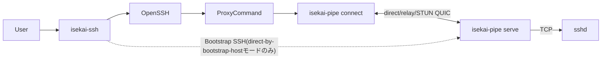

# isekai-ssh / isekai-pipe 設計書

**ステータス:** 実装済み(コア機能)。本書は2026-07-07時点の実装を反映する現行の設計書。
過去の検討過程は `archive/`(`chatgpt.md`・`ISEKAI_SSH_DESIGN.md`・`HELPER_PROTOCOL.md`・
`ISEKAI_PIPE_MIGRATION.md`)を参照。

## 1. 概要

多段NAT配下やprivate network内にあるSSHサーバーへ、多段SSHによるbootstrapを起点として
QUICのP2P経路(またはrelay経由)を構築し、その後のOpenSSH通信を再接続・再開可能な論理
バイトストリーム上で転送するシステム。`isekai-terminal`(Androidアプリ)が持つQUIC接続耐性
(ローミング・完全切断からのresume)を、Androidアプリに依存しない`ssh(1)`ラッパーとして
CLI環境でも使えるようにする。

主要コンポーネントは次の2つ。

| コンポーネント | 役割 |
| --- | --- |
| `isekai-ssh` | OpenSSHフロントエンド。`~/.ssh/config`解決、`#@isekai`設定解析、trust store管理、bootstrap、ConnectionIntent生成、OpenSSH起動を担当する |
| `isekai-pipe` | データプレーン。QUIC接続確立(direct/relay/STUN)・HELLO/proof/ACK・resume・stdio/TCP中継を担当する。`connect`(client)と`serve`(server)の両方を同一バイナリで提供する |

中核となる設計原則:

> **isekai-sshは接続の意図と信頼管理を担当し、isekai-pipeは実際の接続経路と通信状態を所有する。**

`isekai-ssh`はIPアドレスやUDP socketを所有しない。`isekai-pipe`はSSHプロトコルを解釈せず、
任意の双方向バイトストリームを扱う。

## 2. 用語

| 用語 | 意味 |
| --- | --- |
| logical host | ユーザーが指定する接続名。例: `production` |
| bootstrap candidate | remoteにSSHで到達し、`isekai-pipe serve`を配布・起動するための経路(host:port + 任意のvia jump chain) |
| service target | remote `serve`から見たTCP接続先。SSHなら通常`127.0.0.1:22` |
| candidate endpoint | STUN・relay等で実測・交換される短命な到達候補(`direct-by-bootstrap-host`/`server-reflexive`/`relayed`) |
| ConnectionIntent | `isekai-ssh`が生成し`isekai-pipe connect`に渡す短命な接続指示 |
| PersistentProfile | `~/.local/state/isekai/profiles/<host:port>.json`。信頼済みhelperのidentity・接続情報をキャッシュする現行の唯一のprofile store(§8 Epic Bで実配線済み、2026-07-08)。旧`known_helpers.toml`はもう読まれない |
| direct-by-bootstrap-host | bootstrap用SSH宛先を、そのままQUIC dial先のhost部分にも使う経路。Tailscale・LAN・既知direct hostでのみ成立する |

## 3. アーキテクチャ



## 4. isekai-ssh

### 4.1 呼び出し形式

**非サブコマンド呼び出し(wrapper mode、日常の接続)**:

```bash
isekai-ssh [ISEKAI_OPTIONS] [SSH_OPTIONS] destination [command [argument...]]
```

`wrapper.rs`が`ssh -G`で実効設定を解決し、`#@isekai`ディレクティブを読み、trust storeに
登録済みなら`ConnectionIntent`を作って実`ssh`を`ProxyCommand=isekai-pipe connect ...`付きで
起動する。wrapper自身はstdioを`Stdio::inherit()`で丸ごと`ssh`へ委譲するだけで一切加工しない。

固有オプション: `--isekai-bootstrap`/`--isekai-no-bootstrap`/`--isekai-direct`/
`--isekai-explain`/`--isekai-dry-run`/`--isekai-ssh-path`/`--isekai-pipe-path`/
`--isekai-helper-binary`(自動bootstrap用、後述)。

**サブコマンド呼び出し(対話的、trust store管理)**:

| コマンド | 対話性 | 役割 |
| --- | --- | --- |
| `isekai-ssh init <host>` | 対話的 | `isekai-bootstrap::OpenSshBackend`経由でremoteに`isekai-pipe`を配布・起動(`--relay`モード)し、確認後にtrust storeへ登録する |
| `isekai-ssh login` | 対話的(ブラウザ) | Device Authorization FlowでJWT取得 |
| `isekai-ssh logout` | 非対話 | ローカルtoken cache削除 |

過去にあった独立`connect`サブコマンド(自前QUIC relay実装)は削除済み。wrapper +
`isekai-pipe connect`が同じ役割を果たす。

### 4.2 `#@isekai` SSH config拡張

`~/.ssh/config`の`#@isekai <directive> <arguments...>`行(OpenSSHが`#`始まりの行として無視する)
に記述する。

```sshconfig
Host production
    HostName 10.20.0.15
    User deploy

    #@isekai bootstrap-candidate target=192.168.10.15:22 priority=120
    #@isekai bootstrap-candidate target=10.20.0.15:22 via=corp-bastion priority=100
    #@isekai link https://link.example.com
    #@isekai rendezvous https://rendezvous.example.com
    #@isekai stun stun1.example.com:3478
    #@isekai relay masque://relay.example.com
    #@isekai remote-path ~/.local/libexec/isekai/isekai-pipe
    #@isekai service ssh=127.0.0.1:22
    #@isekai resume-grace 120s
```

主なディレクティブ: `enabled`/`bootstrap-policy`(auto/always/never)/`bootstrap-candidate`/
`link`/`rendezvous`/`stun`/`relay`/`remote-path`/`service`/`profile`/`resume-grace`/
`candidate-race-delay`/`relay-delay`/`install-mode`。`bootstrap-candidate`/`link`/
`rendezvous`/`stun`/`relay`/`service`は複数指定で追記、それ以外は最初の値を採用(first-value-wins、
OpenSSHと同じ規則)。`Host`パターン(完全一致/`*`/`?`/否定/複数パターン)・`Include`(絶対/相対/`~`/
glob/循環検出)に対応。`Match`ブロック内の`#@isekai`は`ISEKAI_CONFIG_UNSUPPORTED_MATCH`で拒否する。

### 4.3 trust store(`known_helpers.toml`)

`~/.config/isekai-ssh/known_helpers.toml`(TOML)。キーは`host:port`に正規化(ポート省略時22、
ユーザー名は含めない)。

```toml
[helpers."myhost:22"]
identity_pubkey = "..."
trusted_helper_sha256 = "aaa..."
trusted_helper_version = "0.3.1"
update_policy = "exact-digest-only"
last_via = "bastion.example.com"
trusted_at = "2026-07-04T00:00:00Z"
last_seen_at = "2026-07-04T00:00:00Z"
cached_relay_addr = "203.0.113.10:45231"
cached_cert_sha256 = "3a7f..."
cached_session_secret = "MDEyMzQ1Njc4OTAxMjM0NTY3ODkwMTIzNDU2Nzg5MDE="
```

`update_policy`は閉じたenum(`ExactDigestOnly`のみ)で、serdeが未知のvariantをfail closedで
拒否する。署名検証(release signing key)は導入しない方針(恒久決定、§8 Epic D参照)。

**PersistentProfile migration path**(`isekai-pipe-core::profile`): `known_helpers.toml`から
chatgpt.md §13相当の新schema(`peer_id`/`link_endpoints`/`stun_servers`/`relay_endpoints`/
`candidates`ベース)への変換関数(`migrate_trust_store`)のみ実装済み。旧ファイルは据え置きで、
実際の読み書き経路(`wrapper.rs`/`isekai-pipe connect`)はまだ`known_helpers.toml`を直接使う。

### 4.4 自動bootstrap(direct-by-bootstrap-hostモードのみ)

wrapperは未登録ホストに対し、`--isekai-helper-binary <path>`が与えられていれば
**relay/STUNを使わない`direct-by-bootstrap-host`モードに限り**自動配布・登録できる
(`wrapper.rs::bootstrap_and_register`)。

1. 優先度最上位のbootstrap candidateへ、指定されたローカルバイナリを
   `isekai-bootstrap::OpenSshBackend::install_and_start`(`LaunchSpec::Direct`)経由でSSHアップロードする。
2. リモートで`isekai-pipe serve --target 127.0.0.1:22 --bind 0.0.0.0:0 --max-idle-lifetime <secs>`
   として起動し、handshake JSONを取得する。
3. `init`と同じ`[y/N]`確認(TOFU)を表示・確認後、trust storeへ登録する。
4. `build_connection_intent`を再試行して通常の接続フローへ進む。

**スコープ外(引き続き`isekai-ssh init`が必要)**:
- relay/STUN経由の自動bootstrap(JWT取得手段が未整備)。
- 複数hopの`--via`チェーン(単一hopのみ対応、複数hopは明示的にエラーにして`init`へ誘導)。

## 5. isekai-pipe

### 5.1 crate構成

```text
rust-core/
├── isekai-pipe-protocol/   # 純粋な値型(LogicalHost/ServiceName)
├── isekai-pipe-core/       # ConnectionIntent, ServiceSpec, trust store非依存のprofile migration
├── isekai-pipe/            # CLIバイナリ。connect/serve/probe/inspect
│   └── src/engine/         # serveエンジン本体(旧isekai-helper crate、下記5.4参照)
├── isekai-transport/       # QUIC接続確立(connect側)・relay/STUN到達性・resume
├── isekai-bootstrap/       # --via経由のremote配布・起動(OpenSshBackend)
├── isekai-trust/           # known_helpers.toml読み書き
├── isekai-auth/            # JWT取得・token cache
└── isekai-protocol/        # HELLO/proof/ACK, handshake JSON, resumeフレーム(pure crate)
```

`isekai-protocol`はtokio/quinn/russh/uniffiに一切依存しないpure crateで、`isekai-terminal-core`
(Android)・`isekai-pipe`双方が同じ型・検証関数を共有する。

### 5.2 CLI

```bash
isekai-pipe connect --profile production --service ssh --stdio    # local stdio side (ProxyCommand用)
isekai-pipe serve --service ssh=127.0.0.1:22 [--bind ...] [--relay ...]  # remote service side
isekai-pipe probe   # 段階別到達性確認(Epic J、実装済み)
isekai-pipe inspect # passiveな状態確認(Epic E、実装済み)
```

`serve`の`--target <addr>`は`--service ssh=<addr>`の互換alias。`--service`/`--target`の
どちらか一方は必須(旧isekai-helperのような暗黙の既定値`127.0.0.1:22`は無い)。

`connect`は`--profile`/`--service`が無い場合`ISEKAI_INTENT_ID`環境変数からConnectionIntentを
claimする(wrapperがProxyCommandに設定する経路)。`--mode relay|stun`(既定relay)で
NAT越え方式を選べる。

### 5.3 stdout/stderr契約

- `isekai-ssh` wrapper: `Stdio::inherit()`で`ssh`に丸ごと委譲するだけでstdoutを触らない。
  `--isekai-explain`/`--isekai-dry-run`・エラーは全てstderr。
- `isekai-pipe connect`: HELLO/proof/ACK成功後の`pump_h2c`/`relay_stdio`だけがstdoutに書き込む。
  失敗系(trust store未登録・secret不一致・relay到達不可)はstdoutに一切書かない。
- `isekai-pipe serve`: stdoutは起動handshake JSON1行のみ。ログは全てstderr。

テスト: `isekai-ssh/tests/wrapper_stdout_cleanliness.rs`、`isekai-pipe/tests/stdout_purity.rs`。

### 5.4 serveエンジン(旧isekai-helper crate)

`isekai-pipe serve`は独立したcrateへの委譲ではなく、`isekai-pipe/src/engine/`
(`mod.rs`/`resume.rs`/`plain_socket.rs`)としてisekai-pipe crate自身に統合済み。かつては
`isekai-helper`という独立crate/binaryだったが、Androidアプリの本番リモートブートストラップが
`include_bytes!`でこのバイナリを埋め込み配布していたため、統合にあたって以下も連動して変更した:

- リモートに配布・起動される実体は`isekai-pipe`(`isekai-pipe serve ...`として起動)。
- `isekai_protocol::bootstrap::HELPER_BIN_NAME`を`"isekai-pipe"`に変更
  (`isekai-bootstrap`・Android双方が共有する定数)。
- `isekai-bootstrap::openssh`(isekai-ssh側)・`rust-core/src/helper_bootstrap.rs`(Android側)の
  起動コマンドに`serve`サブコマンドを挿入。
- `rust-core/scripts/build-isekai-pipe-musl.sh`(旧`build-isekai-helper-musl.sh`)で
  x86_64/aarch64 musl静的バイナリをビルドし、`rust-core/src/isekai_pipe_quic_transport.rs`が
  `include_bytes!`でAndroidビルドに埋め込む。

**未検証**: コマンド文字列レベルのアサーション(`isekai-bootstrap/tests/openssh_e2e.rs`)では
`serve`/`--target`の挿入を確認済みだが、`HELPER_BOOTSTRAP_TEST_KEY`が必要な実SSH opt-in
テスト、および実機Androidでのリモートブートストラップ動作は未実施。

## 6. Wire protocol

### 6.1 ALPN / exporter label

- ALPN: `isekai-pipe/1`(バージョン付き。将来の破壊的変更は`/2`にする)
- exporter label: `isekai-pipe-auth-v1`

いずれも`isekai_protocol::hello`で一元定義。旧値(`isekai-helper/1`/`isekai-helper-auth-v1`)との
互換は無い(実利用者がほぼいない段階と判断し、直接変更)。

### 6.2 起動handshake(stdout、1行JSON)

単一スキーマ。各事実(identity・到達候補)は1箇所にしか存在しない。

```json
{"v":1,"session_secret":"...","protocol":{"name":"isekai-pipe","alpn":"isekai-pipe/1"},"peer":{"server_identity":{"kind":"quic-cert-sha256","cert_sha256":"..."}},"services":[{"name":"ssh","target":"127.0.0.1:22"}],"candidates":[{"kind":"direct-by-bootstrap-host","port":45231,"source":"bootstrap-ssh"},{"kind":"server-reflexive","endpoint":"203.0.113.5:45231","source":"stun"}]}
```

- `v`: フォーマットバージョン
- `session_secret`: 起動ごとにランダム生成する秘密(base64)。proof計算に使う
- `protocol`: `name`/`alpn`
- `peer.server_identity.cert_sha256`: QUIC証明書fingerprintの唯一の表現(client側はここで
  ピン留めする)
- `services`: 公開するservice policy(v1は単一service)
- `candidates`: 実行時の到達候補。`direct-by-bootstrap-host`(`port`のみ、常に1つ出力)・
  `server-reflexive`(STUN観測、`--stun-server`指定時のみ)・`relayed`(relay公開endpoint、
  `--relay`指定時のみ)

`HandshakeJson`(`isekai_protocol::handshake`)に`cert_sha256()`/`direct_by_bootstrap_host_port()`/
`stun_observed_addr()`/`relay_public_addr()`アクセサがあり、旧フラットフィールド
(`listen_port`/`cert_sha256`/`stun_observed_addr`/`relay_public_addr`をトップレベルに持つ形)は
廃止済み。

### 6.3 Stream / フレーム

1 QUIC connectionにつき2 stream(data stream + control stream)。

```text
data stream:    SSHの生バイト列(HELLO/ACK後はフレーミング無し)
control stream: APP_ACK / RESUME / RESUME_ACK専用(固定長フレーム)
```

HELLO(`0x01`) → proof検証・`--target`へのTCP接続確認 → ACK(`0x02`)。ACK後は生の双方向パイプ。
`RESUME`(`0x03`)で`session_id`+`resume_proof`+両方向offsetを送り、`RESUME_ACK`(`0x13`)で
再送範囲を確定する。詳細なフレームフォーマット・offset命名(`c2h_sent_offset`/
`c2h_helper_committed_offset`/`h2c_sent_offset`/`h2c_client_delivered_offset`)・
DoSガード(`--max-sessions`/`--resume-buffer-size`)は`archive/HELPER_PROTOCOL.md`§7・
`archive/ISEKAI_SSH_DESIGN.md`「resume を ProxyCommand の背後に隠す」節を参照
(ワイヤーフォーマット自体は変更していない)。

### 6.4 `ssh`自身の生存確認とのレース

resume windowより`ServerAliveInterval × ServerAliveCountMax`を十分長く設定する必要がある
(既定`--resume-window 120s`に対し推奨`ServerAliveInterval 30`×`ServerAliveCountMax 6`=180秒)。
resume window超過時は明示的にstdin/stdoutをクローズし、`std::process::exit()`で終了する
(`tokio::io::stdin()`のブロッキングスレッドがランタイムシャットダウン時にハングする問題への
対策、詳細は`archive/ISEKAI_SSH_DESIGN.md`参照)。

## 7. セキュリティ

- ConnectionIntent: 短命・one-shot・owner-only permission・atomic claim・利用後削除。
  secretはcommand lineへ載せない(環境変数にはopaque IDのみ)。
- Artifact配布: 一時fileへ転送・SHA-256検証・chmod・atomic rename。
- Resume proof: `session_id`+`client_identity`+`server_identity`+`offset`+`nonce`を認証対象に
  含める。`session_id`を知っているだけでresumeできてはならない。
- `relay_jwt`はargvではなくファイル経由(`--relay-jwt-file`)で渡す。`relay_sni`/`relay_jwt`は
  シェル補間前にシェルクォート+厳格な許容文字集合で検証する。
- helper identity keyとrelease signing keyは別概念。release signingは実装したうえで
  恒久的に不採用と判断し撤去した(§8 Epic D参照)。バイナリの完全性はダウンロード時の
  `.sha256`サイドカー照合と、`trusted_helper_sha256`(`update_policy = exact-digest-only`)
  による記憶だけで担保する。

## 8. 既知のギャップ・今後の課題

2026-07-08にバックログとして再編した。着手順を決める実装タスクとして、粒度(Epic/子タスク)・
性質(機能追加/データ移行/セキュリティ基盤/テスト基盤/Deferred ADR)を揃えている。
このセッションでは後方互換性(旧`known_helpers.toml`との共存・dual-read・migration猶予期間等)は
一切考慮しない前提で書き換えている。実装に着手する際は改めて後方互換要否を判断すること。

### 依存関係

```text
Epic A: BootstrapPlan共通基盤
        │
        ├──────────────┐
        ▼              ▼
Epic B: PersistentProfile   Epic D: リリース署名検証
   移行の実配線                  │(公開配布のRelease Gate)
        │
        ▼
Epic E: inspect
        │
        ├────────────────────┐
        ▼                    ▼
   (Epic A完了)          Epic F: login/token provider
        │                    │
        ├─────────┬──────────┘
        ▼         ▼
Epic G: STUN   Epic H: relay
  bootstrap      bootstrap
        │         │
        └────┬────┘
             ▼
      Epic I: wrapper自動bootstrap統合
             │
             ▼
      Epic K: multi-hop --via自動bootstrap

Epic C: 実OpenSSH E2Eハーネス は上記全Epicの受け入れ条件が依拠する共通基盤として並行して進める。
```

### Epic A: BootstrapPlan共通基盤(P0、Epic 1/2の前提)

route軸(direct / STUN / relay)とtopology軸(0-hop / 1-hop / multi-hop)を別々にロジック実装すると
組合せが爆発するため、先に共通のI/Oなし計画生成レイヤーを導入する。

```rust
struct BootstrapPlan {
    destination: BootstrapTarget,
    jump_chain: Vec<JumpHost>,
    route_policy: RoutePolicy,
    credential_source: CredentialSource,
    persistence_policy: PersistencePolicy,
}

enum BootstrapFailure {
    AuthenticationRequired,
    TokenExpired,
    HostKeyRejected,
    JumpHostUnreachable,
    RemoteBinaryMissing,
    RemoteBinaryUntrusted,
    CandidateExchangeFailed,
    StunUnreachable,
    RelayUnauthorized,
    RelayUnavailable,
    QuicHandshakeFailed,
    HelperIdentityMismatch,
    TargetUnreachable,
    PersistenceFailed,
}
```

- 文字列エラーではなく`BootstrapFailure`で分類し、retry可否・`login`/`init`への誘導・
  direct→relay fallbackを判定できるようにする。
- overall bootstrap deadlineと、SSH bootstrap / candidate gathering / direct attempt /
  relay fallbackそれぞれのbudgetを分離する(順番に試すと単純合算で著しく遅くなるため)。
- キャンセル・タイムアウト時に remote `isekai-pipe serve` プロセス・relay reservation・
  一時ファイルが残らないこと、未検証candidateをprofileに書かないことを受け入れ条件にする。
- profile migration・token refresh・known helper更新・helper binary install・relay
  reservationなど複数`isekai-ssh`プロセス間の競合が起き得る箇所は、共有接続の実装(Epic外/
  Deferred、下記ADR参照)を待たずに排他制御を入れる。

### Epic B: PersistentProfile移行の実配線(P0、Epic Iのハード依存)— 完了(2026-07-08)

- schema versionとmigration policyを確定する。→ `PersistentProfile`(schema_version 1)に
  `HelperTrust`が持っていた信頼メタデータ(`identity_pubkey`/`trusted_helper_sha256`/
  `update_policy`/`release_channel`/`last_via`/`last_seen_at`/`cached_stun_observed_addr`)を
  全て追加し、`migrate_legacy_helper_trust`変換がロスレスになるようにした。
- `wrapper.rs`(`build_connection_intent`/`bootstrap_and_register`)・`init.rs`・
  `isekai-pipe connect`の`intent_from_profile`の読み書きを`known_helpers.toml`から
  `PersistentProfile`(`~/.local/state/isekai/profiles/<host:port>.json`)へ一括で切り替えた
  (後方互換を気にしないため、dual-read期間・旧形式fallback・deprecation警告は設けていない。
  旧`known_helpers.toml`はもうどのコードパスからも読まれない)。
- atomic write(temp file + rename、`write_persistent_profile`)は既存実装のまま流用。
- 受け入れ条件のうち、migrationの冪等性・atomic write・secretの非保存は
  `isekai-pipe-core::profile`の既存実装/テストで担保。実SSH e2eテスト
  (`isekai-ssh/tests/init_e2e.rs`・`wrapper_auto_bootstrap_e2e.rs`・
  `isekai-pipe/tests/connect_stun_fallback_e2e.rs`・`stdout_purity.rs`)を
  `PersistentProfile`ベースのアサーションに書き換えて全て green を確認済み。
  複数プロセス同時起動時のlost update防止(ファイルロック)— `isekai-pipe-core::profile`に
  `update_persistent_profile(dir, key, F)`(flock(2)による`<key>.lock`単位の排他ロック→
  `load_persistent_profile`→`F`で新しい値を計算→`write_persistent_profile`)を追加、
  完了(2026-07-09)。ロックは`ProfileLock`(fdのdropで自動解放、プロセスクラッシュ時も
  リークしない)としてスコープし、無関係なprofile同士は互いをブロックしない。
  調査の結果、**現行の呼び出し元(`isekai-ssh init`/wrapper自動bootstrap)はどちらも
  既存profileを読んでから書くのではなく、handshake結果から毎回まっさらな
  `PersistentProfile`を組み立てて上書きする設計**であり、read-modify-writeを行っていない
  (`write_persistent_profile`自体もPID付き一時ファイル+atomic renameで元々ファイル破損は
  起きない)ため、今回はどちらもこの新関数への移行対象にしていない——
  `update_persistent_profile`は「profile migration・token refresh・known helper更新・
  helper binary install・relay reservation」といった将来のread-modify-write型更新のための
  インフラとして先に用意した(honest gap: 現時点でこの関数を実際に呼ぶライブコードパスは
  無い)。テスト: 生成/既存値の受け渡し/25並行スレッドでのカウンタ加算がロック無しでは
  失われるはずのlost updateを確実に防ぐことを検証する結合テストの3件。

### Epic C: 実OpenSSH E2Eハーネス(P0、共通テスト基盤)— bootstrap部分完了(2026-07-08)

- ✅ `rust-core/isekai-ssh/tests/real_sshd_bootstrap_e2e.rs`: 一時ホスト鍵・一時
  `sshd_config`で実`/usr/sbin/sshd`(root不要、非特権ユーザーとして起動)を立て、
  wrapper自動bootstrap(`LaunchSpec::Direct`、`init`の`--relay`経路と違いCA検証壁が無く
  実sshd向けに書ける)経由で**実際にビルド済みの`isekai-pipe`バイナリ**をbase64/SSH exec
  でアップロード・`setsid`でデタッチ実行・handshake捕捉・`PersistentProfile`登録まで
  検証する。アップロード済みバイナリのsha256をローカルの実バイナリと突き合わせて一致を
  確認済み。既存の`init_e2e.rs`/`wrapper_auto_bootstrap_e2e.rs`(in-process `russh` mock
  server + stand-inスクリプト)では検証できていなかった「実OpenSSHサーバーに対する実バイナリ
  配置」の穴を埋める。`sshd`が無い環境では自動的にskipする(他のopt-inテストと同じ規約)。
- 未完了として残っている点(honest gap、silent capにしない):
  - 接続断・resume・known host検証はこのharnessでは未実装。SSH層のresumeは
    `isekai-pipe/tests/serve_e2e.rs`がQUIC/attachプロトコル層で別途カバー済みだが、実sshdの
    SSHセッションを通した経路では未検証。「known host検証」はOpenSSH自身のhost key照合
    ではなく実質的にisekai-pipe側のcert pin検証(`BootstrapFailure::HelperIdentityMismatch`)
    を指すが、そちらの専用テストの有無は本Epicでは調査していない。
  - Linux network namespace/veth/tcを使ったtopology testは、`tests/netlab/`
    (リポジトリルート、rust-core外)に**root権限が必要な単一シナリオのbashスクリプト**
    (`direct_survives_loss_and_delay.sh`)としてすでに存在するが、Rustテストへの統合はして
    いない。このスクリプトは明示的に「isekai-sshのbootstrap-over-sshはスコープ外」と
    書いており、今回作った`real_sshd_bootstrap_e2e.rs`と役割は重複しない
    (前者はネットワーク耐性、後者はbootstrap配線の正しさ)。
  - **CI接続、完了(2026-07-09)**: `.github/workflows/rust-core-test-check.yml`を追加し、
    `push`(main)/`pull_request`(`rust-core/**`変更時、`noq-multipath-spike/**`のみの変更は
    除外)で`cargo test --workspace --exclude noq-multipath-spike`(`noq-multipath-spike`は
    実機検証用の使い捨てコード、CLAUDE.md参照)を実行するようにした。`openssh-server`を
    `apt-get install`することで`real_sshd_bootstrap_e2e.rs`/`real_sshd_multihop_bootstrap_e2e.rs`
    (Epic K)を含むopt-in E2Eテスト一式もGitHub-hosted `ubuntu-24.04`ランナーだけで完結する
    (root権限やnetwork namespaceが要る`tests/netlab/`シナリオのみ対象外、そちらは既存の
    `rust-core-netlab-check.yml`が別途カバー)。ローカルで`cargo test --workspace --exclude
    noq-multipath-spike`を実行し55件全testsuiteがgreenであることを確認済み(所要時間
    合計約200秒)。
- Epic G/H/I/Kが自身のE2Eを追加する際は、このharnessのパターン(実sshd、`#@isekai
  remote-path`で`$HOME`非依存に保つ)を再利用できる。
- staging環境(実STUN・実relay・異なるネットワーク・symmetric NAT相当・relay fallback・token
  expiry)とAndroid実機smoke test(モバイル回線/Wi-Fi切替、app background/foreground、helper
  install/start、reconnect/resume)は、環境依存のため本Epicとは別枠(P2、release checklist側)
  で扱う。

### Epic D: リリース成果物の署名検証 — 実装したうえで撤去、sha256のみを恒久方針とする(2026-07-09)

対象は`known_helpers.toml`ではなく、リモートbootstrapで配置する`isekai-pipe`等の**リリース
成果物**。当初はSHA-256のみでは、artifactとdigestを同じ配布元から取得している限り攻撃者が
両方を差し替えられるため不十分と考え、ed25519署名によるmanifest検証機構(`isekai-release-verify`
crate、`isekai-ssh init --helper-manifest`/`--trusted-release-key`/`--expect-platform`/
`--expect-architecture`、および`wrapper.rs`の自動bootstrap経路への同フラグの配線)を実装した
(`isekai-ssh`のunit test 41件・e2e 20本を含め全てgreenの状態まで完成させた)。

その後、この署名検証機構が実際に守る脅威モデルをユーザーと議論した結果、**この規模の
プロジェクトには過剰であり不要**と判断し、実装済みだった署名検証機構一式を完全に撤去した:

- GitHub Releaseからのダウンロード自体は既にHTTPS+GitHub自身のインフラで保護されている。
  ed25519署名を追加で載せても守れるのは「GitHub自体が侵害された」というケースだけで、
  個人規模のツールとしては非現実的な脅威モデルに対する防御になってしまう。
- 一方で「同じ配布元がartifactとdigestの両方を差し替えられる」という懸念自体は正しいため、
  sha256サイドカー照合(`isekai-ssh/src/helper_download.rs`)と、`init`/自動bootstrap時に
  アップロードした実体のsha256を`trusted_helper_sha256`として記憶しておく既存の仕組み
  (`update_policy = exact-digest-only`)は維持する。TOFU(`[y/N]`)確認も維持する
  (これは変更しない、ユーザー明示指示)。

撤去した内容: `rust-core/isekai-release-verify/`crate全体、`isekai-ssh`側の
`--helper-manifest`/`--trusted-release-key`/`--expect-platform`/`--expect-architecture`
(および`--isekai-`プレフィックス版)フラグと検証呼び出し(`init.rs`/`wrapper.rs`)、
関連テスト(`init.rs`内unit test 5件・`wrapper.rs`内unit test 2件・process-level e2e
`init_manifest_verification_e2e.rs`)、workspace `Cargo.toml`のmembers。

鍵の生成・保管・ローテーション方針やCI署名パイプラインは、上記の理由によりそもそも
不要と判断したため、今後も導入しない(「保留中」ではなく恒久決定)。

### Epic E: `isekai-pipe inspect`(P1)— 完了(2026-07-08)

passiveな状態確認のみ(通信は発生させない)。

- ✅ `isekai-pipe inspect --profile <name> [--json] [--redact] [--verbose]`を実装
  (`isekai-pipe/src/main.rs`)。`default_profiles_dir()`/`load_persistent_profile`で
  `PersistentProfile`を読むだけで、ソケットは一切開かない。
- 表示項目: profile schema version(+inspect自体の出力schema version)、helper identity
  (cert_sha256)、configured endpoints(件数は常時、実リストは`--verbose`時のみ)、
  前回選択経路(`last_path_hint`)、credentialの有無(`legacy_relay_transport`の有無、種別名の
  み)。**secret値(`session_secret_b64`)は`--redact`の有無に関わらず常に非表示**——設計時の
  想定「secret自体は非表示」の通り、redactの有無で切り替わるのはそれ以外の
  ネットワーク特定情報(endpointリスト・`last_via`・`cached_stun_observed_addr`・cert
  fingerprintの切り詰め)。
  - `cached candidates(origin/priority/validity)`は今回は表示していない: `PersistentProfile`
    のシリアライズ形式は`link_endpoints`等のフラットな`Vec<String>`のみを永続化しており、
    `isekai_pipe_core::candidate`側の`CandidateOrigin`/`CandidatePriority`/`CandidateValidity`
    はランタイム専用でPersistentProfileに永続化されていない(honest gap、今回のスコープでは
    捏造しない)。
- ✅ `--json`は`inspect_schema_version`フィールドを持つ(現在`1`)。
- テスト: `isekai-pipe/src/main.rs`内のunit test 12件(secretが`--redact`なしでも一切JSONに
  現れないことを含む)。`cargo build`した実バイナリに対して人手でhuman出力・`--verbose`・
  `--redact --verbose`・`--json`・profile未存在時(exit 69)の5パターンを実行し目視確認済み。

### Epic F: login/token provider基盤(P1、Epic H/Iの前提)— `init`への配線のみ完了(2026-07-09)

着手前の調査で判明: `isekai-ssh login`/`logout`・secure token cache(`isekai-auth::FileTokenProvider`、
`~/.config/isekai-ssh/token.json`、refresh処理、token source優先順位)は**このEpicに着手する前から
既に実装済み**だった(本ドキュメント作成時点でこの節が「未着手」と書いていたのは実態と
ずれていた)。したがって本Epicの実質的な残タスクは「既存の`FileTokenProvider`を実際の
bootstrap経路(`isekai-ssh init`のrelay launch)から呼び出せるようにする」ことだけだった。

codex CLIへの2回のセカンドオピニオン相談(1回目: F/G/Hの全体方針、2回目: 「relay自動bootstrapの
トリガーをどう設計するか」という着手中に浮上した未決点)を経て、次のスコープに絞った:

- ✅ `isekai-ssh init`に`--relay-jwt-from-login`フラグを追加。`--relay-jwt <TOKEN>`は
  `Option<String>`化し、`--relay-jwt`/`--relay-jwt-from-login`のどちらか一方を必須
  (clapの`required_unless_present`/`conflicts_with`で強制)。`--relay-jwt-from-login`指定時は
  `FileTokenProvider::from_default_path()?.get_relay_jwt()`(既存のrefresh処理込み)を呼び、
  トークンが無い/読み込み失敗時は`isekai-ssh login`実行を促すメッセージでfail closedする
  (CLIで`--relay-jwt-from-login`単体・両方指定・トークン未保存の3パターンを手動実行し確認済み)。
- `relay_jwt`のargv非経由(SSH execのstdin経由で渡す)は`isekai-bootstrap::openssh`側で元々
  実装済みだったため変更不要。
- テスト: `init.rs`内のunit test 4件(直接指定・login経由取得・トークン未保存時のエラー・
  両方未指定時のエラー)。
- **意図的に今回はやらないこと**: `wrapper.rs`の自動bootstrap(`bootstrap_and_register`)は
  依然として`LaunchSpec::Direct`のみで、relay launchを選択するトリガーが無い
  (`#@isekai relay`ディレクティブは接続後のfallback候補用でbootstrap時のlaunch指定とは
  形が違う——`SocketAddr`+SNIを持たない)。新しいbootstrap用ディレクティブ(例:
  `#@isekai bootstrap-relay <addr> <sni>`)を今Epic Hの設計を固める前に先走って追加しない、
  というのがcodexの推奨であり採用した判断。したがって「wrapperが自動でrelayを選ぶ」経路は
  Epic Hの課題として残っている。
- relay audience・`session_id`・短命化・単回nonce等のトークン自体のスコープ強化は、
  既存`FileTokenProvider`のスキーマ(`TokenSet`: access_token/refresh_token/expires_at/
  token_endpoint/client_id)を変更する話であり、今回は着手していない(将来の課題として残す)。

**テスト実装時に見つけた既存の不具合を合わせて修正**: `isekai-ssh`のunit testの一部
(`init.rs`/`wrapper.rs`)が process-global な`$HOME`環境変数を書き換える方式で、
`cargo test`のデフォルト並列実行下でスレッド間competitionを起こし得た(既存コードの
コメントで「既知のリスク」として言及されていたが、テストが1つしか無かったため
これまで顕在化していなかった)。今回`$HOME`を書き換えるテストが複数になったことで実際に
flakyな失敗が発生したため、`main.rs`に`#[cfg(test)] static HOME_ENV_LOCK: Mutex<()>`を追加し、
該当する4件のテスト全てがこれを取得してから`$HOME`を書き換えるように修正した(5回連続実行で
安定を確認)。

### Epic G: STUN自動bootstrap route追加(P1、Epic A依存)— 単一primary版で完了(2026-07-09)

着手前にF/G/Hの設計について外部ツール(codex CLI)へセカンドオピニオンを相談した。重要な訂正:
`isekai-auth`/`isekai-ssh login`/`logout`は調査時点で**既に実装済み**(`FileTokenProvider`、
`~/.config/isekai-ssh/token.json`、リフレッシュ対応、e2eテストあり)だった。Epic Fは実質
「既存のFileTokenProviderをbootstrap経路に配線するだけ」に縮小される(下記Epic F参照)。

STUN/direct/relayを1回の接続試行の中でcross-family racing/fallbackさせることは、
`ConnectionIntent`が今も「主transport1つ+同系統fallbackリスト」という形のままであるため
正直に表現できない(スキーマ変更かスケジューラ新設が要る)。したがって今回は
**cross-family racingをやらないスコープに縮小**した:

- ✅ `isekai-ssh/src/wrapper.rs`に`select_transport(profile, configured_stun_servers)`を追加。
  「`#@isekai stun`が1つ以上のSTUNサーバーに解決される」かつ「profileに
  `cached_stun_observed_addr`がある(=bootstrap時に実際にSTUN交換が成立した)」の**両方**が
  揃った場合のみ`IntentTransport::StunP2p`を選び、既存の`ConfigStunProvider`/
  `connect_stun_p2p_with_fallback`をそのまま再利用する。どちらか片方でも欠けていれば従来通り
  `legacy_relay_transport`由来の`IntentTransport::Relay`(direct-by-bootstrap-host)にfallback
  する。STUN選択後に接続が失敗した場合の「directへの再フォールバック」は今回のスコープ外
  (`I-route-scheduler`として後回し、下記Epic I参照)。
  STUN候補の収集自体(`--stun-server`経由のserver-reflexive candidate交換)は本Epic着手前から
  `isekai-bootstrap`層で既に動いていた(`init`/wrapper両方)——今回追加したのは「収集済みの
  候補を実際の接続試行に使う」選択ロジックのみ。
- テスト: `wrapper.rs`内のunit test 4件(STUN選択・evidence無しでのfallback・config無しでの
  fallback・`build_connection_intent`を通した統合テスト)。既存の
  `builds_connection_intent_from_persistent_profile`テストが無変更でpassし続けることも確認
  (`cached_stun_observed_addr`が無いprofileでは従来通りRelayが選ばれる回帰確認)。

### Epic H: relay自動bootstrap route追加(P1、Epic A・F依存)— 完了(2026-07-09)

codexへの3回目のセカンドオピニオン相談(directive設計の具体案を依頼)を経て実装。

- ✅ 新しいdirective `#@isekai bootstrap-relay addr=<SocketAddr> sni=<name>`を追加
  (`wrapper.rs`)。既存の`#@isekai relay <url>`(接続後fallback候補リスト、`SocketAddr`+SNIの
  対を持てない形)とは別名・別型(`BootstrapRelayTarget`)にした。`addr`/`sni`両方必須、
  不明キーは拒否、複数回指定時は既存の`set_once`パターン(他の単一値directiveと同じ、最初の
  指定が勝つ)を踏襲。
- ✅ トリガー条件はEpic Gの「single evidence-gated選択、racingなし」方針を踏襲する固定ルール:
  `bootstrap-relay`が存在すれば`bootstrap_and_register`は常に`LaunchSpec::Relay`を選び、
  `LaunchSpec::Direct`は一切試みない(存在しなければ従来通りDirect)。relay launchが失敗しても
  directへの自動フォールバックはしない(silent fallbackはoperatorの意図——relay到達性・
  露出制御に依存している可能性——を裏切るため、というcodexの判断を採用)。
  bootstrap-relay/bootstrap-policy/`--isekai-no-bootstrap`は独立: 後者2つは
  「auto-bootstrapするかどうか」、前者は「する場合どのlaunch modeか」を制御する。
  `#@isekai bootstrap-relay`自体が明示的なopt-inのため、別途の有効化フラグは設けていない。
  registration時のcached addressもlaunch modeで分岐: direct launchは
  `handshake.direct_by_bootstrap_host_port()`から、relay launchは
  `handshake.relay_public_addr()`(無ければ設定した`relay_addr`にfallback、`init.rs`と同じ
  ロジック)から作る。
- ✅ JWTソースは`isekai_auth::FileTokenProvider::from_default_path()?.get_relay_jwt()`を
  `bootstrap-relay`存在時に無条件で呼ぶ(wrapperには`init --relay-jwt-from-login`のような
  per-invocationフラグが無いため、これが唯一のソース)。トークン無し/読み込み失敗時は
  `init.rs`と同じ文言でfail closedする。`relay_jwt`のargv非経由は`isekai-bootstrap::openssh`側
  で元々担保済み(stdin経由)。
- テスト: `wrapper.rs`内のunit test(directive parsing 6件・directive統合1件)、実SSH e2eテスト
  `wrapper_auto_bootstrap_honors_bootstrap_relay_directive`(スタンドインスクリプトのargv捕捉で
  `--relay`/`--relay-sni`が実際にlaunchコマンドへ到達すること、relay_jwtの値がargvに一切
  現れないこと、登録されたprofileのcached addressが`relayed` candidateから来ていることを検証)。
  全既存テスト(unit 37件・e2e 14件)がgreenのまま。

### Epic I: wrapper自動bootstrap統合(P1、Epic B・G・H依存)— 完了、I-route-schedulerは順序付きfallbackのみ実装(2026-07-09)

codexの提案(2回目の相談)により、一括ゲートにせず`I-G`/`I-H`/`I-route-scheduler`に分割する
方針を採用した。

- ✅ `I-G`(wrapperがSTUN自動bootstrap結果を使う)・`I-H`(wrapperがrelay自動bootstrap結果を
  使う): Epic G・Epic Hそのものの実装として吸収済み(`select_transport`/
  `#@isekai bootstrap-relay`)。未登録ホストからの自動実行・profile保存は元々`bootstrap_and_
  register`にあった機能で変更なし。
- ✅ **BootstrapFailure分類の配線**: `isekai-ssh`に`isekai-bootstrap-plan`を依存追加し、
  `wrapper.rs`の`bootstrap_and_register`内の分類可能な失敗箇所(`install_and_start`失敗
  → `isekai-bootstrap-plan::classify_bootstrap_error`経由、helper binary未指定→
  `RemoteBinaryMissing`、relay JWT取得失敗→`TokenExpired`、trust確認declined→
  `HostKeyRejected`、profile書き込み失敗→`PersistenceFailed`)全てに`anyhow::Error::context
  (BootstrapFailure::...)`で分類を付与するようにした。`run()`側に`print_bootstrap_failure_
  guidance`を追加し、`bootstrap_and_register`失敗時に`err.downcast_ref::<BootstrapFailure>()`
  (`err.chain()`越しの`&dyn Error::downcast_ref`ではなく、anyhow独自vtableによる chain 全体を
  見る top-level downcast — 前者は`ContextError<C, E>`の具象型がちょうど`C`ではないため常に
  失敗する、実装中に一度踏んだ罠)で分類を取り出し、`should_redirect_to_login()`/
  `should_redirect_to_init()`/`may_retry()`に応じて`isekai-ssh login`/`isekai-ssh init`実行や
  再試行を促すメッセージをstderrに出す。`BootstrapError`(`isekai-bootstrap`)→
  `BootstrapFailure`の変換は`isekai-bootstrap-plan::classify_bootstrap_error`が担い、
  `InvalidRelayParam`/`InvalidRemotePath`(リモートに触れる前のローカル引数検証失敗)は
  honest gapとして`None`(未分類)のまま返す。テスト: `isekai-bootstrap-plan`側にunit test
  7件追加、`isekai-ssh`側に`bootstrap_and_register_classifies_missing_helper_binary`を追加。
  既存の unit 38件・e2e 18本は全てgreenのまま(回帰なし)。
- ✅ **`I-route-scheduler`、順序付きfallback(sequential)のみ完了、racingは引き続き未着手
  (2026-07-09)**: Epic G/Hの相談時点でcodexが明示的に先送りを推奨していたが、
  「cross-family ordered fallback/racing」のうち racing(同時並行)ではなく
  ordered fallback(順に試す)の側だけを、既存アーキテクチャを壊さない最小限のスキーマ拡張で
  実装した。
  - `ConnectionIntent`に`cross_family_fallback: Option<IntentTransport>`を追加
    (`#[serde(default, skip_serializing_if = "Option::is_none")]`、既存の`ConnectionIntent`
    JSONとの後方互換を保つ)。`transport`(primary)が完全に失敗した場合にのみ試す**別family**の
    単一の代替transport——`stun_servers`/`relay_endpoints`が担う「同じfamily内の複数候補」とは
    別物、かつracingはしない(1つのprimaryが完全に失敗するまで待ってから初めてfallbackを試す)。
  - `isekai-ssh/src/wrapper.rs::select_transport`の戻り値を`IntentTransport`から
    `(IntentTransport, Option<IntentTransport>)`に変更。STUN P2Pがprimaryとして選ばれた場合、
    (STUN evidenceが無ければそのまま選ばれていたはずの)`legacy_relay_transport`を捨てずに
    `cross_family_fallback`として温存する。Relayがprimaryの場合はfallback無し(`None`)——
    relay/directは既にデフォルト経路であり、evidence無しにSTUNへ後追いで切り替える理由が無い。
  - `isekai-pipe/src/main.rs::run_connect`に`recover_via_cross_family_fallback`を追加。
    STUN P2P経路(`ConnectRoute::StunWithFallback`の`run_stun_p2p_with_fallback`、および
    単一candidate経路の`CandidateRoute::StunP2p`の`connect_stun_p2p`)が失敗した場合のみ、
    `intent.cross_family_fallback`が`IntentTransport::Relay`を持っていれば`run_relay_resumable`
    で1回だけ再試行する(`cert_sha256_hex`は`intent.expected_server_identity`から取る——
    どのtransport variantで再接続してもリモートは同一helperなので、pinはintentレベルで
    共有される)。Relay側の経路にはfallback越しの再試行を追加していない(`cross_family_
    fallback`はEpic Gと同じ理由でSTUN→relay方向にしか今のところ生じないため)。
  - テスト: `recover_via_cross_family_fallback`のunit test 3件(成功時は素通り・fallback無しでは
    元エラーを伝播・fallback自体も失敗した場合は両方のエラーを含める)。実E2Eテスト
    `isekai-pipe/tests/connect_cross_family_fallback_e2e.rs`1件——`ISEKAI_INTENT_ID`経由で
    `cross_family_fallback`付きの`ConnectionIntent`を直接書き込み(wrapperが本番で行う
    hand-offを再現)、到達不能なSTUN server(dead port)を持つSTUN P2Pがprimaryとして必ず
    失敗し、実際に起動した`isekai-pipe serve`への relay fallback で実バイト往復が完了する
    ことを確認(2.5秒で完走)。`isekai-ssh`側にも`select_transport`/`build_connection_intent`の
    既存testを`(transport, fallback)`タプルに合わせて更新、新規assertion追加。
    既存の`isekai-pipe`(unit 86件・e2e 26本)・`isekai-ssh`(unit 41件・e2e 20本)は全てgreenのまま。
  - ❌ **racing(同時並行接続)は引き続き未着手のまま**: `ConnectionIntent::transport`は
    今も単一の値であり、複数transportを同時に試して先に成立した方を使う、という同時実行
    スケジューラは実装していない。今回追加した`cross_family_fallback`は「1つ失敗してから
    次を試す」逐次fallbackのみ。真のracingを実装するには`race.rs`(`race_direct_and_relay`)
    のような既存の同family内racing機構をcross-family化する、より大きな設計変更が要る
    (今回は着手していない、honest gap)。

**codexによるコードレビュー(2026-07-09、Epic A〜H実装一式に対して実施)で見つかったEpic間の
相互作用バグ2件を修正済み**:

1. `isekai-pipe/src/main.rs`の`run_connect`が`intent.relay_endpoints`の非空だけを見てrelay経路
   へ進んでおり、`intent.transport`を確認していなかった。STUN check側は元々`intent.transport`が
   `StunP2p`であることをgateしていたが、relay側だけこのgateが無かったため、`#@isekai stun`と
   `#@isekai relay`を両方設定したホストでは、Epic Gが`StunP2p`をprimaryに選んでいても
   `relay_endpoints`が非空というだけで黙ってrelay経路に上書きされていた。両分岐の判定を
   `choose_connect_route`という純粋関数に切り出し、`intent.transport`の一致を両方でgateする
   ように修正、回帰テスト3件を追加。
2. `isekai-pipe inspect --profile myhost`(ポート省略のエイリアス)が、`connect`/`init`/wrapper
   と違って`isekai_trust::normalize_host_port`を通さずに`load_persistent_profile`を呼んでおり、
   `myhost:22.json`ではなく存在しない`myhost.json`を探して"not found"になっていた。他コマンドと
   同じ正規化を追加、回帰テスト1件を追加。

**codexが指摘した点、対応済み(2026-07-09)**: `PersistentProfile`の`PERSISTENT_PROFILE_SCHEMA_
VERSION`を`1`から`2`へ上げた。ただしオンディスクの形状自体は変えていない——今回のEpic Bで
`identity_pubkey`等を必須フィールドとして追加した時点で、それを書くライブコードパスは
まだどこにも存在しなかった(調査済み、テストコード内のみ)ため、実際に書かれた`1`タグ付き
ファイルは全て今日の形状(`identity_pubkey`等を含む)しか存在しない。したがって`2`への
bumpは「既存の`1`タグ付きファイルを壊さないまま、将来の形状変更に備えて明確なバージョンを
用意しておく」ための純粋なラベル変更であり、`load_persistent_profile`側は意図的に
`schema_version`の値による拒否を一切行っていない(`1`を拒否すると、中身は正しいのに
タグが古いというだけの理由で既存の実profileを壊すことになるため)。

### Epic J: `isekai-pipe probe`(段階別到達性確認)— 完了(2026-07-09)

`inspect`と異なり実際に通信を発生させる。DNS解決→STUN discovery→relay認証→relay接続→QUIC
handshake→certificate pin→helper HELLO/ACK→target TCP到達性を段階ごとに表示し、「成功/失敗」の
二値ではなくどの段階まで成功したかを返す。

- ✅ `isekai-pipe probe --profile <name> [--stun-server <addr>] [--json]`を実装
  (`isekai-pipe/src/main.rs`)。`PersistentProfile`を読むだけで(`inspect`と同じ
  `normalize_host_port`→`load_persistent_profile`)、`intent_from_profile`のような
  `ISEKAI_INTENT_ID`経由の実行時ハンドオフは一切使わない——`--profile`から直接
  一時的な接続試行を組み立てる。
- 実装前に`connect_and_handshake`(`isekai-transport/src/relay.rs`)・`AttemptFailure`
  (`isekai-transport/src/attempt.rs`)を調査し、「DNS解決→STUN discovery→relay認証→
  relay接続→QUIC handshake→certificate pin→helper HELLO/ACK→target TCP到達性」の
  8段階のうち実際に個別観測可能なのはどこまでかを確認した:
  - **DNS解決**: このパイプラインには存在しない(`PersistentProfile`はhelper_addr/
    peer_addrを常に解決済み`SocketAddr`文字列として保持し、ホスト名DNS解決は一切
    発生しない)。`Skipped`として正直に報告し、no-opの成功を捏造しない。
  - **STUN discovery**: `isekai_stun::query_stun`を単体で呼び出し独立した段階として
    観測(profileに`cached_stun_observed_addr`があり`--stun-server`も指定された場合の
    み。`wrapper.rs::select_transport`のevidence-gatingを踏襲)。`connect_stun_p2p_with_
    fallback`が内部でも同じクエリを再度行うため厳密には冗長(STUNパケット2往復)だが、
    「観測できない内部ステップを捏造するより誠実に多少非効率な方を選ぶ」という判断。
  - **relay認証/relay接続/QUIC handshake/certificate pin/helper HELLO/ACK**: `isekai-
    transport`の`connect_and_handshake`が`pub(crate)`で1つの不透明な呼び出しにバンドル
    されており、公開APIとして個別に観測する手段がない。`connect_via_relay_resumable_
    with_fallback`/`connect_stun_p2p_with_fallback`(`_with_fallback`系のみ`AttemptFailure`
    分類を保持する)を1候補のみで呼び、返る`AttemptFailure`のvariantから単一の
    `handshake`段階として報告する(細分化を捏造しない)。
  - **target TCP到達性**: `AttemptFailure::DefinitiveRejectNotRetryable`は
    `AttachRejectReason::Target`からのみ生成される(`attempt.rs`の`From<ConnectAttemptError>`
    match全体を確認済み)ため、このvariantのみが「handshakeは成功したがremoteの
    target到達に失敗」を意味する——既存の公開APIだけで正確に表現できることを確認して
    実装した。成功時は`target_reachability`も`Ok`。
  - `SequentialConnectError`(relay resumable経路)には`SequentialStunConnectError`に
    無い3variant(`AttachedButControlStreamFailed`/`MustResumeButResumeFailed`/
    `GaveUpAfterGenerationRetries`)がある。特に`AttachedButControlStreamFailed`は
    「data streamのattach自体は成功(=target到達も成功)したが、その後のresumable
    control stream openだけ失敗」という状態のため、`handshake`は`Failed`・
    `target_reachability`は`Ok`という非対称な報告になる(handshake全体としては
    完了していないが、target到達の事実は既に判明している)。
  - `requested_resume_grace_secs: 0`で呼ぶ——probeは一回限りの診断であり、
    resumeセッションを維持する理由がない。成功した接続はresume loopを一切開始せず
    即座に`drop`する(サーバー側は通常の切断として扱いresume-parkingに入るだけで、
    リークにはならない)。
- テスト: `isekai-pipe/src/main.rs`内のunit test(`parse_probe`のCLI解析4件、
  `stage_from_attempt_failure`/`stage_from_relay_connect_error`の段階分類4件、
  `ProbeReport::fully_reachable`のロジック1件、JSON出力の tagged 形式1件)。
  実E2Eテスト`isekai-pipe/tests/probe_e2e.rs`2件: 実`isekai-pipe serve`プロセス+実TCP
  リスナーに対する`probe_reports_every_stage_ok_for_a_reachable_target`(全段階`ok`・
  exit 0を確認)、helperプロセスを落としてからの
  `probe_reports_a_failed_handshake_when_the_helper_is_gone`(`handshake: failed`・
  `target_reachability: not_attempted`・exit非0を確認)。既存の`isekai-pipe`テスト
  (unit 83件・e2e 25本)は全てgreenのまま。

### Epic K: 複数hop `--via`チェーンの自動bootstrap(P2、Epic A依存)— 完了(2026-07-09)

`isekai-ssh init`という既存の代替経路があるため優先度は下げてよいが、単純に「hopをループして
sshを実行する」実装は避ける。

- ✅ planner(2-a): `isekai-bootstrap-plan::BootstrapPlan::validate_jump_chain(destination,
  jump_chain)`として実装(`BootstrapPlan::new`もこれを呼ぶよう再実装、重複なし)。I/Oなしで
  hop正規化・循環検出・最大hop数判定を行う純粋関数で、「unsupported構成判定」はこの循環検出/
  最大hop数チェック自体が担う(それを超える追加の制約は見つからなかった——`relay_jwt`は
  経由hop数に関わらず常に最終destinationのstdin経由でのみ配送されるため、multi-hopと
  relay launchの組み合わせに新規の制約は生じない)。`isekai-ssh init`(`init.rs::parse_via_chain`)・
  wrapper自動bootstrap(`wrapper.rs::bootstrap_and_register`)の両方がこの1つの実装を共有する。
- ✅ executor(2-b): `isekai-bootstrap::openssh::join_via_chain`が`ssh(1)`ネイティブの
  `-J host1,host2,...`(カンマ区切り複数hop)を1回の`ssh(1)`呼び出しで組み立てる——中間ホスト上で
  さらに`ssh`を実行するnested-shell方式は使わない。`BootstrapBackend::install_and_start`の
  `via`引数を`Option<&JumpSpec>`(0or1hop)から`&[JumpSpec]`(0..N hop)へ変更し、
  `isekai-ssh init`/wrapper両方の`--via`/`bootstrap-candidate via=...`が複数hopを渡せるように
  なった(`InitArgs.via`は`Option<String>`から`Vec<String>`(`--via`複数指定)へ変更)。中間hopは
  `ssh(1)`のProxyJump機構自体が中継するだけで、bootstrap payload/credentialを一切解釈しない
  (`-J`の性質上、中間hopはTCP転送のみを行う)。テスト: `isekai-bootstrap`側に`join_via_chain`の
  unit test 3件、`isekai-bootstrap-plan`側に`validate_jump_chain`のunit test 3件、`isekai-ssh`側に
  `bootstrap_and_register_accepts_a_multi_hop_via_chain_and_rejects_a_looping_one`を追加。
  既存の`isekai-bootstrap`(unit 7+e2e 7)・`isekai-ssh`(unit 39+e2e 18)は全てgreenのまま。
- ✅ E2E: `isekai-ssh/tests/real_sshd_multihop_bootstrap_e2e.rs`。Epic Cの実`sshd`ハーネス
  (`real_sshd_bootstrap_e2e.rs`)を拡張し、`127.0.0.1`上の異なるポートで実`/usr/sbin/sshd`を
  2つ(bastion/target)起動、`ssh(1)`ネイティブの`-J`で繋いで実バイナリのアップロード・起動・
  `PersistentProfile`登録まで検証する。`via`は`#@isekai bootstrap-candidate ... via=...`
  ディレクティブではなく実際の`ProxyJump`(OpenSSH標準キーワード、shim `-F`設定の`Host`ブロック)
  から`ssh -G`経由で取れることを検証している(`wrapper.rs::defaults_bootstrap_candidate_from_ssh_g`
  の実route)。3回連続実行して安定を確認済み(各回45〜56秒)。

### Epic L: 初回接続と2回目以降を同じ`isekai-ssh <host>`一発で完結させる — 完了(2026-07-09)

ユーザーからの要望:「初回は`init`、2回目から`isekai-ssh`という使い分けを意識したくない。
1つのコマンドで初回も2回目も接続できるようにしたい」。調査の結果、これは2つの別々の
ギャップに分解できた:

1. **relay経由の自動bootstrapに必要なrelayアドレス+SNIをどこから得るか** — 実は追加コード
   不要で既に可能だった。`wrapper.rs::load_isekai_directives_from_file`は`ssh_config(5)`と
   同じ「複数の`Host`ブロックがマッチしたら先勝ち」というカスケード方式で`#@isekai`
   ディレクティブを収集しているため、`~/.ssh/config`の末尾に`Host *`ブロックで
   `#@isekai bootstrap-relay addr=... sni=...`を一度書いておけば、個別の`Host`ブロックが
   無い新規ホストに対しても「全ホスト共通のデフォルトrelay」として効く(個別ブロックが
   あればそちらが優先される)。この事実自体はEpic Hの実装時から存在していたが、
   ドキュメント化されていなかった(READMEにQuick Startとして追記)。
2. **ヘルパーバイナリ(`isekai-pipe`)の調達** — `--isekai-helper-binary <path>`を毎回手で
   渡さないと`no --isekai-helper-binary given`で即座に失敗していた。埋め込みバイナリは
   意図的に無い(`cli::InitArgs::helper_binary`のdoc comment参照: 全ての`cargo build -p
   isekai-ssh`がmuslアーティファクトを要求するようになる罠を避けるため)。

2番の解決策として、ユーザーの選択によりGitHub Releasesからの自動ダウンロード機構を
実装した。**このプロジェクトはまだGitHub Release配布を一切始めていない**ため、今回の
スコープはisekai-ssh側の自動ダウンロード機構の実装のみとし、実際にGitHub Releaseを
発行するCIワークフロー・実在するrelease assetの用意は対象外(honest gap、README
「既知の制限」に明記)。署名鍵の生成/保管は、Epic Dで実装したうえで恒久的に不要と
判断し撤去済みのため、そもそも対象外。

- ✅ **リモートアーキテクチャ検出**: `isekai-bootstrap::openssh::OpenSshBackend::
  detect_remote_arch(target, via)`を追加。`uname -m`を単独のssh(1)ラウンドトリップとして
  実行し、`"x86_64"`/`"aarch64"`(`"arm64"`もaarch64として受理)に正規化する
  (`rust-core/src/helper_bootstrap.rs`の`IsekaiPipeBinaries::select_for`、Android側の
  既存remote-bootstrap実装と同じarch分岐を踏襲)。`BootstrapError`に
  `RemoteCommandFailed`/`UnsupportedArch`を追加。
- ✅ **GitHub Releaseダウンロード+キャッシュ**: 新モジュール`isekai-ssh/src/helper_download.rs`。
  `isekai-auth::oauth`/`device_flow`と同じ`ureq`(blocking、`tokio::task::spawn_blocking`で
  包む)を使い、`{repo}/releases/latest/download/{asset}`(GitHubのredirectで実タグへ飛ぶ、
  API呼び出し・JSON parse不要)からダウンロードする。asset名規約は
  `isekai-pipe-<arch>-unknown-linux-musl`(`build-isekai-pipe-musl.sh`の出力アーキと対応)。
  `.sha256`サイドカー(存在すれば)で整合性検証(ベストエフォート、404は許容)。
  `$XDG_CACHE_HOME/isekai-ssh/helpers`(既定`~/.cache/isekai-ssh/helpers`)にatomic writeで
  キャッシュする。**鮮度チェック**(2026-07-09追加): pinned tag(`--helper-release-tag`指定時)は
  GitHub上のrelease assetが不変であるためキャッシュを無期限に信頼するが、`"latest"`
  (tag省略時)は`.last-checked`サイドカー(Unixタイムスタンプ)で最終チェック時刻を記録し、
  `DEFAULT_FRESHNESS_TTL_SECS`(既定24時間、`ISEKAI_SSH_HELPER_CACHE_TTL_SECS`で上書き可)を
  超えたら再ダウンロードして内容を比較する(バイト列が同じならキャッシュファイル自体は
  書き換えず`.last-checked`だけ更新)。再チェック中にネットワークが不通の場合はエラーにせず
  既存のキャッシュへ警告ログ付きでフォールバックする(`CLAUDE.md`の日和見的フォールバック
  設計に合わせた判断 — オフライン環境でも一度キャッシュ済みなら動き続けるべきため)。
- ✅ **`init.rs`/`wrapper.rs`への配線**: `InitArgs::helper_binary`を`PathBuf`(必須)から
  `Option<PathBuf>`に緩和。`--helper-binary`/`--isekai-helper-binary`省略時、
  `helper_download::resolve_helper_binary`が`detect_remote_arch`→
  `ensure_helper_binary_cached`の順で解決を試み、失敗時は既存の明示的エラーメッセージ
  (`--helper-binary`を渡すか`isekai-ssh init`を実行するよう促す)にフォールバックする。
  明示指定時はアーキ検出・ダウンロードを一切スキップし、既存ユーザーの挙動・性能に
  影響を与えない。`--helper-release-repo`/`--helper-release-tag`(init)・
  `--isekai-helper-release-repo`/`--isekai-helper-release-tag`(wrapper)を追加
  (既定`cuzic/isekai-terminal`/latest)。整合性検証はダウンロード時の`.sha256`サイドカー
  照合のみ(Epic D参照、署名検証は導入しない)。
- ✅ テスト: `isekai-bootstrap`に`normalize_uname_arch`のunit test + 実sshd越しの
  `detect_remote_arch`統合test。`helper_download`にURL構築/キャッシュパス計算の純粋関数
  unit testと、ローカルmock HTTPサーバー(このcrateの既存mock STUN serverと同じ
  「最小限を手書きする」慣習)に対する実ダウンロードe2eテスト(ダウンロード成功・
  キャッシュ再利用・sha256不一致拒否・サイドカー欠如の許容・404失敗)。
  **エンドツーエンド受け入れテスト**`isekai-ssh/tests/wrapper_auto_download_relay_bootstrap_e2e.rs`:
  実sshd(mock) + mock HTTPサーバーを組み合わせ、`~/.ssh/config`に`Host *` +
  `#@isekai bootstrap-relay`だけを置いた状態で`--isekai-helper-binary`を一切渡さず
  `isekai-ssh <新規ホスト>`を実行し、アーキ検出→ダウンロード→relay bootstrap→
  `PersistentProfile`登録まで完走することを確認(ユーザーが求めていた体験そのものの証明、
  3.4秒で完走・3回連続実行で安定確認済み)。デバッグ中に発見したハマりどころ: 新しく
  duplicateしたmock sshdサーバー実装で`channel_eof`ハンドラのコピーを一度忘れ、
  アップロードのstdin書き込み後にEOFがリモートの`base64 -d`まで伝播せず無期限ハング
  した(既存の`wrapper_auto_bootstrap_e2e.rs`にはこのハンドラが実装済みだったが、
  duplicateする際に見落とした)。
  既存の`isekai-bootstrap`(unit 10+e2e 8)・`isekai-ssh`(unit 54+e2e 20)は全てgreenのまま。

### ADR: 複数isekai-sshプロセスによるisekai-pipe共有(マルチプレクス) — 実装しない(Deferred)

検討の結果、SSH ControlMaster/ControlPersist(CLI)・SSH接続プーリング(Android)という
SSHプロトコル層での代替手段の方がシンプルだと判明したため、独自QUIC broker(常駐broker・
ローカルIPC・process lifecycle・crash recovery・session isolation・per-session flow
control・multiplex protocol・broker upgrade・stale session cleanupが必要)は実装しない。
詳細案は`archive/ISEKAI_SSH_DESIGN.md`「複数isekai-sshプロセスによるisekai-pipe共有」節に
記録として保持。Android側のSSH接続プーリング（プールキー・ライフサイクル・障害分離方針）の
詳細設計は`archive/ISEKAI_SSH_DESIGN.md`「2026-07-07: 上記オープンな課題の調査・設計確定」節で
確定済み。`TransportPreference::PLAIN_SSH`に加え、isekai-pipe QUICファミリー（`ISEKAI_PIPE_QUIC`/
`AUTO`/`ISEKAI_PIPE_QUIC_MULTIPATH`/`ISEKAI_STUN_P2P_QUIC`/`ISEKAI_LINK_RELAY_QUIC`）も対象
（「1 QUIC connection = 1 data stream」制約によりQUIC接続とネストしたSSH認証が実質1つの
プールエントリに収束するため）。`TSSHD_QUIC`も同様にDeferred。

**再検討条件**(いずれかを満たした場合のみ新しいEpicとして起票する):

- ControlMasterが使えないクライアントが主要用途になった。
- QUIC handshake・relay確立コストが支配的になった。
- 多数セッションによるrelay費用が問題になった。
- Android側プールとCLI側の共通brokerが必要になった。
- 「1 connection = 1 stream」制約を廃止するprotocol revisionを行う。

### Epic M: リモート発 control-plane(タブごとの title/clipboard 同期)— 実装中(P3、独立)

**実装状況(2026-07-10)**:
- ✅ ワイヤーフォーマット: `isekai-protocol::ctl`(`CtlMessage`/`ClipboardMime`、サイズcap込み)。
- ✅ `isekai-pipe ctl title|clip push|clip pull`(UNIX domain socket経由でCtlMessageを
  送受信するCLI本体、`$ISEKAI_CTL_SOCK`/`--sock`で接続先解決)。
- ⬜ `isekai-ssh`ラッパー側のper-tab UDS forward(`-R`/`ssh -O forward`)の配線・
  `ISEKAI_CTL_SOCK`環境変数の付与。
- ⬜ stale UNIX domain socketのlazy sweep GC。
- ⬜ isekai-terminal本体アプリ(Android/iOS)側のUniFFI配線・push/pullのopt-in設定・
  Android`ClipData`(画像は`FileProvider`経由)実装。

**動機**: リモートの対話シェルが出す OSC 0/2(タイトル変更)・OSC 52(クリップボード)は、
tmux配下だと既定でtmuxに横取りされ、外側のターミナル(Windows Terminalの`ssh`+`isekai-ssh`
経路・isekai-terminal本体アプリのどちらでも)に届かない。`set-titles`/`set-titles-string`の
tmux.conf設定で直る範囲もあるが、それに頼らずリモートから明示的に「このタブのタイトルを
変える」「クリップボードにこれを書く」と伝えられる経路を用意する。

**満たすべき制約(検討の過程で判明したもの)**:

1. **リモート側の宛先識別**は解ける: 同一ホストへの複数タブがあっても、各タブに紐づく
   対話シェルの`tty`(`pid`はコマンドのたびに変わるため補助情報止まり)を使えば区別できる。
2. **ローカル側の宛先識別は isekai-transport(QUIC接続)の上に乗せると解けない**:
   同一ホストへの複数タブは、CLI側は`ssh(1)`のControlMaster/ControlPersist、Android側は
   接続プーリングによって1本の接続に収束しうる(上記ADR参照、「1 QUIC connection = 1
   data stream」制約)。isekai-transportはこの共有された1本の下で動く複数タブを区別する
   手段を持たない。
3. **isekai-ssh(外部sshのProxyCommand)はControlMaster配下では2本目以降のタブに対して
   一切起動されない**。ControlPathのローカルソケット経由でOpenSSHクライアント内部だけで
   閉じるため、isekai-ssh側にフックする余地がない。

このため、**識別の粒度を isekai-transport ではなく SSH の port forward(リクエストごとに
スコープが閉じる、OpenSSH自身が面倒を見る層)に置く**設計にする。ControlMaster配下でも
`ssh -O forward`によるforward追加はクライアントの個別リクエストとして扱われるため、
「自前QUIC broker」(上記ADRで見送った方向)を作らずに両立できる。

**設計**:

- タブ(=`isekai-ssh <hostname>`の1回の起動)ごとに、一意なリモートパスを持つ
  **UNIX domain socket**を`-R`でローカルへ転送する(`-R <remote-sock>:<local-sock>`)。
  TCPポートは使わない(ネットワーク待受を一切増やしたくない、というのが今回の前提)。
  - リモート側パス: `~/.cache/isekai-pipe/ctl/<uuid>.sock`のような、対象ユーザーの
    ホームの下(モード0700ディレクトリ)。`/tmp`のようなworld-writableな場所は避ける
    (同一ホスト上の他ユーザーによるsocket先取り・シンボリックリンク攻撃を避けるため)。
  - ローカル側パス: `isekai-ssh`ラッパー自身が生成・listenする一意なUNIX domain socket
    (例 `$XDG_RUNTIME_DIR/isekai-ssh/ctl/<uuid>.sock`)。
  - master接続を新規に張る場合はそのProxyCommand起動列の中で、既存masterに相乗りする
    場合は`ssh -O forward -R ...`で、どちらの場合も**タブ側の`isekai-ssh`ラッパーが毎回
    自分で forward を要求する**(isekai-ssh本体がProxyCommandとして起動されない2本目
    以降のタブでも、ラッパー自体は`ssh`本体とは別に必ず起動されるため、ここは常に
    フックできる)。
  - 対応するローカルUNIX domain socketは、タブの`isekai-ssh`ラッパープロセスが
    セッションの生存期間中ずっとlistenし続ける(タブの数だけlistenする、という前提を
    採用——数十タブ程度ならUNIX domain socketのlisten自体はほぼコスト無し)。
  - タブが閉じたら`ssh -O cancel -R ...`でforwardを解除し、ローカルsocketも削除する。
- リモートの対話シェルには`ISEKAI_CTL_SOCK=<remote-sock>`を環境変数として渡す
  (`SetEnv`/`SendEnv`か、実行コマンド前置きのexport)。リモート側で動く小さなCLIが
  これを読んで接続先を決める。
- **新しいバイナリは作らない**: `isekai-pipe`(既にmusl staticでリモートに配布・起動
  されている実体、§5.4参照)へ`ctl`サブコマンドを追加する
  (`isekai-pipe ctl title "<text>"` / `isekai-pipe ctl clip push --mime <mime>` /
  `isekai-pipe ctl clip pull`)。ユーザーは
  シェルの`PROMPT_COMMAND`やスクリプトから明示的に呼ぶ(自動検知はできないため、
  この呼び出し自体がOSC 0/2/52の代わりになる)。
- **ワイヤーフォーマット**: `isekai-protocol`に`ctl`モジュールを新設し、
  `HandshakeJson`と同じ流儀(serde、明示的フィールドのみ)で1行JSONを定義する。

  ```rust
  enum ClipboardMime { TextPlain, TextHtml, ImagePng }

  enum CtlMessage {
      SetTitle { value: String },
      // host → device(リモートからデバイスのクリップボードに書く)
      ClipboardPush { mime: ClipboardMime, data_b64: String },
      // device → host(リモートがデバイスのクリップボードを要求する/その応答)
      ClipboardPullRequest {},
      ClipboardPullResponse { mime: ClipboardMime, data_b64: String },
  }
  ```

  `isekai-terminal-core`(Android/iOS)・`isekai-pipe`双方が同じ型を共有できるようにする
  (§5.1の`isekai-protocol`がtokio/quinn/russh非依存のpure crateである方針を踏襲)。
  `ClipboardPullRequest`/`Response`は同じUDS接続の中で往復する(1接続1回のリクエスト/
  レスポンスで完結させ、長時間張りっぱなしのセッションにはしない)。`data_b64`には
  `HandshakeJson`と同様に上限(暫定案: text/htmlは64KiB、imageは4MiBなど)を設け、
  リモート側の壊れた/悪意あるCLIが際限なく巨大なペイロードを送る事故を防ぐ
  (`MAX_HANDSHAKE_JSON_LEN`と同じ「生成的なcapを1箇所に置く」パターン)。
- **クリップボードは双方向・opt-in**(2026-07-10改訂: 当初はhost→deviceのwrite-onlyのみで
  合意していたが、pull方向も対象にする)。`push`(host→device書き込み)と`pull`
  (device→hostへの読み出し)はリスクの性質が違う(pushはクリップボードハイジャック——
  悪意あるリモートが仕込んだコマンドをユーザーが気づかず貼り付けて実行してしまう懸念、
  pullはデバイス側クリップボードの機密情報(パスワード等)がリモートへ流出する懸念)ため、
  **push/pullを別々にopt-inできるようにする**(どちらもデフォルトOFF)。
  - `text/plain`・`text/html`・`image/png`の3種のMIMEに対応する。
  - Android側の実装注記: `ClipData`はテキスト(`newPlainText`)・HTML
    (`newHtmlText`)はそのまま値を持てるが、画像は生バイト列を直接持てないため、
    アプリのキャッシュディレクトリに一時ファイルとして書き出し`FileProvider`経由の
    `content://` URIを`ClipData.newUri`で渡す実装になる(`newRawUri`ではなく
    パーミッション付与が必要な`content://`を使う)。この一時ファイルも下記GCの対象に
    含める。
- **isekai-terminal本体アプリ(Android/iOS)側は素直**: 自前のSSHクライアント(russh)と
  UI両方を管理下に置いているため、forwardのトリックは不要。タブごとの`SessionOrchestrator`
  が直接この`CtlMessage`をUniFFI経由でUIコールバックへ渡せばよい。むしろ既存の
  `terminal.rs:376 osc_dispatch`(OSC 0/2パース)がある通り、tmux側で`set-titles`/
  `allow-passthrough`が効いている環境では標準のOSC経路がそのまま動くので、この
  control-plane機構は「tmuxに握りつぶされたときのフォールバック」という位置づけになる。
- **既知の制限**: 別のSSH接続時に開始・attachされたtmuxセッション(reconnect跨ぎ)では
  `$ISEKAI_CTL_SOCK`が古いforwardを指したまま残る。`isekai-pipe ctl`はこの場合エラーに
  せずstderrにログを出すだけで黙って失敗する(新しいペイン/ウィンドウでは正しいsocketに
  差し替わるため、[[multipath-opportunistic-policy]]と同じ「使えない環境では黙って
  フォールバックする」方針に合わせる)。
- **stale UNIX domain socketのGC**: セッションが異常切断(クラッシュ・`kill -9`・
  ネットワーク瞬断など、正常な`ssh -O cancel`+unlinkのパスを通らない終了)した場合、
  socketファイルが残留しうる。常駐監視プロセスは置かず、**次に同種のsocketを作る
  タイミングでのlazy sweep**だけで対処する:
  - ディレクトリ内の既存`*.sock`それぞれに非blockingで`connect()`を試みる。
    `ECONNREFUSED`(listenしているプロセスがいない、いわゆる「見捨てられた」socket)なら
    即`unlink`して良い。接続が確立できてしまう場合はまだ使用中なので触らない
    (新規UUID採番なので通常は衝突しない——この判定は主に「本当に見捨てられているか」の
    確認用)。
  - `connect()`だけでは判断がつかないケースへのフォールバックとして、mtimeが一定期間
    (仮案: 24時間、Epic Lの`DEFAULT_FRESHNESS_TTL_SECS`/
    `ISEKAI_SSH_HELPER_CACHE_TTL_SECS`と同じ命名・上書き手段の慣習を踏襲)を超えている
    ものも掃除対象にする。
  - ローカル側(`$XDG_RUNTIME_DIR/isekai-ssh/ctl/`)はディレクトリ自体がログアウト/
    再起動でtmpfsごと消える(XDG仕様通りの寿命)ため、長時間ログインしっぱなしの
    セッションでクラッシュが積み重なるケースだけがlazy sweepの実質的な対象になる。
  - リモート側(`~/.cache/isekai-pipe/ctl/`)の実際のsocket bind自体は`-R`のstreamlocal
    forwardを持つ`sshd`が管理しており、正常なchannel/接続終了時は`sshd`自身が
    unlinkする(こちらが管理する必要はない)。異常終了時に残ったファイルは、次回
    `isekai-pipe serve`起動(bootstrap)のタイミングで同じlazy sweepを行う。
  - Android側のクリップボード画像用一時ファイル(上記`FileProvider`経路)も同じ
    lazy sweep(アプリ起動時 or 新しい画像を書き出す直前に、古い一時ファイルを掃除)の
    対象に含める。
- **セキュリティ**: ローカル/リモートどちらのsocketもディレクトリ・socket自体を
  ユーザー専用パーミッション(0700/0600)にする。`isekai-pipe ctl`が受け付ける操作は
  `title`/`clip_push`/`clip_pull`のみに限定した固定ホワイトリストとし、任意コマンド実行の
  ような汎用RPCにはしない(同一SSH接続内のトラスト境界を前提にしても、対応するsocketに
  書き込めれば誰でもタイトル/クリップボードを書き換えられる、という副作用は残るため)。
  `clip_push`(クリップボードハイジャックの踏み台になりうる)・`clip_pull`
  (デバイス側の機密情報流出になりうる)は別々の設定でopt-inさせ、両方無効が既定値とする。

**この設計で解決すること**: ControlMasterでの接続共有(CLI)・接続プーリング(Android)の
どちらとも両立する。識別はisekai-transport/QUICの層ではなく、OpenSSH自身が管理する
port forwardのリクエストスコープに委ねているため、「共有された1本の接続の上に何本の
タブが乗っていても」正しく宛先を解決できる。
