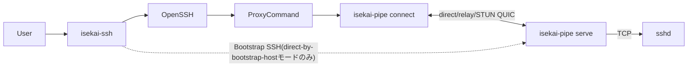

# isekai-ssh / isekai-pipe 設計書

**ステータス:** 実装済み(コア機能)。本書は2026-07-07時点の実装を反映する現行の設計書。
過去の検討過程は `archive/`(`chatgpt.md`・`ISEKAI_SSH_DESIGN.md`・`HELPER_PROTOCOL.md`・
`ISEKAI_PIPE_MIGRATION.md`)を参照。

## 1. 概要

多段NAT配下やprivate network内にあるSSHサーバーへ、多段SSHによるbootstrapを起点として
QUICのP2P経路(またはrelay経由)を構築し、その後のOpenSSH通信を再接続・再開可能な論理
バイトストリーム上で転送するシステム。`isekai-terminal`(Androidアプリ)が持つQUIC接続耐性
(ローミング・完全切断からのresume)を、Androidアプリに依存しない`ssh(1)`ラッパーとして
CLI環境でも使えるようにする。

主要コンポーネントは次の2つ。

| コンポーネント | 役割 |
| --- | --- |
| `isekai-ssh` | OpenSSHフロントエンド。`~/.ssh/config`解決、`#@isekai`設定解析、trust store管理、bootstrap、ConnectionIntent生成、OpenSSH起動を担当する |
| `isekai-pipe` | データプレーン。QUIC接続確立(direct/relay/STUN)・HELLO/proof/ACK・resume・stdio/TCP中継を担当する。`connect`(client)と`serve`(server)の両方を同一バイナリで提供する |

中核となる設計原則:

> **isekai-sshは接続の意図と信頼管理を担当し、isekai-pipeは実際の接続経路と通信状態を所有する。**

`isekai-ssh`はIPアドレスやUDP socketを所有しない。`isekai-pipe`はSSHプロトコルを解釈せず、
任意の双方向バイトストリームを扱う。

## 2. 用語

| 用語 | 意味 |
| --- | --- |
| logical host | ユーザーが指定する接続名。例: `production` |
| bootstrap candidate | remoteにSSHで到達し、`isekai-pipe serve`を配布・起動するための経路(host:port + 任意のvia jump chain) |
| service target | remote `serve`から見たTCP接続先。SSHなら通常`127.0.0.1:22` |
| candidate endpoint | STUN・relay等で実測・交換される短命な到達候補(`direct-by-bootstrap-host`/`server-reflexive`/`relayed`) |
| ConnectionIntent | `isekai-ssh`が生成し`isekai-pipe connect`に渡す短命な接続指示 |
| PersistentProfile | `~/.local/state/isekai/profiles/<host:port>.json`。信頼済みhelperのidentity・接続情報をキャッシュする現行の唯一のprofile store(§8 Epic Bで実配線済み、2026-07-08)。旧`known_helpers.toml`はもう読まれない |
| direct-by-bootstrap-host | bootstrap用SSH宛先を、そのままQUIC dial先のhost部分にも使う経路。Tailscale・LAN・既知direct hostでのみ成立する |

## 3. アーキテクチャ



## 4. isekai-ssh

### 4.1 呼び出し形式

**非サブコマンド呼び出し(wrapper mode、日常の接続)**:

```bash
isekai-ssh [ISEKAI_OPTIONS] [SSH_OPTIONS] destination [command [argument...]]
```

`wrapper.rs`が`ssh -G`で実効設定を解決し、`#@isekai`ディレクティブを読み、trust storeに
登録済みなら`ConnectionIntent`を作って実`ssh`を`ProxyCommand=isekai-pipe connect ...`付きで
起動する。wrapper自身はstdioを`Stdio::inherit()`で丸ごと`ssh`へ委譲するだけで一切加工しない。

固有オプション: `--isekai-bootstrap`/`--isekai-no-bootstrap`/`--isekai-direct`/
`--isekai-explain`/`--isekai-dry-run`/`--isekai-ssh-path`/`--isekai-pipe-path`/
`--isekai-helper-binary`(自動bootstrap用、後述)。

**サブコマンド呼び出し(対話的、trust store管理)**:

| コマンド | 対話性 | 役割 |
| --- | --- | --- |
| `isekai-ssh init <host>` | 対話的 | `isekai-bootstrap::OpenSshBackend`経由でremoteに`isekai-pipe`を配布・起動(`--relay`モード)し、確認後にtrust storeへ登録する |
| `isekai-ssh login` | 対話的(ブラウザ) | Device Authorization FlowでJWT取得 |
| `isekai-ssh logout` | 非対話 | ローカルtoken cache削除 |

過去にあった独立`connect`サブコマンド(自前QUIC relay実装)は削除済み。wrapper +
`isekai-pipe connect`が同じ役割を果たす。

### 4.2 `#@isekai` SSH config拡張

`~/.ssh/config`の`#@isekai <directive> <arguments...>`行(OpenSSHが`#`始まりの行として無視する)
に記述する。

```sshconfig
Host production
    HostName 10.20.0.15
    User deploy

    #@isekai bootstrap-candidate target=192.168.10.15:22 priority=120
    #@isekai bootstrap-candidate target=10.20.0.15:22 via=corp-bastion priority=100
    #@isekai link https://link.example.com
    #@isekai rendezvous https://rendezvous.example.com
    #@isekai stun stun1.example.com:3478
    #@isekai relay masque://relay.example.com
    #@isekai remote-path ~/.local/libexec/isekai/isekai-pipe
    #@isekai service ssh=127.0.0.1:22
    #@isekai resume-grace 120s
```

主なディレクティブ: `enabled`/`bootstrap-policy`(auto/always/never)/`bootstrap-candidate`/
`link`/`rendezvous`/`stun`/`relay`/`remote-path`/`service`/`profile`/`resume-grace`/
`candidate-race-delay`/`relay-delay`/`install-mode`。`bootstrap-candidate`/`link`/
`rendezvous`/`stun`/`relay`/`service`は複数指定で追記、それ以外は最初の値を採用(first-value-wins、
OpenSSHと同じ規則)。`Host`パターン(完全一致/`*`/`?`/否定/複数パターン)・`Include`(絶対/相対/`~`/
glob/循環検出)に対応。`Match`ブロック内の`#@isekai`は`ISEKAI_CONFIG_UNSUPPORTED_MATCH`で拒否する。

### 4.3 trust store(`known_helpers.toml`)

`~/.config/isekai-ssh/known_helpers.toml`(TOML)。キーは`host:port`に正規化(ポート省略時22、
ユーザー名は含めない)。

```toml
[helpers."myhost:22"]
identity_pubkey = "..."
trusted_helper_sha256 = "aaa..."
trusted_helper_version = "0.3.1"
update_policy = "exact-digest-only"
last_via = "bastion.example.com"
trusted_at = "2026-07-04T00:00:00Z"
last_seen_at = "2026-07-04T00:00:00Z"
cached_relay_addr = "203.0.113.10:45231"
cached_cert_sha256 = "3a7f..."
cached_session_secret = "MDEyMzQ1Njc4OTAxMjM0NTY3ODkwMTIzNDU2Nzg5MDE="
```

`update_policy`は閉じたenum(`ExactDigestOnly`のみ)で、serdeが未知のvariantをfail closedで
拒否する。署名検証(release signing key)は未実装。

**PersistentProfile migration path**(`isekai-pipe-core::profile`): `known_helpers.toml`から
chatgpt.md §13相当の新schema(`peer_id`/`link_endpoints`/`stun_servers`/`relay_endpoints`/
`candidates`ベース)への変換関数(`migrate_trust_store`)のみ実装済み。旧ファイルは据え置きで、
実際の読み書き経路(`wrapper.rs`/`isekai-pipe connect`)はまだ`known_helpers.toml`を直接使う。

### 4.4 自動bootstrap(direct-by-bootstrap-hostモードのみ)

wrapperは未登録ホストに対し、`--isekai-helper-binary <path>`が与えられていれば
**relay/STUNを使わない`direct-by-bootstrap-host`モードに限り**自動配布・登録できる
(`wrapper.rs::bootstrap_and_register`)。

1. 優先度最上位のbootstrap candidateへ、指定されたローカルバイナリを
   `isekai-bootstrap::OpenSshBackend::install_and_start`(`LaunchSpec::Direct`)経由でSSHアップロードする。
2. リモートで`isekai-pipe serve --target 127.0.0.1:22 --bind 0.0.0.0:0 --max-idle-lifetime <secs>`
   として起動し、handshake JSONを取得する。
3. `init`と同じ`[y/N]`確認(TOFU)を表示・確認後、trust storeへ登録する。
4. `build_connection_intent`を再試行して通常の接続フローへ進む。

**スコープ外(引き続き`isekai-ssh init`が必要)**:
- relay/STUN経由の自動bootstrap(JWT取得手段が未整備)。
- 複数hopの`--via`チェーン(単一hopのみ対応、複数hopは明示的にエラーにして`init`へ誘導)。

## 5. isekai-pipe

### 5.1 crate構成

```text
rust-core/
├── isekai-pipe-protocol/   # 純粋な値型(LogicalHost/ServiceName)
├── isekai-pipe-core/       # ConnectionIntent, ServiceSpec, trust store非依存のprofile migration
├── isekai-pipe/            # CLIバイナリ。connect/serve/probe/inspect
│   └── src/engine/         # serveエンジン本体(旧isekai-helper crate、下記5.4参照)
├── isekai-transport/       # QUIC接続確立(connect側)・relay/STUN到達性・resume
├── isekai-bootstrap/       # --via経由のremote配布・起動(OpenSshBackend)
├── isekai-trust/           # known_helpers.toml読み書き
├── isekai-auth/            # JWT取得・token cache
└── isekai-protocol/        # HELLO/proof/ACK, handshake JSON, resumeフレーム(pure crate)
```

`isekai-protocol`はtokio/quinn/russh/uniffiに一切依存しないpure crateで、`isekai-terminal-core`
(Android)・`isekai-pipe`双方が同じ型・検証関数を共有する。

### 5.2 CLI

```bash
isekai-pipe connect --profile production --service ssh --stdio    # local stdio side (ProxyCommand用)
isekai-pipe serve --service ssh=127.0.0.1:22 [--bind ...] [--relay ...]  # remote service side
isekai-pipe probe   # 未実装(skeleton)
isekai-pipe inspect # 未実装(skeleton)
```

`serve`の`--target <addr>`は`--service ssh=<addr>`の互換alias。`--service`/`--target`の
どちらか一方は必須(旧isekai-helperのような暗黙の既定値`127.0.0.1:22`は無い)。

`connect`は`--profile`/`--service`が無い場合`ISEKAI_INTENT_ID`環境変数からConnectionIntentを
claimする(wrapperがProxyCommandに設定する経路)。`--mode relay|stun`(既定relay)で
NAT越え方式を選べる。

### 5.3 stdout/stderr契約

- `isekai-ssh` wrapper: `Stdio::inherit()`で`ssh`に丸ごと委譲するだけでstdoutを触らない。
  `--isekai-explain`/`--isekai-dry-run`・エラーは全てstderr。
- `isekai-pipe connect`: HELLO/proof/ACK成功後の`pump_h2c`/`relay_stdio`だけがstdoutに書き込む。
  失敗系(trust store未登録・secret不一致・relay到達不可)はstdoutに一切書かない。
- `isekai-pipe serve`: stdoutは起動handshake JSON1行のみ。ログは全てstderr。

テスト: `isekai-ssh/tests/wrapper_stdout_cleanliness.rs`、`isekai-pipe/tests/stdout_purity.rs`。

### 5.4 serveエンジン(旧isekai-helper crate)

`isekai-pipe serve`は独立したcrateへの委譲ではなく、`isekai-pipe/src/engine/`
(`mod.rs`/`resume.rs`/`plain_socket.rs`)としてisekai-pipe crate自身に統合済み。かつては
`isekai-helper`という独立crate/binaryだったが、Androidアプリの本番リモートブートストラップが
`include_bytes!`でこのバイナリを埋め込み配布していたため、統合にあたって以下も連動して変更した:

- リモートに配布・起動される実体は`isekai-pipe`(`isekai-pipe serve ...`として起動)。
- `isekai_protocol::bootstrap::HELPER_BIN_NAME`を`"isekai-pipe"`に変更
  (`isekai-bootstrap`・Android双方が共有する定数)。
- `isekai-bootstrap::openssh`(isekai-ssh側)・`rust-core/src/helper_bootstrap.rs`(Android側)の
  起動コマンドに`serve`サブコマンドを挿入。
- `rust-core/scripts/build-isekai-pipe-musl.sh`(旧`build-isekai-helper-musl.sh`)で
  x86_64/aarch64 musl静的バイナリをビルドし、`rust-core/src/isekai_pipe_quic_transport.rs`が
  `include_bytes!`でAndroidビルドに埋め込む。

**未検証**: コマンド文字列レベルのアサーション(`isekai-bootstrap/tests/openssh_e2e.rs`)では
`serve`/`--target`の挿入を確認済みだが、`HELPER_BOOTSTRAP_TEST_KEY`が必要な実SSH opt-in
テスト、および実機Androidでのリモートブートストラップ動作は未実施。

## 6. Wire protocol

### 6.1 ALPN / exporter label

- ALPN: `isekai-pipe/1`(バージョン付き。将来の破壊的変更は`/2`にする)
- exporter label: `isekai-pipe-auth-v1`

いずれも`isekai_protocol::hello`で一元定義。旧値(`isekai-helper/1`/`isekai-helper-auth-v1`)との
互換は無い(実利用者がほぼいない段階と判断し、直接変更)。

### 6.2 起動handshake(stdout、1行JSON)

単一スキーマ。各事実(identity・到達候補)は1箇所にしか存在しない。

```json
{"v":1,"session_secret":"...","protocol":{"name":"isekai-pipe","alpn":"isekai-pipe/1"},"peer":{"server_identity":{"kind":"quic-cert-sha256","cert_sha256":"..."}},"services":[{"name":"ssh","target":"127.0.0.1:22"}],"candidates":[{"kind":"direct-by-bootstrap-host","port":45231,"source":"bootstrap-ssh"},{"kind":"server-reflexive","endpoint":"203.0.113.5:45231","source":"stun"}]}
```

- `v`: フォーマットバージョン
- `session_secret`: 起動ごとにランダム生成する秘密(base64)。proof計算に使う
- `protocol`: `name`/`alpn`
- `peer.server_identity.cert_sha256`: QUIC証明書fingerprintの唯一の表現(client側はここで
  ピン留めする)
- `services`: 公開するservice policy(v1は単一service)
- `candidates`: 実行時の到達候補。`direct-by-bootstrap-host`(`port`のみ、常に1つ出力)・
  `server-reflexive`(STUN観測、`--stun-server`指定時のみ)・`relayed`(relay公開endpoint、
  `--relay`指定時のみ)

`HandshakeJson`(`isekai_protocol::handshake`)に`cert_sha256()`/`direct_by_bootstrap_host_port()`/
`stun_observed_addr()`/`relay_public_addr()`アクセサがあり、旧フラットフィールド
(`listen_port`/`cert_sha256`/`stun_observed_addr`/`relay_public_addr`をトップレベルに持つ形)は
廃止済み。

### 6.3 Stream / フレーム

1 QUIC connectionにつき2 stream(data stream + control stream)。

```text
data stream:    SSHの生バイト列(HELLO/ACK後はフレーミング無し)
control stream: APP_ACK / RESUME / RESUME_ACK専用(固定長フレーム)
```

HELLO(`0x01`) → proof検証・`--target`へのTCP接続確認 → ACK(`0x02`)。ACK後は生の双方向パイプ。
`RESUME`(`0x03`)で`session_id`+`resume_proof`+両方向offsetを送り、`RESUME_ACK`(`0x13`)で
再送範囲を確定する。詳細なフレームフォーマット・offset命名(`c2h_sent_offset`/
`c2h_helper_committed_offset`/`h2c_sent_offset`/`h2c_client_delivered_offset`)・
DoSガード(`--max-sessions`/`--resume-buffer-size`)は`archive/HELPER_PROTOCOL.md`§7・
`archive/ISEKAI_SSH_DESIGN.md`「resume を ProxyCommand の背後に隠す」節を参照
(ワイヤーフォーマット自体は変更していない)。

### 6.4 `ssh`自身の生存確認とのレース

resume windowより`ServerAliveInterval × ServerAliveCountMax`を十分長く設定する必要がある
(既定`--resume-window 120s`に対し推奨`ServerAliveInterval 30`×`ServerAliveCountMax 6`=180秒)。
resume window超過時は明示的にstdin/stdoutをクローズし、`std::process::exit()`で終了する
(`tokio::io::stdin()`のブロッキングスレッドがランタイムシャットダウン時にハングする問題への
対策、詳細は`archive/ISEKAI_SSH_DESIGN.md`参照)。

## 7. セキュリティ

- ConnectionIntent: 短命・one-shot・owner-only permission・atomic claim・利用後削除。
  secretはcommand lineへ載せない(環境変数にはopaque IDのみ)。
- Artifact配布: 一時fileへ転送・SHA-256検証・chmod・atomic rename。
- Resume proof: `session_id`+`client_identity`+`server_identity`+`offset`+`nonce`を認証対象に
  含める。`session_id`を知っているだけでresumeできてはならない。
- `relay_jwt`はargvではなくファイル経由(`--relay-jwt-file`)で渡す。`relay_sni`/`relay_jwt`は
  シェル補間前にシェルクォート+厳格な許容文字集合で検証する。
- helper identity keyとrelease signing keyは別概念。`isekai-ssh init --helper-manifest`で
  ed25519署名付きmanifestのopt-in検証ができる(`isekai-release-verify`crate、§8 Epic D)が、
  実際の署名鍵の発行・埋め込みはまだ無い(検証機構のみ)。`update_policy`は`exact-digest-only`
  のみで、いずれの検証結果も自動更新可否の判断には未接続。

## 8. 既知のギャップ・今後の課題

2026-07-08にバックログとして再編した。着手順を決める実装タスクとして、粒度(Epic/子タスク)・
性質(機能追加/データ移行/セキュリティ基盤/テスト基盤/Deferred ADR)を揃えている。
このセッションでは後方互換性(旧`known_helpers.toml`との共存・dual-read・migration猶予期間等)は
一切考慮しない前提で書き換えている。実装に着手する際は改めて後方互換要否を判断すること。

### 依存関係

```text
Epic A: BootstrapPlan共通基盤
        │
        ├──────────────┐
        ▼              ▼
Epic B: PersistentProfile   Epic D: リリース署名検証
   移行の実配線                  │(公開配布のRelease Gate)
        │
        ▼
Epic E: inspect
        │
        ├────────────────────┐
        ▼                    ▼
   (Epic A完了)          Epic F: login/token provider
        │                    │
        ├─────────┬──────────┘
        ▼         ▼
Epic G: STUN   Epic H: relay
  bootstrap      bootstrap
        │         │
        └────┬────┘
             ▼
      Epic I: wrapper自動bootstrap統合
             │
             ▼
      Epic K: multi-hop --via自動bootstrap

Epic C: 実OpenSSH E2Eハーネス は上記全Epicの受け入れ条件が依拠する共通基盤として並行して進める。
```

### Epic A: BootstrapPlan共通基盤(P0、Epic 1/2の前提)

route軸(direct / STUN / relay)とtopology軸(0-hop / 1-hop / multi-hop)を別々にロジック実装すると
組合せが爆発するため、先に共通のI/Oなし計画生成レイヤーを導入する。

```rust
struct BootstrapPlan {
    destination: BootstrapTarget,
    jump_chain: Vec<JumpHost>,
    route_policy: RoutePolicy,
    credential_source: CredentialSource,
    persistence_policy: PersistencePolicy,
}

enum BootstrapFailure {
    AuthenticationRequired,
    TokenExpired,
    HostKeyRejected,
    JumpHostUnreachable,
    RemoteBinaryMissing,
    RemoteBinaryUntrusted,
    CandidateExchangeFailed,
    StunUnreachable,
    RelayUnauthorized,
    RelayUnavailable,
    QuicHandshakeFailed,
    HelperIdentityMismatch,
    TargetUnreachable,
    PersistenceFailed,
}
```

- 文字列エラーではなく`BootstrapFailure`で分類し、retry可否・`login`/`init`への誘導・
  direct→relay fallbackを判定できるようにする。
- overall bootstrap deadlineと、SSH bootstrap / candidate gathering / direct attempt /
  relay fallbackそれぞれのbudgetを分離する(順番に試すと単純合算で著しく遅くなるため)。
- キャンセル・タイムアウト時に remote `isekai-pipe serve` プロセス・relay reservation・
  一時ファイルが残らないこと、未検証candidateをprofileに書かないことを受け入れ条件にする。
- profile migration・token refresh・known helper更新・helper binary install・relay
  reservationなど複数`isekai-ssh`プロセス間の競合が起き得る箇所は、共有接続の実装(Epic外/
  Deferred、下記ADR参照)を待たずに排他制御を入れる。

### Epic B: PersistentProfile移行の実配線(P0、Epic Iのハード依存)— 完了(2026-07-08)

- schema versionとmigration policyを確定する。→ `PersistentProfile`(schema_version 1)に
  `HelperTrust`が持っていた信頼メタデータ(`identity_pubkey`/`trusted_helper_sha256`/
  `update_policy`/`release_channel`/`last_via`/`last_seen_at`/`cached_stun_observed_addr`)を
  全て追加し、`migrate_legacy_helper_trust`変換がロスレスになるようにした。
- `wrapper.rs`(`build_connection_intent`/`bootstrap_and_register`)・`init.rs`・
  `isekai-pipe connect`の`intent_from_profile`の読み書きを`known_helpers.toml`から
  `PersistentProfile`(`~/.local/state/isekai/profiles/<host:port>.json`)へ一括で切り替えた
  (後方互換を気にしないため、dual-read期間・旧形式fallback・deprecation警告は設けていない。
  旧`known_helpers.toml`はもうどのコードパスからも読まれない)。
- atomic write(temp file + rename、`write_persistent_profile`)は既存実装のまま流用。
- 受け入れ条件のうち、migrationの冪等性・atomic write・secretの非保存は
  `isekai-pipe-core::profile`の既存実装/テストで担保。実SSH e2eテスト
  (`isekai-ssh/tests/init_e2e.rs`・`wrapper_auto_bootstrap_e2e.rs`・
  `isekai-pipe/tests/connect_stun_fallback_e2e.rs`・`stdout_purity.rs`)を
  `PersistentProfile`ベースのアサーションに書き換えて全て green を確認済み。
  複数プロセス同時起動時のlost update防止(ファイルロック)は未着手のまま残っている。

### Epic C: 実OpenSSH E2Eハーネス(P0、共通テスト基盤)— bootstrap部分完了(2026-07-08)

- ✅ `rust-core/isekai-ssh/tests/real_sshd_bootstrap_e2e.rs`: 一時ホスト鍵・一時
  `sshd_config`で実`/usr/sbin/sshd`(root不要、非特権ユーザーとして起動)を立て、
  wrapper自動bootstrap(`LaunchSpec::Direct`、`init`の`--relay`経路と違いCA検証壁が無く
  実sshd向けに書ける)経由で**実際にビルド済みの`isekai-pipe`バイナリ**をbase64/SSH exec
  でアップロード・`setsid`でデタッチ実行・handshake捕捉・`PersistentProfile`登録まで
  検証する。アップロード済みバイナリのsha256をローカルの実バイナリと突き合わせて一致を
  確認済み。既存の`init_e2e.rs`/`wrapper_auto_bootstrap_e2e.rs`(in-process `russh` mock
  server + stand-inスクリプト)では検証できていなかった「実OpenSSHサーバーに対する実バイナリ
  配置」の穴を埋める。`sshd`が無い環境では自動的にskipする(他のopt-inテストと同じ規約)。
- 未完了として残っている点(honest gap、silent capにしない):
  - 接続断・resume・known host検証はこのharnessでは未実装。SSH層のresumeは
    `isekai-pipe/tests/serve_e2e.rs`がQUIC/attachプロトコル層で別途カバー済みだが、実sshdの
    SSHセッションを通した経路では未検証。「known host検証」はOpenSSH自身のhost key照合
    ではなく実質的にisekai-pipe側のcert pin検証(`BootstrapFailure::HelperIdentityMismatch`)
    を指すが、そちらの専用テストの有無は本Epicでは調査していない。
  - Linux network namespace/veth/tcを使ったtopology testは、`tests/netlab/`
    (リポジトリルート、rust-core外)に**root権限が必要な単一シナリオのbashスクリプト**
    (`direct_survives_loss_and_delay.sh`)としてすでに存在するが、Rustテストへの統合はして
    いない。このスクリプトは明示的に「isekai-sshのbootstrap-over-sshはスコープ外」と
    書いており、今回作った`real_sshd_bootstrap_e2e.rs`と役割は重複しない
    (前者はネットワーク耐性、後者はbootstrap配線の正しさ)。
  - **CI未接続**: 調査の結果、このリポジトリには現時点で`cargo test`をrust-core全体に対して
    実行するCIワークフローが一つも存在しない(`.github/workflows/*.yml`はすべてビルド検証
    (musl/xcframework/アプリビルド)のみで、Rustテストスイートの自動実行は無い。
    `rust-core-netlab-check.yml`のみ`workflow_dispatch`専用のPoC)。したがって
    `real_sshd_bootstrap_e2e.rs`を含むすべてのcargo testは引き続き手動実行が前提であり、
    「CI実行可能」ではあるが「CI実行されている」わけではない。rust-core全体のcargo testを
    CIに接続するかどうかは本Epicの範囲を超える別判断として残す。
- Epic G/H/I/Kが自身のE2Eを追加する際は、このharnessのパターン(実sshd、`#@isekai
  remote-path`で`$HOME`非依存に保つ)を再利用できる。
- staging環境(実STUN・実relay・異なるネットワーク・symmetric NAT相当・relay fallback・token
  expiry)とAndroid実機smoke test(モバイル回線/Wi-Fi切替、app background/foreground、helper
  install/start、reconnect/resume)は、環境依存のため本Epicとは別枠(P2、release checklist側)
  で扱う。

### Epic D: リリース成果物の署名検証(公開配布のRelease Gate)— manifest検証機構のみ完了(2026-07-08)

対象は`known_helpers.toml`ではなく、リモートbootstrapで配置する`isekai-pipe`等の**リリース
成果物**。SHA-256のみでは、artifactとdigestを同じ配布元から取得している限り攻撃者が両方を
差し替えられるため不十分。

着手前に調査した結果、**現時点でGitHub Releaseによる配布自体が一切存在しない**
(`isekai-ssh/README.md`「まだGitHub Releaseとして配布していないので、現状はソースから
ビルドする」)ことが判明した。したがって「配布元が改ざんされたバイナリを自動ダウンロードする」
という本来のRelease Gateの脅威モデルは今は成立しないが、「ユーザーが手元でGitHub Releaseから
ダウンロードした(と思っている)バイナリを`init --helper-binary`に渡す」ケースは今でも現実の
脅威(配布ページの改ざん・MITM)であり、そちらを守る検証機構だけを先に実装した。**鍵の実際の
生成・保管・ローテーション方針の確定とCI署名パイプラインの構築は、実際にGitHub Releaseの配布を
開始するタイミングまで意図的に保留している**(このセッションでの判断、ユーザー確認済み)。

- ✅ 新規crate`rust-core/isekai-release-verify/`: `ReleaseManifest`
  (version/platform/architecture/artifact_filename/size/sha256/protocol_compat/
  release_channel/key_id)と、その正規化JSONバイト列に対するed25519署名を持つ`SignedManifest`。
  `TrustedReleaseKeys`(key_id→公開鍵のレジストリ、鍵の実際の出所には無関係)と
  `verify_artifact`(signature検証→platform/architecture一致→size一致→SHA-256一致の順で検証し、
  署名を検証する前にmanifestの中身を一切信用しない設計)を実装。I/Oフリー・17ユニットテスト。
- ✅ `isekai-ssh init`に`--helper-manifest <path>`/`--trusted-release-key <key_id=hexpubkey>`
  (複数指定可)/`--expect-platform`/`--expect-architecture`をopt-inフラグとして追加。
  `--helper-manifest`を指定した場合のみ検証が走り、失敗時はSSH接続を一切行わずに終了する
  (デプロイ前に検証が完了するため、実sshdもモックサーバーも不要にテストできる)。指定しない
  場合は既存の挙動と完全に同じ(デフォルトoff)。
- ✅ テスト: `isekai-ssh/src/init.rs`内のunit test 5件(正常系・改ざんバイナリ・信頼鍵なし・
  expect-platform未指定・署名者と異なる鍵を信頼している場合)と、実バイナリを起動してCLI配線を
  検証するprocess-level e2eテスト`isekai-ssh/tests/init_manifest_verification_e2e.rs`2件。
- 未着手として意図的に残している点:
  - offline release signing keyの実際の生成・保管方式、key ID運用、鍵ローテーション・
    emergency revocation方針の確定。
  - `wrapper.rs`の自動bootstrap経路(`bootstrap_and_register`)への同フラグの追加(`init`のみ
    に配線済み。自動bootstrapへの拡張はEpic Iと合わせて検討する)。
  - CI側でのrelease signing・manifest生成・鍵ローテーションtestは、実際にGitHub Releaseでの
    配布を開始するまで意味を持たないため保留。
  - 「一時ファイルのままinstallせず既存バイナリを維持する」という受け入れ条件は、今回配線した
    `init`が対象にしている**ローカルの`--helper-binary`**に対する検証であり、リモート側への
    アップロード・install自体の話ではないため該当しない(将来、実際のダウンロード→install
    パイプラインができた時点で改めて検討する)。

### Epic E: `isekai-pipe inspect`(P1)— 完了(2026-07-08)

passiveな状態確認のみ(通信は発生させない)。

- ✅ `isekai-pipe inspect --profile <name> [--json] [--redact] [--verbose]`を実装
  (`isekai-pipe/src/main.rs`)。`default_profiles_dir()`/`load_persistent_profile`で
  `PersistentProfile`を読むだけで、ソケットは一切開かない。
- 表示項目: profile schema version(+inspect自体の出力schema version)、helper identity
  (cert_sha256)、configured endpoints(件数は常時、実リストは`--verbose`時のみ)、
  前回選択経路(`last_path_hint`)、credentialの有無(`legacy_relay_transport`の有無、種別名の
  み)。**secret値(`session_secret_b64`)は`--redact`の有無に関わらず常に非表示**——設計時の
  想定「secret自体は非表示」の通り、redactの有無で切り替わるのはそれ以外の
  ネットワーク特定情報(endpointリスト・`last_via`・`cached_stun_observed_addr`・cert
  fingerprintの切り詰め)。
  - `cached candidates(origin/priority/validity)`は今回は表示していない: `PersistentProfile`
    のシリアライズ形式は`link_endpoints`等のフラットな`Vec<String>`のみを永続化しており、
    `isekai_pipe_core::candidate`側の`CandidateOrigin`/`CandidatePriority`/`CandidateValidity`
    はランタイム専用でPersistentProfileに永続化されていない(honest gap、今回のスコープでは
    捏造しない)。
- ✅ `--json`は`inspect_schema_version`フィールドを持つ(現在`1`)。
- テスト: `isekai-pipe/src/main.rs`内のunit test 12件(secretが`--redact`なしでも一切JSONに
  現れないことを含む)。`cargo build`した実バイナリに対して人手でhuman出力・`--verbose`・
  `--redact --verbose`・`--json`・profile未存在時(exit 69)の5パターンを実行し目視確認済み。

### Epic F: login/token provider基盤(P1、Epic H/Iの前提)— `init`への配線のみ完了(2026-07-09)

着手前の調査で判明: `isekai-ssh login`/`logout`・secure token cache(`isekai-auth::FileTokenProvider`、
`~/.config/isekai-ssh/token.json`、refresh処理、token source優先順位)は**このEpicに着手する前から
既に実装済み**だった(本ドキュメント作成時点でこの節が「未着手」と書いていたのは実態と
ずれていた)。したがって本Epicの実質的な残タスクは「既存の`FileTokenProvider`を実際の
bootstrap経路(`isekai-ssh init`のrelay launch)から呼び出せるようにする」ことだけだった。

codex CLIへの2回のセカンドオピニオン相談(1回目: F/G/Hの全体方針、2回目: 「relay自動bootstrapの
トリガーをどう設計するか」という着手中に浮上した未決点)を経て、次のスコープに絞った:

- ✅ `isekai-ssh init`に`--relay-jwt-from-login`フラグを追加。`--relay-jwt <TOKEN>`は
  `Option<String>`化し、`--relay-jwt`/`--relay-jwt-from-login`のどちらか一方を必須
  (clapの`required_unless_present`/`conflicts_with`で強制)。`--relay-jwt-from-login`指定時は
  `FileTokenProvider::from_default_path()?.get_relay_jwt()`(既存のrefresh処理込み)を呼び、
  トークンが無い/読み込み失敗時は`isekai-ssh login`実行を促すメッセージでfail closedする
  (CLIで`--relay-jwt-from-login`単体・両方指定・トークン未保存の3パターンを手動実行し確認済み)。
- `relay_jwt`のargv非経由(SSH execのstdin経由で渡す)は`isekai-bootstrap::openssh`側で元々
  実装済みだったため変更不要。
- テスト: `init.rs`内のunit test 4件(直接指定・login経由取得・トークン未保存時のエラー・
  両方未指定時のエラー)。
- **意図的に今回はやらないこと**: `wrapper.rs`の自動bootstrap(`bootstrap_and_register`)は
  依然として`LaunchSpec::Direct`のみで、relay launchを選択するトリガーが無い
  (`#@isekai relay`ディレクティブは接続後のfallback候補用でbootstrap時のlaunch指定とは
  形が違う——`SocketAddr`+SNIを持たない)。新しいbootstrap用ディレクティブ(例:
  `#@isekai bootstrap-relay <addr> <sni>`)を今Epic Hの設計を固める前に先走って追加しない、
  というのがcodexの推奨であり採用した判断。したがって「wrapperが自動でrelayを選ぶ」経路は
  Epic Hの課題として残っている。
- relay audience・`session_id`・短命化・単回nonce等のトークン自体のスコープ強化は、
  既存`FileTokenProvider`のスキーマ(`TokenSet`: access_token/refresh_token/expires_at/
  token_endpoint/client_id)を変更する話であり、今回は着手していない(将来の課題として残す)。

**テスト実装時に見つけた既存の不具合を合わせて修正**: `isekai-ssh`のunit testの一部
(`init.rs`/`wrapper.rs`)が process-global な`$HOME`環境変数を書き換える方式で、
`cargo test`のデフォルト並列実行下でスレッド間competitionを起こし得た(既存コードの
コメントで「既知のリスク」として言及されていたが、テストが1つしか無かったため
これまで顕在化していなかった)。今回`$HOME`を書き換えるテストが複数になったことで実際に
flakyな失敗が発生したため、`main.rs`に`#[cfg(test)] static HOME_ENV_LOCK: Mutex<()>`を追加し、
該当する4件のテスト全てがこれを取得してから`$HOME`を書き換えるように修正した(5回連続実行で
安定を確認)。

### Epic G: STUN自動bootstrap route追加(P1、Epic A依存)— 単一primary版で完了(2026-07-09)

着手前にF/G/Hの設計について外部ツール(codex CLI)へセカンドオピニオンを相談した。重要な訂正:
`isekai-auth`/`isekai-ssh login`/`logout`は調査時点で**既に実装済み**(`FileTokenProvider`、
`~/.config/isekai-ssh/token.json`、リフレッシュ対応、e2eテストあり)だった。Epic Fは実質
「既存のFileTokenProviderをbootstrap経路に配線するだけ」に縮小される(下記Epic F参照)。

STUN/direct/relayを1回の接続試行の中でcross-family racing/fallbackさせることは、
`ConnectionIntent`が今も「主transport1つ+同系統fallbackリスト」という形のままであるため
正直に表現できない(スキーマ変更かスケジューラ新設が要る)。したがって今回は
**cross-family racingをやらないスコープに縮小**した:

- ✅ `isekai-ssh/src/wrapper.rs`に`select_transport(profile, configured_stun_servers)`を追加。
  「`#@isekai stun`が1つ以上のSTUNサーバーに解決される」かつ「profileに
  `cached_stun_observed_addr`がある(=bootstrap時に実際にSTUN交換が成立した)」の**両方**が
  揃った場合のみ`IntentTransport::StunP2p`を選び、既存の`ConfigStunProvider`/
  `connect_stun_p2p_with_fallback`をそのまま再利用する。どちらか片方でも欠けていれば従来通り
  `legacy_relay_transport`由来の`IntentTransport::Relay`(direct-by-bootstrap-host)にfallback
  する。STUN選択後に接続が失敗した場合の「directへの再フォールバック」は今回のスコープ外
  (`I-route-scheduler`として後回し、下記Epic I参照)。
  STUN候補の収集自体(`--stun-server`経由のserver-reflexive candidate交換)は本Epic着手前から
  `isekai-bootstrap`層で既に動いていた(`init`/wrapper両方)——今回追加したのは「収集済みの
  候補を実際の接続試行に使う」選択ロジックのみ。
- テスト: `wrapper.rs`内のunit test 4件(STUN選択・evidence無しでのfallback・config無しでの
  fallback・`build_connection_intent`を通した統合テスト)。既存の
  `builds_connection_intent_from_persistent_profile`テストが無変更でpassし続けることも確認
  (`cached_stun_observed_addr`が無いprofileでは従来通りRelayが選ばれる回帰確認)。

### Epic H: relay自動bootstrap route追加(P1、Epic A・F依存)— 完了(2026-07-09)

codexへの3回目のセカンドオピニオン相談(directive設計の具体案を依頼)を経て実装。

- ✅ 新しいdirective `#@isekai bootstrap-relay addr=<SocketAddr> sni=<name>`を追加
  (`wrapper.rs`)。既存の`#@isekai relay <url>`(接続後fallback候補リスト、`SocketAddr`+SNIの
  対を持てない形)とは別名・別型(`BootstrapRelayTarget`)にした。`addr`/`sni`両方必須、
  不明キーは拒否、複数回指定時は既存の`set_once`パターン(他の単一値directiveと同じ、最初の
  指定が勝つ)を踏襲。
- ✅ トリガー条件はEpic Gの「single evidence-gated選択、racingなし」方針を踏襲する固定ルール:
  `bootstrap-relay`が存在すれば`bootstrap_and_register`は常に`LaunchSpec::Relay`を選び、
  `LaunchSpec::Direct`は一切試みない(存在しなければ従来通りDirect)。relay launchが失敗しても
  directへの自動フォールバックはしない(silent fallbackはoperatorの意図——relay到達性・
  露出制御に依存している可能性——を裏切るため、というcodexの判断を採用)。
  bootstrap-relay/bootstrap-policy/`--isekai-no-bootstrap`は独立: 後者2つは
  「auto-bootstrapするかどうか」、前者は「する場合どのlaunch modeか」を制御する。
  `#@isekai bootstrap-relay`自体が明示的なopt-inのため、別途の有効化フラグは設けていない。
  registration時のcached addressもlaunch modeで分岐: direct launchは
  `handshake.direct_by_bootstrap_host_port()`から、relay launchは
  `handshake.relay_public_addr()`(無ければ設定した`relay_addr`にfallback、`init.rs`と同じ
  ロジック)から作る。
- ✅ JWTソースは`isekai_auth::FileTokenProvider::from_default_path()?.get_relay_jwt()`を
  `bootstrap-relay`存在時に無条件で呼ぶ(wrapperには`init --relay-jwt-from-login`のような
  per-invocationフラグが無いため、これが唯一のソース)。トークン無し/読み込み失敗時は
  `init.rs`と同じ文言でfail closedする。`relay_jwt`のargv非経由は`isekai-bootstrap::openssh`側
  で元々担保済み(stdin経由)。
- テスト: `wrapper.rs`内のunit test(directive parsing 6件・directive統合1件)、実SSH e2eテスト
  `wrapper_auto_bootstrap_honors_bootstrap_relay_directive`(スタンドインスクリプトのargv捕捉で
  `--relay`/`--relay-sni`が実際にlaunchコマンドへ到達すること、relay_jwtの値がargvに一切
  現れないこと、登録されたprofileのcached addressが`relayed` candidateから来ていることを検証)。
  全既存テスト(unit 37件・e2e 14件)がgreenのまま。

### Epic I: wrapper自動bootstrap統合(P1、Epic B・G・H依存)— route選択・エラー分類は完了、I-route-schedulerは未着手(2026-07-09)

codexの提案(2回目の相談)により、一括ゲートにせず`I-G`/`I-H`/`I-route-scheduler`に分割する
方針を採用した。

- ✅ `I-G`(wrapperがSTUN自動bootstrap結果を使う)・`I-H`(wrapperがrelay自動bootstrap結果を
  使う): Epic G・Epic Hそのものの実装として吸収済み(`select_transport`/
  `#@isekai bootstrap-relay`)。未登録ホストからの自動実行・profile保存は元々`bootstrap_and_
  register`にあった機能で変更なし。
- ✅ **BootstrapFailure分類の配線**: `isekai-ssh`に`isekai-bootstrap-plan`を依存追加し、
  `wrapper.rs`の`bootstrap_and_register`内の分類可能な失敗箇所(`install_and_start`失敗
  → `isekai-bootstrap-plan::classify_bootstrap_error`経由、helper binary未指定→
  `RemoteBinaryMissing`、relay JWT取得失敗→`TokenExpired`、trust確認declined→
  `HostKeyRejected`、profile書き込み失敗→`PersistenceFailed`)全てに`anyhow::Error::context
  (BootstrapFailure::...)`で分類を付与するようにした。`run()`側に`print_bootstrap_failure_
  guidance`を追加し、`bootstrap_and_register`失敗時に`err.downcast_ref::<BootstrapFailure>()`
  (`err.chain()`越しの`&dyn Error::downcast_ref`ではなく、anyhow独自vtableによる chain 全体を
  見る top-level downcast — 前者は`ContextError<C, E>`の具象型がちょうど`C`ではないため常に
  失敗する、実装中に一度踏んだ罠)で分類を取り出し、`should_redirect_to_login()`/
  `should_redirect_to_init()`/`may_retry()`に応じて`isekai-ssh login`/`isekai-ssh init`実行や
  再試行を促すメッセージをstderrに出す。`BootstrapError`(`isekai-bootstrap`)→
  `BootstrapFailure`の変換は`isekai-bootstrap-plan::classify_bootstrap_error`が担い、
  `InvalidRelayParam`/`InvalidRemotePath`(リモートに触れる前のローカル引数検証失敗)は
  honest gapとして`None`(未分類)のまま返す。テスト: `isekai-bootstrap-plan`側にunit test
  7件追加、`isekai-ssh`側に`bootstrap_and_register_classifies_missing_helper_binary`を追加。
  既存の unit 38件・e2e 18本は全てgreenのまま(回帰なし)。
- ❌ **未着手**: `I-route-scheduler`(cross-family ordered fallback/racing、`ConnectionIntent`
  のスキーマ変更が要る)は、Epic G/Hの相談時点でcodexが明示的に先送りを推奨しており、今回も
  着手していない。

**codexによるコードレビュー(2026-07-09、Epic A〜H実装一式に対して実施)で見つかったEpic間の
相互作用バグ2件を修正済み**:

1. `isekai-pipe/src/main.rs`の`run_connect`が`intent.relay_endpoints`の非空だけを見てrelay経路
   へ進んでおり、`intent.transport`を確認していなかった。STUN check側は元々`intent.transport`が
   `StunP2p`であることをgateしていたが、relay側だけこのgateが無かったため、`#@isekai stun`と
   `#@isekai relay`を両方設定したホストでは、Epic Gが`StunP2p`をprimaryに選んでいても
   `relay_endpoints`が非空というだけで黙ってrelay経路に上書きされていた。両分岐の判定を
   `choose_connect_route`という純粋関数に切り出し、`intent.transport`の一致を両方でgateする
   ように修正、回帰テスト3件を追加。
2. `isekai-pipe inspect --profile myhost`(ポート省略のエイリアス)が、`connect`/`init`/wrapper
   と違って`isekai_trust::normalize_host_port`を通さずに`load_persistent_profile`を呼んでおり、
   `myhost:22.json`ではなく存在しない`myhost.json`を探して"not found"になっていた。他コマンドと
   同じ正規化を追加、回帰テスト1件を追加。

**codexが指摘したが未対応のまま残している点**: `PersistentProfile`の`schema_version`は`1`のまま
だが、今回のEpic Bで`identity_pubkey`等の新規必須(非Option)フィールドを追加したため、もし
このスキーマ形状より前に書かれた`PersistentProfile` JSONファイルが存在すればデシリアライズに
失敗する。ただし調査済みの通り、Epic B着手前は`PersistentProfile`の読み書きはどのライブコード
パスからも一切行われていなかった(テストコード内のみ)ため、この形状より前のファイルが実際に
存在するケースは無いはずであり、実害は無いと判断した。将来的な安全策として`schema_version`を
2へ上げることは低コストで可能だが、今回は据え置いている。

`inspect`と異なり実際に通信を発生させる。DNS解決→STUN discovery→relay認証→relay接続→QUIC
handshake→certificate pin→helper HELLO/ACK→target TCP到達性を段階ごとに表示し、「成功/失敗」の
二値ではなくどの段階まで成功したかを返す。

### Epic K: 複数hop `--via`チェーンの自動bootstrap(P2、Epic A依存)— planner/executorは完了、E2Eは進行中(2026-07-09)

`isekai-ssh init`という既存の代替経路があるため優先度は下げてよいが、単純に「hopをループして
sshを実行する」実装は避ける。

- ✅ planner(2-a): `isekai-bootstrap-plan::BootstrapPlan::validate_jump_chain(destination,
  jump_chain)`として実装(`BootstrapPlan::new`もこれを呼ぶよう再実装、重複なし)。I/Oなしで
  hop正規化・循環検出・最大hop数判定を行う純粋関数で、「unsupported構成判定」はこの循環検出/
  最大hop数チェック自体が担う(それを超える追加の制約は見つからなかった——`relay_jwt`は
  経由hop数に関わらず常に最終destinationのstdin経由でのみ配送されるため、multi-hopと
  relay launchの組み合わせに新規の制約は生じない)。`isekai-ssh init`(`init.rs::parse_via_chain`)・
  wrapper自動bootstrap(`wrapper.rs::bootstrap_and_register`)の両方がこの1つの実装を共有する。
- ✅ executor(2-b): `isekai-bootstrap::openssh::join_via_chain`が`ssh(1)`ネイティブの
  `-J host1,host2,...`(カンマ区切り複数hop)を1回の`ssh(1)`呼び出しで組み立てる——中間ホスト上で
  さらに`ssh`を実行するnested-shell方式は使わない。`BootstrapBackend::install_and_start`の
  `via`引数を`Option<&JumpSpec>`(0or1hop)から`&[JumpSpec]`(0..N hop)へ変更し、
  `isekai-ssh init`/wrapper両方の`--via`/`bootstrap-candidate via=...`が複数hopを渡せるように
  なった(`InitArgs.via`は`Option<String>`から`Vec<String>`(`--via`複数指定)へ変更)。中間hopは
  `ssh(1)`のProxyJump機構自体が中継するだけで、bootstrap payload/credentialを一切解釈しない
  (`-J`の性質上、中間hopはTCP転送のみを行う)。テスト: `isekai-bootstrap`側に`join_via_chain`の
  unit test 3件、`isekai-bootstrap-plan`側に`validate_jump_chain`のunit test 3件、`isekai-ssh`側に
  `bootstrap_and_register_accepts_a_multi_hop_via_chain_and_rejects_a_looping_one`を追加。
  既存の`isekai-bootstrap`(unit 7+e2e 7)・`isekai-ssh`(unit 39+e2e 18)は全てgreenのまま。
- Epic Cのharnessを使った最低2-hop構成のE2Eを受け入れ条件にする(進行中)。

### ADR: 複数isekai-sshプロセスによるisekai-pipe共有(マルチプレクス) — 実装しない(Deferred)

検討の結果、SSH ControlMaster/ControlPersist(CLI)・SSH接続プーリング(Android)という
SSHプロトコル層での代替手段の方がシンプルだと判明したため、独自QUIC broker(常駐broker・
ローカルIPC・process lifecycle・crash recovery・session isolation・per-session flow
control・multiplex protocol・broker upgrade・stale session cleanupが必要)は実装しない。
詳細案は`archive/ISEKAI_SSH_DESIGN.md`「複数isekai-sshプロセスによるisekai-pipe共有」節に
記録として保持。Android側のSSH接続プーリング（プールキー・ライフサイクル・障害分離方針）の
詳細設計は`archive/ISEKAI_SSH_DESIGN.md`「2026-07-07: 上記オープンな課題の調査・設計確定」節で
確定済み。`TransportPreference::PLAIN_SSH`に加え、isekai-pipe QUICファミリー（`ISEKAI_PIPE_QUIC`/
`AUTO`/`ISEKAI_PIPE_QUIC_MULTIPATH`/`ISEKAI_STUN_P2P_QUIC`/`ISEKAI_LINK_RELAY_QUIC`）も対象
（「1 QUIC connection = 1 data stream」制約によりQUIC接続とネストしたSSH認証が実質1つの
プールエントリに収束するため）。`TSSHD_QUIC`も同様にDeferred。

**再検討条件**(いずれかを満たした場合のみ新しいEpicとして起票する):

- ControlMasterが使えないクライアントが主要用途になった。
- QUIC handshake・relay確立コストが支配的になった。
- 多数セッションによるrelay費用が問題になった。
- Android側プールとCLI側の共通brokerが必要になった。
- 「1 connection = 1 stream」制約を廃止するprotocol revisionを行う。
