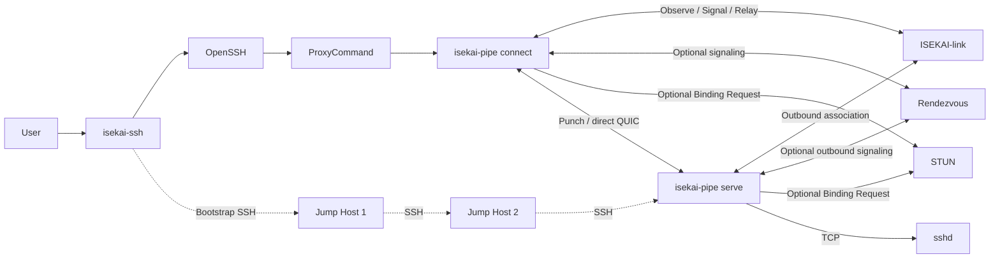
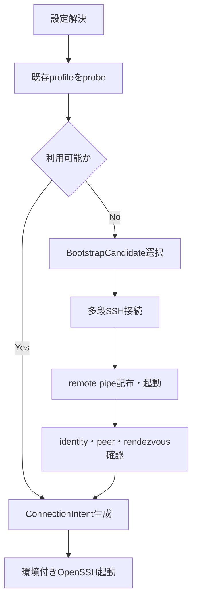
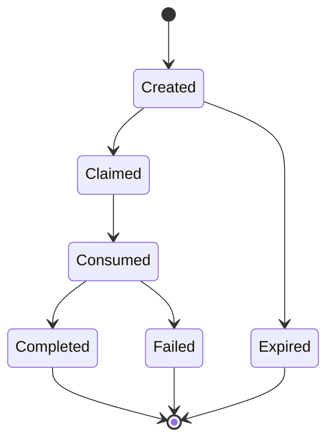
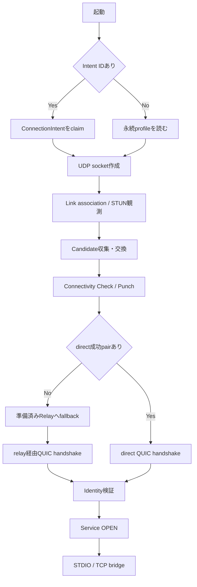
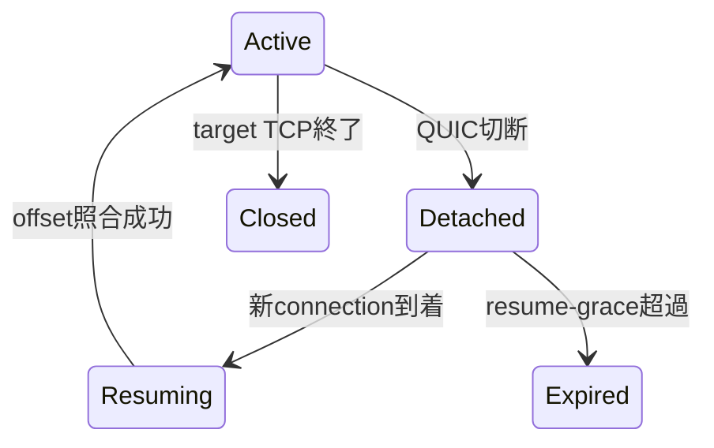
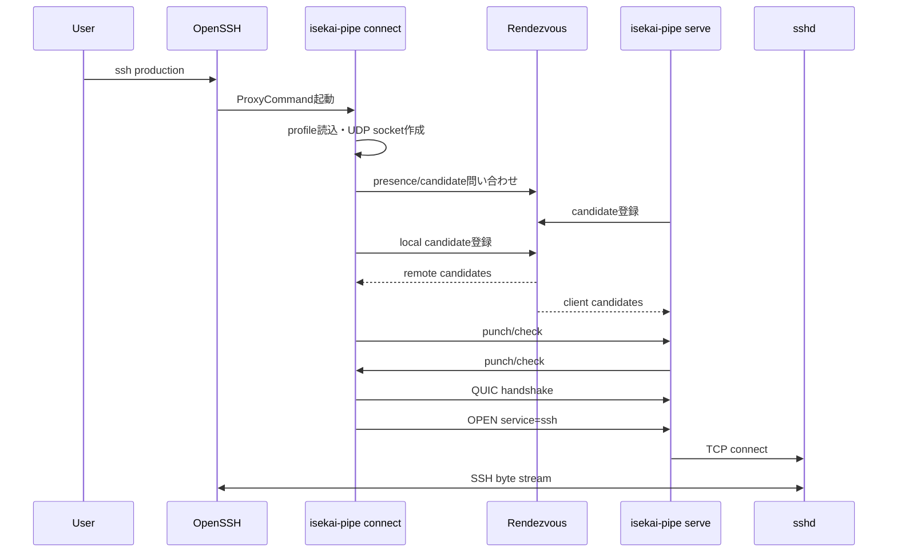
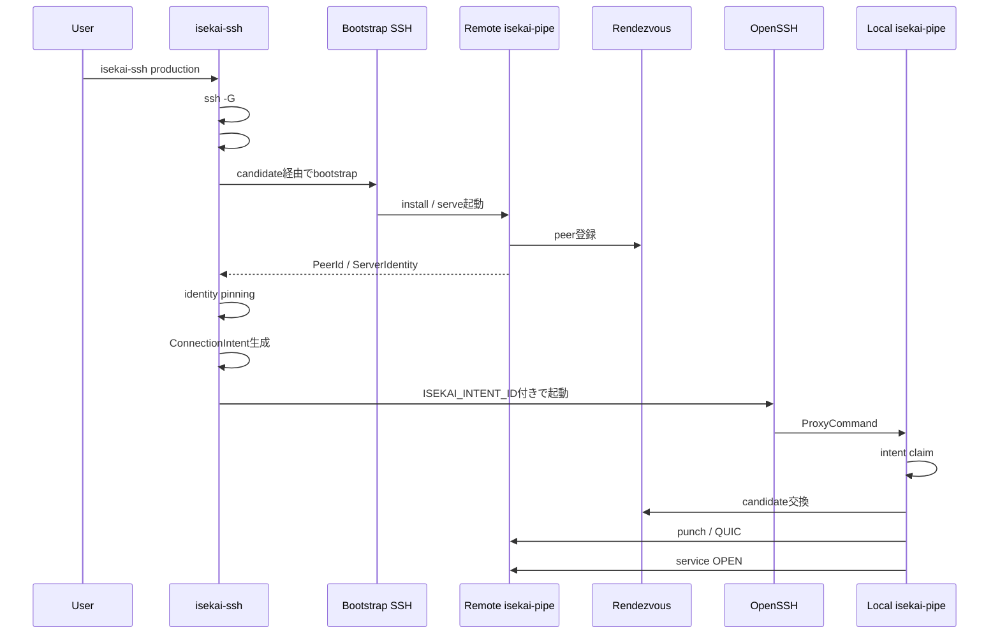

# isekai-ssh / isekai-pipe 最終仕様・設計書

> **ARCHIVED（2026-07-07）**: 本書がきっかけとなった移行（`ISEKAI_PIPE_MIGRATION.md`）は
> ほぼ完了した。現在の設計・実装状況は `ISEKAI_PIPE_DESIGN.md` を参照すること。
> 用語・`#@isekai`ディレクティブ・アーキテクチャ図など、大部分は現在も正確だが、
> 一部（旧`connect`サブコマンド前提の記述、handshake JSONの旧フラットフィールド等）は
> 実装時に変更されている。

**ステータス:** v1基本設計
**更新日:** 2026-07-07
**対象プラットフォーム:** Linux、macOS、Windowsクライアント／Linuxサーバー
**実装言語:** Rust

---

# 1. 概要

本システムは、多段NAT配下やprivate network内にあるSSHサーバーへ、多段SSHによるbootstrapを起点としてQUICのP2P経路を構築し、その後のOpenSSH通信を再接続・再開可能な論理バイトストリーム上で転送する。NAT外部endpointの観測には、STUNを直接利用する方式と、ISEKAI-linkへのoutbound associationを利用する方式を持つ。ISEKAI-link方式では、外部endpoint観測・candidate交換・relay待機を同じ接続準備の中で行い、direct接続に失敗した場合はそのままISEKAI-link経由へfallbackできる。

主要コンポーネントは次の2つである。

| コンポーネント       | 役割                                                                      |
| ------------- | ----------------------------------------------------------------------- |
| `isekai-ssh`  | OpenSSHフロントエンド。設定解決、bootstrap、trust導入、ConnectionIntent生成、OpenSSH起動を担当する |
| `isekai-pipe` | 汎用データプレーン。STUNまたはISEKAI-linkによる外部endpoint観測、candidate交換、hole punching、relay fallback、QUIC、TCP変換、session resumeを担当する |

中核となる設計原則は次のとおりである。

> **isekai-sshは接続の意図と準備を担当し、isekai-pipeは実際の接続経路と通信状態を所有する。**

`isekai-ssh`はIPアドレスやUDP socketを所有しない。

`isekai-pipe`はSSHプロトコルを解釈しない。SSHを含む任意の双方向バイトストリームを扱う。

---

# 2. 最終的な設計判断

## 2.1 採用する構成

```text
isekai-ssh
    ├─ ~/.ssh/configを解決
    ├─ #@isekai設定を解析
    ├─ 必要なら多段SSHでbootstrap
    ├─ remote isekai-pipe serveを配布・起動
    ├─ peer identityを確認
    ├─ ConnectionIntentを生成
    └─ OpenSSHを起動
             │
             │ ProxyCommand
             ▼
       isekai-pipe connect
             ├─ UDP socket作成
             ├─ STUNまたはISEKAI-linkで外部endpoint観測
             ├─ candidate交換
             ├─ ISEKAI-link relay reservation
             ├─ hole punching
             ├─ directまたはrelay経由QUIC確立
             ├─ SelectedPath所有
             ├─ logical session管理
             ├─ resume
             └─ stdin/stdout bridge
```

## 2.2 v1で採用しない構成

次の機能はv1から除外する。

```text
・preconnect
・常駐ローカルbroker
・attachプロセス
・socketpair
・ProxyUseFdpass
・QUIC connectionのプロセス間移譲
```

OpenSSHが起動した後、`ProxyCommand`として起動された`isekai-pipe connect`が、candidate収集からQUIC接続、SSH byte stream転送までを一貫して所有する。

これにより、ローカルbrokerとattach間のbyte stream IPCは不要になる。

## 2.3 ユーザーが編集する設定ファイル

ユーザーが手動で編集する設定ファイルは、原則として次の1つだけとする。

```text
~/.ssh/config
```

Isekai固有設定は、OpenSSHが通常コメントとして無視する`#@isekai`行に記述する。OpenSSHは`#`で始まる行をコメントとして扱う。

---

# 3. システムの目的

## 3.1 機能目的

本システムは次を実現する。

1. OpenSSHの認証・PTY・agent・forwarding・設定資産を維持する
2. private IPしか持たない対象ホストを、多段SSH経由でbootstrapする
3. NAT配下の双方が協調してUDP hole punchingを行う
4. LAN、public NAT mapping、Tailscale、relayなど複数経路から利用可能な経路を選択する
5. Wi-Fiとセルラーの切り替えやNAT rebindingに耐える
6. QUIC connectionが完全に失われても、別のQUIC connection上で論理sessionを再開する
7. bootstrap完了後は通常の`ssh`、`scp`、`sftp`から利用できる
8. SSH以外のTCPサービスへ`isekai-pipe`を再利用できる
9. bootstrap用設定と通常接続用設定の二重管理を避ける

## 3.2 非目的

v1では次を対象外とする。

```text
・SSHプロトコルの再実装
・sshdの置き換え
・L3 VPNの提供
・完全なICE wire protocol互換
・socatの全機能の再実装
・任意IP・任意portへ接続するopen proxy
・サーバープロセス再起動をまたぐsession復旧
・クライアントプロセス終了後のsession復旧
・複数SSH session間でのQUIC connection共有
・OpenSSH起動前のQUIC preconnect
```

---

# 4. 用語

| 用語                 | 意味                                                     |
| ------------------ | ------------------------------------------------------ |
| Logical Host       | `production`など、ユーザーが指定するSSH接続対象                        |
| PeerId             | `isekai-pipe serve`インスタンスの論理識別子                        |
| ServerIdentity     | peerを暗号学的に認証する公開鍵identity                              |
| BootstrapCandidate | 多段SSHで対象ホストへ到達するための候補                                  |
| CandidateSource    | STUN、ISEKAI-link、network interface、rendezvous、relayなどcandidateの生成元 |
| Candidate          | 実行時に得られる一時的な到達候補                                       |
| CandidatePair      | local candidateとremote candidateの組                     |
| SelectedPath       | 接続確認と認証に成功した実経路                                        |
| ConnectionIntent   | `isekai-ssh`が生成する短命な接続指示                               |
| Profile            | bootstrap後に保存される永続的なpeer設定                             |
| LogicalSession     | QUIC connectionをまたいで存続する双方向byte stream                 |
| Rendezvous         | peer presence、candidate、punch調整情報を交換する制御サービス           |
| ISEKAI-link        | 外部endpoint観測、candidate交換、punch調整、relay転送を統合して提供できるサービス |

---

# 5. アーキテクチャ



## 5.1 制御プレーン

`isekai-ssh`と、ISEKAI-linkまたは独立rendezvousが担当する。

```text
isekai-ssh:
    bootstrap
    trust introduction
    ConnectionIntent生成
    OpenSSH起動

ISEKAI-link:
    public endpoint観測
    peer presence
    candidate交換
    punch generation同期
    短命ticket発行
    relay reservation

独立rendezvous:
    peer presence
    candidate交換
    punch generation同期
    短命ticket発行
```

## 5.2 データプレーン

`isekai-pipe`が担当する。

```text
UDP socket
STUN / ISEKAI-link endpoint observation
hole punching
direct QUIC / relay経由QUIC
logical session
offset / ACK
resume buffer
TCP / stdio bridge
```

---

# 6. isekai-ssh仕様

## 6.1 役割

`isekai-ssh`はRust製のOpenSSHフロントエンドである。

SSHプロトコルは実装せず、最終的なSSH接続にはシステムのOpenSSHを使用する。

OpenSSHはPTY、agent forwarding、TCP forwarding、Unix domain socket forwarding、リモートコマンドなどを提供する。

## 6.2 主な責務

```text
・SSH argvの解析
・ssh -Gによる実効設定取得
・#@isekaiマーカーの解析
・bootstrap candidateの選択
・多段SSH起動
・対象OS / architecture判定
・remote isekai-pipeの配布
・remote serveの登録・起動
・server identity取得とpinning
・ConnectionIntent生成
・OpenSSHへの環境変数付与
・最終的なOpenSSH起動
```

`ssh -G`は、`Host`および`Match`評価後の設定を表示して終了するため、OpenSSH標準設定の実効値取得に使用する。

## 6.3 担当しない処理

```text
・UDP socket作成
・STUN通信
・candidate pair生成
・hole punching
・QUIC handshake
・SelectedPath選択
・byte stream転送
・logical session resume
```

---

# 7. isekai-ssh CLI

## 7.1 通常形式

```bash
isekai-ssh [ISEKAI_OPTIONS] [SSH_OPTIONS] destination [command [argument...]]
```

例:

```bash
isekai-ssh production
isekai-ssh -L 5432:127.0.0.1:5432 production
isekai-ssh -A production
isekai-ssh production 'journalctl -f'
```

`isekai-ssh`固有オプション以外は、元の順序を維持してOpenSSHへ渡す。

## 7.2 固有オプション

| オプション                     | 意味                                              |
| ------------------------- | ----------------------------------------------- |
| `--isekai-bootstrap`      | 状態にかかわらずbootstrapを再実行する                         |
| `--isekai-no-bootstrap`   | bootstrapせず、既存profileだけを使う                      |
| `--isekai-direct`         | Isekai経路を使わずbootstrap candidate経由でSSHする         |
| `--isekai-explain`        | 解決した設定と実行計画を表示する                                |
| `--isekai-doctor`         | OpenSSH、設定、profile、rendezvous、remote serveを診断する |
| `--isekai-dry-run`        | 子プロセスを起動せず、計画のみ表示する                             |
| `--isekai-json`           | 診断結果をJSONで出力する                                  |
| `--isekai-ssh-path PATH`  | 使用するOpenSSHバイナリを指定する                            |
| `--isekai-pipe-path PATH` | 配布・参照する`isekai-pipe`を指定する                       |

固有オプションには必ず`--isekai-`接頭辞を付け、OpenSSHの将来オプションとの衝突を避ける。

---

# 8. SSH config拡張

## 8.1 記法

```text
#@isekai <directive> <arguments...>
```

例:

```sshconfig
Host production
    HostName 10.20.0.15
    User deploy
    IdentityFile ~/.ssh/production_ed25519

    ProxyCommand isekai-pipe connect --profile "%n" --service ssh --stdio

    #@isekai bootstrap-candidate target=192.168.10.15:22 priority=120
    #@isekai bootstrap-candidate target=10.20.0.15:22 via=corp-bastion,private-gateway priority=100
    #@isekai bootstrap-candidate target=203.0.113.15:22 priority=20

    # 推奨: 統合型ISEKAI-link
    #@isekai link https://link.example.com

    # 任意: 独立構成または追加観測用
    #@isekai rendezvous https://rendezvous.example.com
    #@isekai stun stun1.example.com:3478
    #@isekai stun stun2.example.com:3478
    #@isekai relay masque://relay.example.com

    #@isekai remote-path ~/.local/libexec/isekai/isekai-pipe
    #@isekai service ssh=127.0.0.1:22
    #@isekai resume-grace 120s
```

`ProxyCommand`は標準入力を読み、標準出力へ書く任意のコマンドを接続ストリームとして利用できる。`%n`はユーザーが指定した元のhost名を表す。

## 8.2 v1ディレクティブ

| ディレクティブ                | 既定値                | 説明                        |
| ---------------------- | ------------------ | ------------------------- |
| `enabled`              | `yes`              | Isekai接続を有効化する            |
| `bootstrap-candidate`  | `HostName`から生成     | bootstrap用SSH候補           |
| `bootstrap-policy`     | `auto`             | `auto`、`always`、`never`   |
| `link`                 | なし                 | ISEKAI-link endpoint。外部endpoint観測、candidate交換、relay fallbackを統合する。複数指定可 |
| `rendezvous`           | なし                 | 独立rendezvous endpoint。複数指定可 |
| `stun`                 | なし                 | STUN server。独立観測または追加観測に使用。複数指定可 |
| `relay`                | なし                 | 独立relay endpoint。ISEKAI-linkを使わない構成または追加fallbackに使用 |
| `remote-path`          | platform既定         | remote binary配置先          |
| `service`              | `ssh=127.0.0.1:22` | 公開するserviceとTCP target    |
| `profile`              | `%n`               | 永続profile名                |
| `resume-grace`         | `120s`             | QUIC切断後にtarget TCPを保持する時間 |
| `candidate-race-delay` | `150ms`            | 次候補を開始するまでの間隔             |
| `relay-delay`          | `750ms`            | direct系候補よりrelayを遅延させる時間  |
| `install-mode`         | `user`             | `user`または`system`         |

ISEKAI-link統合方式では`link`だけで外部endpoint観測、candidate交換、relay fallbackを構成できる。`stun`は必須ではない。ただし、NAT mappingの多様性を観測しdirect成功率を上げる目的で、ISEKAI-linkとSTUNを併用してよい。

## 8.3 評価規則

OpenSSHと同様に、原則として最初に得られた値を採用する。OpenSSHの設定も、通常は最初に指定された値が使用される。

```sshconfig
Host production
    #@isekai resume-grace 300s

Host *
    #@isekai resume-grace 120s
```

`production`では`300s`となる。

複数指定が意味を持つ次のディレクティブは追記型とする。

```text
bootstrap-candidate
link
rendezvous
stun
relay
service
```

## 8.4 Hostパターン

v1で次をサポートする。

```text
・完全一致
・*
・?
・否定パターン !
・複数Hostパターン
```

## 8.5 Include

`Include`はv1から対応する。

OpenSSHの`Include`は複数path、glob、`~`、環境変数をサポートし、glob結果を辞書順に処理できる。`Host`や`Match`ブロック内にも記述できる。

`isekai-ssh`は次を実装する。

```text
・絶対path
・相対path
・~
・glob
・辞書順展開
・再帰Include
・循環検出
・-Fで指定されたconfigを起点にする
```

## 8.6 Match

通常のOpenSSH設定としての`Match`は利用できるが、v1では`Match`ブロック内の`#@isekai`を禁止する。

理由は、`Match exec`、`canonical`、`final`など、OpenSSHと同じ再評価を独自parserで再現する必要が生じるためである。

```text
ISEKAI_CONFIG_UNSUPPORTED_MATCH
```

を返す。

## 8.7 不明ディレクティブ

一致するHostブロック内の不明な`#@isekai`ディレクティブはエラーとする。

```sshconfig
# 誤字として拒否
#@isekai boostrap-candidate ...
```

---

# 9. profile名の安全性

`ProxyCommand`文字列はユーザーのshellを介して実行され、OpenSSHはshell特殊文字を自動escapeしない。

このため、Isekai profileとして利用するHost aliasは次の文字集合に制限する。

```regex
^[A-Za-z0-9._-]+$
```

制限に一致しない場合は、明示的な安全なprofile名を指定する。

```sshconfig
Host "production east"
    #@isekai profile production-east
```

`ProxyCommand`では、安全なprofileのみを使用する。

---

# 10. bootstrap candidate

## 10.1 目的

bootstrap candidateは、対象ホストへ管理用SSHで到達するための静的候補である。

これは`isekai-pipe`の動的candidateとは別物である。

```text
BootstrapCandidate:
    対象ホストへSSHで到達する候補

Pipe Candidate:
    UDP hole punching時に実行時生成される候補
```

## 10.2 モデル

```rust
struct BootstrapCandidate {
    target: HostPort,
    jump_chain: Vec<SshDestination>,
    priority: u32,
    connect_timeout: Duration,
    address_family: Option<AddressFamily>,
}
```

## 10.3 複数候補

```sshconfig
#@isekai bootstrap-candidate target=192.168.10.15:22 priority=120
#@isekai bootstrap-candidate target=10.20.0.15:22 via=corp-bastion,private-gateway priority=100
#@isekai bootstrap-candidate target=203.0.113.15:22 priority=20
```

候補はpriority順に評価する。

多段jump hostはカンマ区切りの`ProxyJump`として利用でき、順番に訪問される。`ProxyJump`と`ProxyCommand`は競合し、先に指定された方が有効になる。

bootstrap時は、P2P用`ProxyCommand`を使用しないようにコマンドライン側で経路を上書きする。

```text
direct candidate:
    -o ProxyCommand=none

jump candidate:
    -J jump1,jump2
```

## 10.4 candidate選択

対話promptの競合を防ぐため、次の二段階で評価する。

### Phase A: 非対話preflight

```text
BatchMode=yes
ConnectTimeout=短時間
固定の副作用なしremote command
```

複数候補を時間差で試し、非対話認証まで成功した候補を選ぶ。

### Phase B: 対話接続

すべての候補が認証段階で止まった場合は、最優先の到達可能候補だけを対話モードで起動する。

複数のpassword、passphrase、MFA promptを同時表示しない。

## 10.5 host key identity

複数IPが同一の論理ホストを指す場合、`HostKeyAlias`相当の設定を使い、known_hosts上のidentityを論理ホストへ統一する。

bootstrap candidateごとに無関係なhost keyを自動受理してはならない。

---

# 11. bootstrap処理

## 11.1 処理フロー



## 11.2 remote配布

bootstrapは次を行う。

1. remote OSとCPU architectureを取得する
2. 対応する`isekai-pipe` artifactを選択する
3. 一時pathへ転送する
4. SHA-256を検証する
5. 実行権限を設定する
6. atomic renameで正式pathへ配置する
7. server identityを生成または読み込む
8. service設定を反映する
9. `isekai-pipe serve`を起動または再起動する
10. rendezvous登録完了を確認する
11. PeerIdとServerIdentityを取得する

## 11.3 冪等性

次が一致する場合、再配置・再起動を省略する。

```text
remote binary version
binary hash
service mapping
server identity
serve process health
rendezvous registration
```

## 11.4 remote lifecycle

Linux v1では、次の優先順でremote processを管理する。

```text
1. systemd --user service
2. system service
3. 管理されたstandalone daemon
```

単なるbootstrap SSH sessionの子プロセスとして放置しない。

---

# 12. ConnectionIntent

## 12.1 目的

ConnectionIntentは、`isekai-ssh`から`isekai-pipe connect`へ渡す短命な接続指示である。

ConnectionIntentは経路を指定しない。

```text
「203.0.113.10:45823へ接続する」
    ×

「peer productionへ、現在利用可能な経路を生成して接続する」
    ○
```

## 12.2 モデル

```rust
struct ConnectionIntent {
    schema_version: u32,

    intent_id: IntentId,
    profile: ProfileName,

    peer_id: PeerId,
    expected_server_identity: ServerIdentity,
    service: ServiceName,

    link_endpoints: Vec<LinkEndpoint>,
    link_ticket: Option<Secret<LinkTicket>>,

    rendezvous: Vec<RendezvousEndpoint>,
    rendezvous_ticket: Option<Secret<RendezvousTicket>>,

    stun_servers: Vec<StunServer>,
    relay_endpoints: Vec<RelayEndpoint>,
    relay_policy: RelayPolicy,

    punch_generation: PunchGeneration,

    created_at: SystemTime,
    expires_at: SystemTime,

    bootstrap_provenance: BootstrapProvenance,
}
```

## 12.3 引き継ぎ方式

ConnectionIntent本体は、ユーザー専用runtime directoryへ保存する。

```text
Linux:
    $XDG_RUNTIME_DIR/isekai/intents/<intent-id>.json

macOS:
    ユーザー専用temporary runtime directory

Windows:
    %LOCALAPPDATA%\Isekai\runtime\intents\
```

OpenSSHへ渡すのは、秘密情報を含まないIDだけとする。

```text
ISEKAI_INTENT_ID=<opaque-random-id>
```

Rustの子プロセスは既定で親の環境変数を継承し、`Command::env`で個別の環境変数を設定できる。

```text
isekai-ssh
    ISEKAI_INTENT_IDを設定
        ↓
OpenSSH
        ↓ 環境継承
ProxyCommand shell
        ↓
isekai-pipe connect
```

`SendEnv`は使用しない。これはremote SSH serverへ環境変数を送る仕組みではなく、ローカルプロセス間の継承である。

## 12.4 secretの扱い

次を環境変数またはcommand lineへ載せてはならない。

```text
link ticket
rendezvous ticket
resume secret
private key
candidate authentication credential
```

## 12.5 atomic claim

同じintentを複数processが利用できないよう、取得時にatomic claimする。

```text
intents/<id>.json
    ↓ atomic rename
claimed/<id>.<pid>.json
```

claimに成功した1 processだけが利用できる。

## 12.6 lifecycle



既定TTLは60秒とする。

成功・失敗後はsecretを含むintent本体を削除する。

---

# 13. 永続profile

bootstrap完了後、通常の`ssh production`でも接続できるように永続profileを保存する。

```json
{
  "schema_version": 1,
  "profile": "production",
  "peer_id": "peer_01...",
  "server_identity": "ed25519:...",
  "service": "ssh",
  "link_endpoints": [
    "https://link.example.com"
  ],
  "rendezvous": [
    "https://rendezvous.example.com"
  ],
  "stun_servers": [
    "stun1.example.com:3478",
    "stun2.example.com:3478"
  ],
  "relay_endpoints": [
    "https://link.example.com/relay"
  ],
  "relay_policy": {
    "mode": "fallback",
    "delay_ms": 750
  },
  "remote_version": "0.1.0",
  "last_bootstrap_at": "2026-07-07T12:00:00Z",
  "last_path_hint": {
    "kind": "server_reflexive",
    "expires_at": "2026-07-07T12:05:00Z"
  }
}
```

保存するのはpeerを再発見するための情報であり、STUNまたはISEKAI-linkが観測した過去のpublic IP:portを恒久的な接続先として扱わない。観測値は短命candidateまたはpath hintに限定する。

---

# 14. isekai-pipe仕様

## 14.1 役割

`isekai-pipe`は、stdioまたはTCPと、QUIC上の再開可能なlogical sessionを接続する。

```text
STDIO / TCP
    ↕
logical session
    ↕
QUIC
    ↕
logical session
    ↕
TCP target
```

## 14.2 単一binary

クライアントとサーバーでbinaryを分けない。

```bash
isekai-pipe connect ...
isekai-pipe serve ...
```

内部libraryはclient/serverに分離できるが、配布物は単一binaryとする。

---

# 15. isekai-pipe CLI

## 15.1 connect

OpenSSH ProxyCommand用途:

```bash
isekai-pipe connect \
    --profile production \
    --service ssh \
    --stdio
```

`.ssh/config`:

```sshconfig
ProxyCommand isekai-pipe connect --profile "%n" --service ssh --stdio
```

TCP listen用途:

```bash
isekai-pipe connect \
    --profile production \
    --service postgres \
    --listen 127.0.0.1:5432
```

## 15.2 serve

```bash
isekai-pipe serve \
    --bind 0.0.0.0:45823 \
    --service ssh=127.0.0.1:22 \
    --state-dir ~/.local/state/isekai-pipe
```

複数service:

```bash
isekai-pipe serve \
    --bind 0.0.0.0:45823 \
    --service ssh=127.0.0.1:22 \
    --service postgres=127.0.0.1:5432
```

## 15.3 probe

```bash
isekai-pipe probe --profile production
```

| 終了code | 意味                 |
| -----: | ------------------ |
|    `0` | 接続可能               |
|    `2` | profileなし          |
|    `3` | identity不一致        |
|    `4` | rendezvous到達不能     |
|    `5` | peer offline       |
|    `6` | candidate pair確立失敗 |
|    `7` | serviceなし          |

## 15.4 inspect

```bash
isekai-pipe inspect --profile production
isekai-pipe inspect --profile production --json
```

---

# 16. isekai-pipe connect処理



## 16.1 解決順序

```text
1. ISEKAI_INTENT_IDがある
   → ConnectionIntentを使用する

2. intentがない
   → --profileの永続profileを使用する

3. profileもない
   → ISEKAI_BOOTSTRAP_REQUIRED
```

---

# 17. Candidate設計

## 17.1 CandidateSource

`.ssh/config`やprofileへ保存するのはcandidateそのものではなくcandidateの生成元である。

```rust
struct CandidateSourceConfig {
    link_endpoints: Vec<LinkEndpoint>,
    rendezvous: Vec<RendezvousEndpoint>,
    stun_servers: Vec<StunServer>,
    relay_servers: Vec<RelayEndpoint>,
    interface_policy: InterfacePolicy,
    path_policy: PathPolicy,
}
```

ISEKAI-linkが設定されている場合、1つのendpointが次の複数の役割を兼ねてよい。

```text
・NAT外部endpointの観測
・peer presence
・candidate交換
・punch generation同期
・relay reservation
・opaque data relay
```

STUN、独立rendezvous、独立relayを組み合わせる分離構成も引き続きサポートする。

## 17.2 NAT外部endpointの観測

ここでいうpublic addressは、IPアドレスだけではなく、NATが割り当てた`public IP:UDP port`の組を意味する。

観測方式は次の2つである。

### 17.2.1 STUN方式

`isekai-pipe`がQUICと共有するUDP socketからSTUN Binding Requestを送信し、STUN serverが観測した送信元`IP:port`をserver-reflexive candidateとして得る。

```text
shared UDP socket
    → STUN server
    ← observed public IP:port
```

### 17.2.2 ISEKAI-link方式

`isekai-pipe`がISEKAI-linkへ認証済みoutbound associationを確立し、ISEKAI-linkが観測した送信元`IP:port`を受け取る。同時にrelay reservationを準備し、direct接続に失敗した場合は同じISEKAI-linkをrelay data pathとして利用できる。

```text
shared UDP socket
    → ISEKAI-link association
    ← observed public IP:port
    ↔ candidate / punch coordination
    ↔ relay reservation
```

ISEKAI-link方式の利点は、public endpointの観測とrelay fallbackの準備が別々の処理にならないことである。P2Pが成立した場合、ISEKAI-linkはcontrol/standby経路に留まり、SSH byte streamはdirect QUICで流す。P2Pが成立しない場合、追加のrelay探索を行わず、準備済みrelay candidateを選択できる。

### 17.2.3 観測値の扱い

STUNまたはISEKAI-linkが返した値は、あくまでobserverから見えた短命なendpointである。endpoint-dependent mappingでは、ISEKAI-link向けmappingとpeer向けmappingが異なる可能性がある。

したがって、次を必須とする。

```text
・観測値だけでdirect到達可能と判定しない
・観測元とsocket identityを記録する
・同一UDP socketから観測した値だけをdirect candidateに昇格できる
・peerとの認証済みconnectivity checkを必ず行う
・失敗時はpeer-reflexive candidateまたはrelay candidateを使う
```

```rust
struct ObservedEndpoint {
    addr: SocketAddr,
    observer: EndpointObserver,
    socket_id: SocketId,
    observed_at: Instant,
    expires_at: Instant,
}

enum EndpointObserver {
    Stun(StunServerId),
    IsekaiLink(LinkEndpointId),
}
```

STUNとISEKAI-linkを同時に設定した場合は並列に観測してよい。結果が一致しなくても即座にエラーとはせず、別candidateとしてconnectivity checkへ進める。

## 17.3 Candidate

candidateは接続ごとに生成される。

```rust
struct Candidate {
    id: CandidateId,
    generation: PunchGeneration,
    kind: CandidateKind,

    base_addr: SocketAddr,
    observed_addr: Option<SocketAddr>,

    network_id: NetworkId,
    priority: u32,
    source: CandidateSource,

    expires_at: Option<Instant>,
}
```

```rust
enum CandidateKind {
    Host,
    ServerReflexive,
    PeerReflexive,
    Relayed,
}
```

ICEはSTUNとTURNを利用してcandidateを生成し、candidate pairへのconnectivity checkによって利用可能な経路を決定する。`isekai-pipe`はこの考え方を採用するが、v1ではRFC 8445 wire protocolそのものへの完全互換を目標としない。

STUNまたはISEKAI-linkによるserver-reflexive candidateの観測だけを接続成功とはみなさず、保護されたconnectivity checkを必須とする。STUN由来のcandidateについても、観測値は後続のconnectivity checkで検証される前提で扱う。

## 17.4 CandidatePair

```rust
struct CandidatePair {
    local: CandidateId,
    remote: CandidateId,
    priority: u64,
    state: CandidatePairState,
    last_rtt: Option<Duration>,
}
```

## 17.5 SelectedPath

```rust
struct SelectedPath {
    local_candidate: CandidateId,
    remote_candidate: CandidateId,

    actual_local_addr: SocketAddr,
    actual_remote_addr: SocketAddr,

    socket: Arc<UdpSocket>,
    quic_connection: QuicConnection,

    punch_generation: PunchGeneration,
    established_at: Instant,
}
```

SelectedPathは`isekai-pipe`内部専用型とする。

```text
・JSONへ保存しない
・ConnectionIntentへ入れない
・isekai-sshへ返さない
・command lineへ載せない
・profileへ永続化しない
```

診断には所有権を持たないsummaryだけを使用する。

---

# 18. UDP socket所有

STUN、ISEKAI-linkによる外部endpoint観測、hole punching、direct QUICは、可能な限り同一のUDP socketを使用する。ISEKAI-linkがUDP relayを提供する場合も、実装上可能なら同じsocket ownershipへ統合する。

```text
Shared UDP socket
    ├─ STUN Binding Request
    ├─ ISEKAI-link association / endpoint observation
    ├─ connectivity check
    ├─ punch packet
    ├─ direct QUIC datagram
    └─ relay encapsulation / relay QUIC datagram
```

QuinnのEndpointは1つのUDP socketに対応し、同じEndpoint上で複数connectionを扱える。

別socketを使うと異なるNAT mappingになる可能性があるため、socket ownershipを途中で分離しない。ISEKAI-link接続が別socketを必要とする実装では、その接続で観測された`IP:port`をdirect用server-reflexive candidateとして流用してはならない。その場合、観測値は診断情報に限定し、ISEKAI-linkからはrelayed candidateだけを生成する。

---

# 19. Candidate選択

候補を完全な直列で試すと、壊れた候補による待ち時間が累積する。

そのため、priority順の時間差並列方式を採用する。

```text
t=0ms      ISEKAI-link association / relay reservationを開始
t=0ms      前回成功した同一networkのcandidate pair
t=150ms    LAN / host candidate
t=300ms    server-reflexive candidate
t=750ms    relay candidateをwinner候補として解禁
```

winner条件:

```text
・connectivity check成功
・QUIC handshake成功
・ServerIdentity一致
・service OPEN成功
```

単にUDP packetが到達しただけではwinnerにしない。

winner以外のcandidateは、接続断後の再探索用に保持する。ISEKAI-linkのrelay reservationは、direct pathがwinnerになった後も低コストで維持できる場合はstandbyとして保持する。`relay-delay`はrelay準備開始時刻ではなく、relayをwinnerとして採用可能にする時刻を表す。

---

# 20. Rendezvous / ISEKAI-link

## 20.1 配備方式

v1は次の2方式をサポートする。

| 方式 | 構成 | 特徴 |
| --- | --- | --- |
| 統合方式 | ISEKAI-link | 外部endpoint観測、presence、candidate交換、punch同期、relay fallbackを1つのoutbound associationで提供する |
| 分離方式 | STUN + rendezvous + relay | 各機能を独立サービスとして構成する |

`#@isekai link`が設定されている場合は統合方式を優先する。`stun`、`rendezvous`、`relay`を併記した場合は、追加candidate sourceまたは追加fallbackとして並行利用できる。

## 20.2 ISEKAI-linkの責務

```text
・PeerIdのpresence登録
・接続元public IP:portの観測
・短命candidateの交換
・punch generation同期
・短命ticket発行
・relay reservation
・direct失敗時のopaque data relay
```

ISEKAI-linkの実装参照先:

```text
https://github.com/seera-networks/ISEKAI-link
```

## 20.3 Rendezvousの責務

独立rendezvousを使用する場合の責務は次のとおりである。

```text
・PeerIdのpresence登録
・短命candidateの交換
・punch generation同期
・短命ticket発行
・relay情報通知
```

## 20.4 非責務

ISEKAI-linkおよびrendezvousは次を行わない。

```text
・SSH byte streamの平文復号
・peer間payload暗号のsession key取得
・ServerIdentityの変更
・接続先TCP targetの任意指定
・観測したpublic IP:portをpeer identityとして扱うこと
```

relay transport自体をISEKAI-linkで終端する実装であっても、peer間payloadは別レイヤーでend-to-end暗号化し、ISEKAI-linkがSSH byte streamを解読できない構成とする。

## 20.5 remote serve

`isekai-pipe serve`は、ISEKAI-linkまたは独立rendezvousへoutbound control connectionを維持する。

これにより、private network内でlistenしているだけでは到達不能なpeerを再発見できる。ISEKAI-link使用時は、このoutbound associationをrelay reservationとしても利用する。

## 20.6 directからrelayへのfallback

初回接続時:

```text
1. ISEKAI-link associationとrelay reservationを先に準備する
2. host / LAN / server-reflexive candidateでP2Pを試す
3. direct pathが成功したらdirect QUICを採用する
4. `relay-delay`までにdirect pathが成立しなければrelay candidateを採用する
```

接続中のdirect path喪失時:

```text
1. QUIC migrationで復旧可能ならdirect connectionを継続する
2. 不可能ならISEKAI-link relay上に新しいQUIC connectionを確立する
3. LogicalSessionをRESUMEし、未確認dataを再送する
```

実装が同一QUIC connectionをrelay pathへmigrationできる場合は利用してよいが、v1の必須要件にはしない。v1の基準動作は「relay上の新QUIC connection + application-level RESUME」とする。

relay接続中も、帯域と頻度を制限したdirect upgrade probeを行ってよい。direct pathが認証まで成功した場合は、新しいdirect QUIC connectionへRESUMEしてrelayから離脱できる。

---

# 21. Peer認証とtrust introduction

## 21.1 初回

初回bootstrap SSHを、ServerIdentityの導入経路として使用する。

```text
OpenSSH host authentication
    ↓
bootstrap SSH channel
    ↓
remote isekai-pipe ServerIdentity
    ↓
local profileへpinning
```

## 21.2 以後

hole punchingやrelayに成功しても、提示されたidentityが期待値と一致しなければ拒否する。

```text
expected_server_identity
    ==
presented_server_identity
```

不一致:

```text
ISEKAI_PIPE_IDENTITY_CHANGED
```

identity変更をrendezvous情報だけで自動受理してはならない。

---

# 22. Service model

クライアントは原則として任意のIP:portを指定しない。

```bash
isekai-pipe connect --service ssh
```

serve側でservice名を固定targetへ割り当てる。

```text
ssh      → 127.0.0.1:22
postgres → 127.0.0.1:5432
rdp      → 192.168.1.20:3389
```

これにより、remote側が任意の内部hostへ接続できるopen proxyになることを防ぐ。

bootstrapで自動構成するv1の既定serviceは次とする。

```text
ssh → 127.0.0.1:22
```

---

# 23. QUIC connectionとlogical session

## 23.1 QUIC migration

QUIC connectionはconnection IDを利用して新しいnetwork pathへ移動でき、NAT rebindingなどによるaddress変更後もconnectionを継続できる。新しいpathではpath validationが行われる。

この範囲ではQUIC migrationを利用する。

## 23.2 Application-level resume

次の場合、QUIC connection自体は失われる。

```text
・idle timeout
・長時間の完全断
・connection state消失
・双方のnetwork変更
・全path喪失
```

この場合、新しいUDP mappingとQUIC connectionを作り、既存のlogical sessionをapplication-level protocolで再開する。

```text
candidate再収集
    ↓
hole punching
    ↓
新しいQUIC connection
    ↓
RESUME
    ↓
offset照合
    ↓
未確認data再送
```

---

# 24. LogicalSession

```rust
struct LogicalSession {
    session_id: SessionId,
    peer_id: PeerId,
    service: ServiceName,

    state: SessionState,

    c2t: DirectionState,
    t2c: DirectionState,

    current_path: Option<SelectedPath>,
    resume_deadline: Instant,
}
```

```rust
enum SessionState {
    Opening,
    Active,
    Detached,
    Resuming,
    Closed,
    Failed,
}
```

## 24.1 方向

```text
C2T:
    Client → Target TCP

T2C:
    Target TCP → Client
```

## 24.2 Offset

### C2T

```text
sent_offset:
    clientが送信した累計byte数

committed_offset:
    serveがtarget TCPへの書き込みに成功した累計byte数
```

### T2C

```text
sent_offset:
    serveがclientへ送信した累計byte数

committed_offset:
    clientがlocal outputへの書き込みに成功した累計byte数
```

## 24.3 Resume

```rust
struct ResumeRequest {
    session_id: SessionId,
    client_identity: ClientIdentity,

    c2t_committed_offset: C2TOffset,
    t2c_committed_offset: T2COffset,

    punch_generation: PunchGeneration,
    nonce: Nonce,
    proof: ResumeProof,
}
```

serverは自身のoffsetと照合し、双方が保持している再送可能範囲を決定する。

---

# 25. Wire protocol

概念上のframe:

```text
CLIENT_HELLO
SERVER_HELLO

OPEN_SESSION
OPEN_ACK

DATA
APP_ACK

DETACH

RESUME
RESUME_ACK

CLOSE
ERROR

PING
PONG
```

## 25.1 Version negotiation

```text
protocol_version
min_supported_version
features
```

互換範囲が重ならない場合:

```text
PROTOCOL_VERSION_UNSUPPORTED
```

## 25.2 Frame validation

次を拒否する。

```text
・不正length
・未知の必須frame type
・設定上限を超える巨大frame
・offset overflow
・offset巻き戻り
・不正session ID
・期限切れticket
・identity不一致
```

---

# 26. 再送buffer

各方向に独立したreplay bufferを持つ。

```text
C2T replay buffer
T2C replay buffer
```

既定値:

```text
per direction: 4 MiB
per session:   8 MiB
global:        256 MiB
```

上限を超えた場合、古い未ACK dataを黙って捨てて継続してはならない。

```text
ISEKAI_RESUME_BUFFER_EXHAUSTED
```

としてsessionを明示的に失敗させる。

---

# 27. target TCP維持

QUIC connectionが失われても、serve側はtarget TCPを即座には閉じない。



次の場合にtarget TCPを閉じる。

```text
・resume-grace超過
・target TCP自身が終了
・replay buffer上限超過
・認証失敗
・protocol violation
・明示的CLOSE
```

---

# 28. stdout / stderr

`isekai-pipe connect --stdio`では、stdoutはSSH byte stream専用とする。

```text
stdin:
    OpenSSHからremoteへ送るbyte stream

stdout:
    remoteからOpenSSHへ返すbyte stream

stderr:
    log
    warning
    progress
    diagnostic
```

stdoutへ次を出力してはならない。

```text
・ログ
・JSON
・banner
・再接続通知
・debug message
```

---

# 29. 通常接続フロー

```bash
ssh production
```



---

# 30. bootstrap付き接続フロー

```bash
isekai-ssh production
```



---

# 31. 失敗時のfallback

接続失敗時の順序:

```text
1. 前回成功candidate pair
2. host / LAN candidate
3. server-reflexive candidate
4. Tailscale等の明示network
5. 準備済みISEKAI-link relay
6. configured standalone relay
7. isekai-sshから起動されている場合は再bootstrapを提案
```

`ssh production`から直接起動された`isekai-pipe`は、勝手に多段SSH bootstrapを行わない。

bootstrapは`isekai-ssh`の責務である。ISEKAI-linkが利用可能な場合、P2P失敗は接続失敗とはみなさず、relay経由でservice OPENまで成功した時点で接続成功とする。

---

# 32. セキュリティ

## 32.1 ConnectionIntent

```text
・短命
・one-shot
・owner-only permission
・atomic claim
・利用後削除
・secretをcommand lineへ載せない
・環境変数にはopaque IDだけを載せる
```

## 32.2 Artifact配布

```text
・一時fileへ転送
・SHA-256検証
・owner確認
・chmod
・atomic rename
・共有書込可能directoryから実行しない
```

## 32.3 Rendezvous / ISEKAI-link

```text
・candidate情報は短命
・観測したpublic endpointは短命でありidentityに使わない
・ticketは短命
・candidate checkを認証する
・relay利用時もpeer identityを検証する
・SSH byte streamの平文を保持しない
・peer間payload暗号のkeyを取得しない
・relay metadataの保持期間を制限する
```

## 32.4 Resume

resume proofは少なくとも次を認証対象に含める。

```text
session_id
client identity
server identity
offset
punch generation
nonce
challenge
```

session IDを知っているだけでresumeできてはならない。

## 32.5 Profileとstate

永続profileとruntime stateは、他ユーザーが書き換えられないpermissionにする。

---

# 33. 状態保存

## 33.1 ユーザー編集

```text
~/.ssh/config
```

## 33.2 自動管理

```text
runtime/
    intents/
    claimed/

state/
    profiles/
    identities/
    bootstrap-cache/
    path-hints/
    logs/
```

概念的な配置:

```text
Linux:
    runtime: $XDG_RUNTIME_DIR/isekai/
    state:   $XDG_STATE_HOME/isekai/
    data:    $XDG_DATA_HOME/isekai/

macOS:
    ~/Library/Application Support/Isekai/
    ~/Library/Caches/Isekai/

Windows:
    %LOCALAPPDATA%\Isekai\
```

---

# 34. エラーcode

## 34.1 isekai-ssh

```text
ISEKAI_CONFIG_NOT_FOUND
ISEKAI_CONFIG_UNKNOWN_DIRECTIVE
ISEKAI_CONFIG_UNSUPPORTED_MATCH
ISEKAI_CONFIG_UNSAFE_PROFILE

ISEKAI_OPENSSH_NOT_FOUND
ISEKAI_OPENSSH_CONFIG_FAILED

ISEKAI_BOOTSTRAP_NO_CANDIDATE
ISEKAI_BOOTSTRAP_UNREACHABLE
ISEKAI_BOOTSTRAP_AUTH_FAILED
ISEKAI_REMOTE_ARCH_UNSUPPORTED
ISEKAI_REMOTE_INSTALL_FAILED
ISEKAI_REMOTE_START_FAILED

ISEKAI_PIPE_IDENTITY_CHANGED
ISEKAI_INTENT_CREATE_FAILED
```

## 34.2 isekai-pipe

```text
ISEKAI_PROFILE_NOT_FOUND

ISEKAI_INTENT_NOT_FOUND
ISEKAI_INTENT_ALREADY_CLAIMED
ISEKAI_INTENT_EXPIRED

ISEKAI_LINK_UNREACHABLE
ISEKAI_LINK_AUTH_FAILED
ISEKAI_LINK_OBSERVATION_FAILED
ISEKAI_RELAY_RESERVATION_FAILED

ISEKAI_RENDEZVOUS_UNREACHABLE
ISEKAI_RENDEZVOUS_TICKET_REJECTED
ISEKAI_PEER_OFFLINE

ISEKAI_NO_VALID_CANDIDATE_PAIR
ISEKAI_PUNCH_TIMEOUT
ISEKAI_IDENTITY_MISMATCH

ISEKAI_QUIC_HANDSHAKE_FAILED
ISEKAI_SERVICE_NOT_FOUND

ISEKAI_SESSION_EXPIRED
ISEKAI_RESUME_REJECTED
ISEKAI_RESUME_BUFFER_EXHAUSTED
ISEKAI_PROTOCOL_VIOLATION
```

---

# 35. 診断

## 35.1 isekai-ssh --isekai-explain

```text
Logical host:          production
Resolved SSH target:   deploy@10.20.0.15:22
Pipe profile:          production
Bootstrap policy:      auto

Bootstrap candidates:
  1. 192.168.10.15:22                         priority=120
  2. 10.20.0.15:22 via corp-bastion,gateway  priority=100
  3. 203.0.113.15:22                          priority=20

PeerId:                peer_01...
Server identity:       ed25519:AAAA...
Remote version:        0.1.0
ISEKAI-link:           reachable / relay-ready
Rendezvous:            reachable
Peer state:            online
Address discovery:     isekai-link + stun
Last path:             server-reflexive
Final command:         ssh production
```

## 35.2 isekai-pipe inspect

```text
Profile:               production
Peer:                  peer_01...
Service:               ssh
ISEKAI-link:           connected / relay-ready
Observed endpoint:     203.0.113.10:45823 via isekai-link
Candidates gathered:   5 local / 3 remote
Selected path:         srflx → srflx
RTT:                   42ms
QUIC state:            active
Logical session:       active
C2T committed:         14820
T2C committed:         201944
```

---

# 36. Metrics

次の時間を計測する。

```text
T0 isekai-pipe process start
T1 UDP socket ready
T1a ISEKAI-link association ready
T1b relay reservation ready
T2 local candidates gathered
T3 remote candidates received
T4 connectivity check success
T5 QUIC handshake complete
T6 identity verified
T7 service open complete
T8 first SSH banner byte
```

主要指標:

```text
link_association_latency = T1a - T1
relay_ready_latency       = T1b - T1
candidate_gather_latency  = T2 - T1
punch_latency             = T4 - T2
quic_handshake_latency   = T5 - T4
proxy_ready_latency      = T7 - T0
ssh_banner_latency       = T8 - T0
resume_latency
relay_fallback_rate
direct_success_rate
link_observation_success_rate
stun_link_observation_mismatch_rate
relay_to_direct_upgrade_rate
```

preconnectは、実測で`proxy_ready_latency`がUX上の問題になった場合にのみ再検討する。

---

# 37. crate構成

```text
rust-core/
├── isekai-pipe-protocol/
├── isekai-pipe-core/
├── isekai-pipe/
└── isekai-ssh/
```

## 37.1 isekai-pipe-protocol

I/Oに依存しないpure crate。

```text
PeerId
ServerIdentity
ConnectionIntent
SessionId
offset型
handshake型
frame型
codec
version negotiation
validation
error code
```

依存禁止:

```text
tokio
quinn
russh
uniffi
OS固有API
Android / iOS型
```

## 37.2 isekai-pipe-core

```text
candidate/
stun/
rendezvous/
punch/
transport/
quic/
identity/
service/
session/
resume/
buffer/
```

feature:

```toml
client = []
server = []
quinn-transport = []
```

## 37.3 isekai-pipe

CLI binary。

```text
connect
serve
probe
inspect
version
```

## 37.4 isekai-ssh

```text
argv/
ssh_config/
markers/
bootstrap/
artifact/
intent/
profile/
launcher/
diagnostics/
```

---

# 38. 重要な不変条件

```text
INV-01
isekai-sshはUDP socketを作成しない。

INV-02
SelectedPathはisekai-pipe外へ出さない。

INV-03
STUN、ISEKAI-link外部endpoint観測、punch、direct QUICは同じsocket ownershipの下で行う。別socketで観測したendpointをdirect candidateへ流用しない。

INV-04
ConnectionIntentはpeer identityとserviceを固定する。

INV-05
STUNまたはISEKAI-linkが観測した過去のpublic IP:portをpeer identityまたは固定接続先として保存しない。

INV-06
STUN結果またはISEKAI-linkの観測結果だけを接続成功とみなさない。

INV-07
connectivity check、QUIC handshake、identity検証後にpathを採用する。

INV-08
bootstrap SSHはtrust introductionと配布に使う。

INV-09
通常のSSH byte streamをbootstrap SSHで恒久中継しない。

INV-10
QUIC connection消失後はapplication-level resumeを行う。

INV-11
未ACK dataを黙って破棄してsessionを継続しない。

INV-12
ProxyCommandのstdoutへログを混入させない。

INV-13
clientから任意のtarget IP:portを指定させない。

INV-14
v1ではpreconnect、broker、attachを導入しない。

INV-15
P2P失敗時にISEKAI-link relayを選択しても、ServerIdentity検証とservice authorizationを省略しない。

INV-16
relay経由のpath切替で、logical sessionのoffsetおよび再送規則を変更しない。
```

---

# 39. テスト方針

## 39.1 SSH config

```text
・完全一致Host
・ワイルドカード
・否定パターン
・Host *
・first-value-wins
・Include
・glob順序
・Include循環
・-F
・未知マーカー
・Match内マーカー拒否
・危険なprofile名
```

## 39.2 SSH argv

```text
isekai-ssh host
isekai-ssh user@host
isekai-ssh -p 2222 host
isekai-ssh -i "path with spaces" host
isekai-ssh -L 8080:localhost:80 host
isekai-ssh -R 8080:localhost:80 host
isekai-ssh -D 1080 host
isekai-ssh host command arg
isekai-ssh -o Option=value host
```

fake `ssh` binaryで最終argvと環境変数を検証する。

## 39.3 Intent

```text
・正常claim
・二重claim
・期限切れ
・不正owner
・不正permission
・identity不一致
・service不一致
・異常終了後の回収
```

## 39.4 Bootstrap

```text
・direct candidate
・1段jump
・複数jump
・複数IP候補
・非対話認証成功
・対話fallback
・artifactなし
・同version
・旧version
・hash不一致
・remote architecture非対応
・identity変更
・rendezvous登録失敗
```

## 39.5 NAT traversal

```text
・単一NAT
・多段NAT
・endpoint-dependent mapping
・public IP変更
・public port変更
・STUNのみでの外部endpoint観測
・ISEKAI-linkのみでの外部endpoint観測
・STUNとISEKAI-linkの観測値一致
・STUNとISEKAI-linkの観測値不一致
・ISEKAI-linkが別socketの場合に観測値をdirect candidateへ流用しないこと
・LAN candidate
・Tailscale candidate
・direct失敗から準備済みISEKAI-link relayへのfallback
・ISEKAI-link relay接続後のdirect upgrade
・standalone relay fallback
・peer-reflexive candidate
```

## 39.6 Resume

```text
・QUIC connection完全消失
・別candidate pairで再接続
・C2T ACK直前切断
・C2T ACK直後切断
・T2C ACK直前切断
・重複DATA
・offset巻き戻り
・buffer上限
・resume-grace超過
```

## 39.7 OpenSSH E2E

```text
・interactive shell
・日本語入力
・Ctrl+C
・terminal resize
・scp
・sftp
・Git over SSH
・LocalForward
・RemoteForward
・DynamicForward
・agent forwarding
・長時間idle
・切断中の大量出力
```

---

# 40. 実装フェーズ

## Phase 1: 名前と境界の固定

```text
・isekai-helperをisekai-pipe serveへ変更
・client proxyをisekai-pipe connectへ変更
・単一binary化
・SelectedPath ownership固定
```

## Phase 2: isekai-ssh最小実装

```text
・Rust CLI
・SSH argv透過
・ssh -G
・OpenSSH起動
・単一bootstrap candidate
・remote artifact配布
```

## Phase 3: #@isekai

```text
・Host pattern
・Include
・first-value-wins
・unknown directive検出
・explain
・doctor
```

## Phase 4: 複数bootstrap candidate

```text
・direct
・multiple ProxyJump
・非対話preflight
・対話fallback
・HostKeyAlias管理
```

## Phase 5: ConnectionIntent

```text
・runtime store
・opaque ID
・環境継承
・atomic claim
・TTL
・cleanup
```

## Phase 6: NAT traversal

```text
・同一UDP socket
・STUN外部endpoint観測
・ISEKAI-link association
・ISEKAI-link外部endpoint観測
・relay reservation
・rendezvous
・candidate交換
・hole punching
・time-staggered race
・direct→relay fallback
・relay→direct upgrade
```

## Phase 7: QUIC logical session

```text
・service OPEN
・DATA
・APP_ACK
・offset
・replay buffer
・target TCP維持
```

## Phase 8: Resume

```text
・candidate再収集
・new punch generation
・new QUIC connection
・RESUME / RESUME_ACK
・重複排除
・明示的buffer exhaustion
```

---

# 41. v1受け入れ条件

1. ユーザーが編集する設定は`~/.ssh/config`だけである
2. `ssh production`でbootstrap済みpeerへ接続できる
3. `isekai-ssh production`で未bootstrap peerを構築できる
4. 複数のbootstrap IPと多段jumpを扱える
5. `isekai-ssh`がSSHプロトコルを実装していない
6. `isekai-pipe`がSSHプロトコルへ依存していない
7. STUNまたはISEKAI-linkの観測結果を固定接続先として永続利用していない
8. 外部endpoint観測、hole punching、direct QUICが同じUDP socket ownershipを使用する
9. QUIC connection完全消失後にlogical sessionをresumeできる
10. target TCPへ重複dataを書き込まない
11. replay不能時に黙ってdataを欠落させない
12. ServerIdentity変更を自動受理しない
13. rendezvousおよびISEKAI-linkはSSH byte streamの平文を保有しない
14. stdoutへ診断logを混入させない
15. `scp`、`sftp`、Git over SSHが動作する
16. v1にbroker、attach、socketpair、preconnectが存在しない
17. STUNを設定せずISEKAI-linkだけでもpublic endpoint観測と接続確立を試行できる
18. direct P2Pが不成立でも、ISEKAI-link relay経由で同じserviceへ接続できる
19. direct path喪失後、ISEKAI-link relay上の新QUIC connectionへLogicalSessionをresumeできる
20. relay利用中もISEKAI-linkがSSH byte streamの平文を取得しない

---

# 42. 最終的な位置づけ

```text
isekai-ssh
    OpenSSH向けコントロールプレーン

    ・設定を解釈する
    ・bootstrap経路を見つける
    ・remoteを準備する
    ・peerを信頼する
    ・接続の意図を作る
    ・OpenSSHを起動する

isekai-pipe
    SSH非依存のデータプレーン

    ・現在のnetworkを観測する
    ・STUNまたはISEKAI-linkでNAT外部endpointを観測する
    ・candidateを生成する
    ・hole punchingする
    ・P2P失敗時はISEKAI-link relayへfallbackする
    ・実経路を選択する
    ・QUICを所有する
    ・logical sessionを維持する
    ・TCPとQUICを変換する
```

本設計を一文で表す。

> **isekai-sshは接続の意図を作り、isekai-pipeは接続の現実を作る。**
